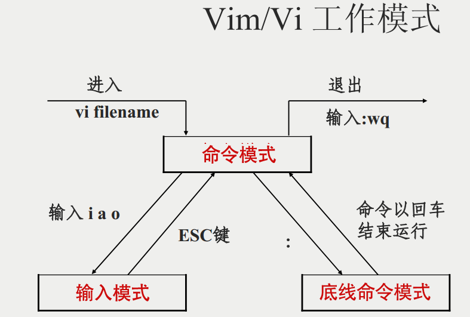
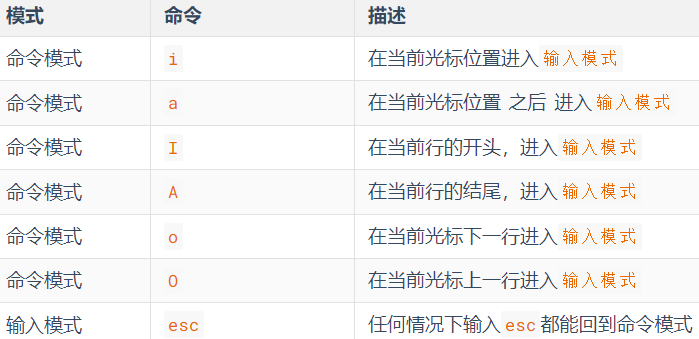
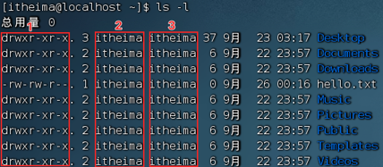
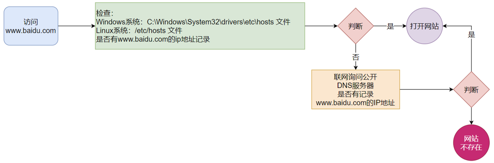
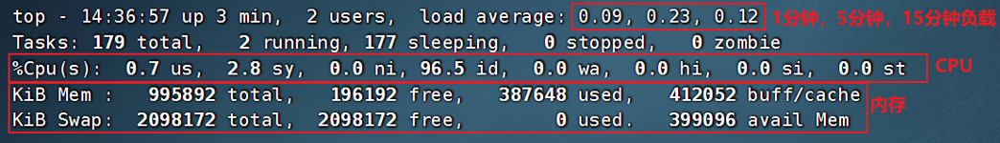
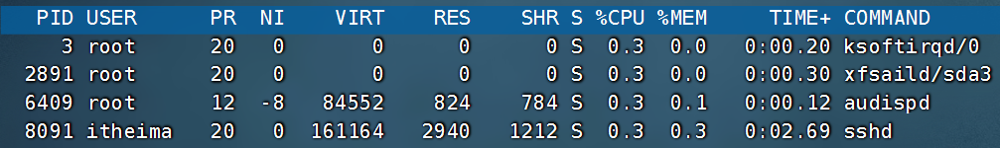
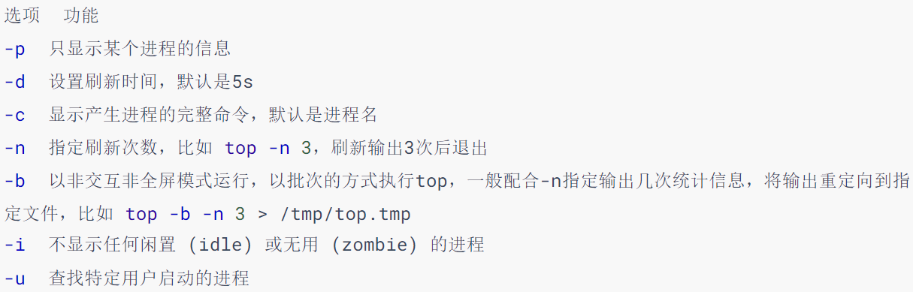
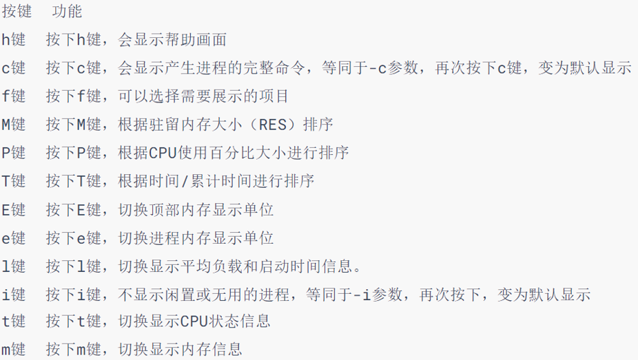
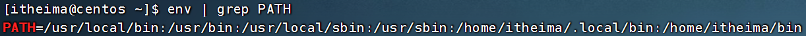

## Linux学习笔记

## 1 入门

### 1.1 操作系统概述

计算机是由硬件和软件所组成。

- 硬件：计算机系统中由电子，机械和光电元件等组成的各种物理装置的总称。

- 软件：是用户和计算机硬件之间的接口和桥梁，用户通过软件与计算机进行交流。

- 操作系统是计算机软件的一种，它主要负责：
  作为用户和计算机硬件之间的桥梁，调度和管理计算机硬件进行工作。

### 1.2 初识Linux

Linux系统的组成如下：

- Linux系统内核
- 系统级应用程序
  - 内核提供系统最核心的功能，如：调度CPU、调度内存、调度文件系统、调度网络通讯、调度IO等。
  - 系统级应用程序，可以理解为出厂自带程序，可供用户快速上手操作系统，如：文件管理器、任务管理器、图片查看、音乐播放等。

Linux系统发行版：

- **主要**基于CentOS操作系统进行讲解

- **辅助**讲解Ubuntu系统的相关知识

### 1.3 虚拟机介绍

1. 什么是虚拟机？

通过虚拟化技术，在电脑内，虚拟出计算机硬件，并给虚拟的硬件安装操作系统，即可得到一台虚拟的电脑，称之为虚拟机。

2. 为什么要使用虚拟机？

学习Linux系统，需要有Linux系统环境。
我们不能给自己电脑重装系统为Linux，所以通过虚拟机的形式，得到可以用的Linux系统环境，供后续学习使用。

### 1.4 Linux远程连接

**1）对于操作系统的使用，有2种使用形式**

- 图形化页面使用操作系统
- 以命令的形式使用操作系统不论是Windows还是Linux亦或是MacOS系统，都是支持这两种使用形式。
  - 图形化：使用操作系统提供的图形化页面，以获得**图形化反馈**的形式去使用操作系统。
  - 命令行：使用操作系统提供的各类命令，以获得**字符反馈**的形式去使用操作系统。

**2）Linux以命令行形式使用**

- Linux从诞生至今，在图形化页面的优化上，并未重点发力。所以Linux操作系统的图形化页面：不好用、不稳定。
- 在开发中，使用命令行形式，效率更高，更加直观，并且资源占用低，程序运行更稳定。所以，后续的课程学习中，我们：

**3）使用FinalShell连接Linux去使用**

- 操作Linux系统中间跨越VMware窗口会导致交互不太方便
- 我们只需要使用命令行无需使用图形化，所以通过命令行远程连接使用即可

**4）如何查看Linux的IP地址并远程连接呢**

- 在Linux操作系统中，桌面空白右键点击：open in terminal
- 输入ifconfig，即可看到IP地址
- 在FinalShell中配置好IP地址，账号密码后即可连接成功

### 1.5 WSL

WSL：Windows Subsystem for Linux，是用于Windows系统之上的Linux子系统。

作用很简单，可以在Windows系统中获得Linux系统环境，并完全直连计算机硬件，无需通过虚拟机虚拟硬件。

简而言之：
Windows10的WSL功能，可以无需单独虚拟一套硬件设备，
直接使用主机的物理硬件，构建Linux操作系统并不会影响Windows系统本身的运行

## 2 Linux基本命令

### 2.1 Linux的目录结构

**1）目录结构**

Linux的目录结构是一个树型结构

Windows 系统可以拥有多个盘符, 如 C盘、D盘、E盘

Linux没有盘符这个概念, 只有一个根目录 /, 所有文件都在它下面

**2）路径描述方式**

- 在Windows系统中，路径之间的层级关系使用： \ 来表示
  D:\data\work\hello.txt /usr/local/hello.txt
  - D:表示D盘
  - \表示层级关系注意：

- 在Linux系统中，路径之间的层级关系，使用：/ 来表示
  /user / local

  - 开头的/表示根目录
  - 后面的/表示层级关系‌

  

### 2.2 Linux命令入门

#### 2.2.1 Linux命令基础

**1）命令行和命令**

命令行：即Linux终端（Terminal），一种命令提示符页面。

命令：即Linux程序。一个命令就是一个Linux程序

**2）Linux命令基础格式**

`command [-options] [parameter]`

- command： 命令本身
- -options：[可选，非必填]命令的一些选项，可以通过选项控制命令的行为细节
- parameter：[可选，非必填]命令的参数，多数用于命令的指向目标等

#### 2.2.2 ls命令入门

作用：列出目录下的内容

`ls [-a -l -h] [Linux路径]`

- -a -l -h 是可选的选项

- Linux路径是此命令可选的参数

直接使用ls命令本体，表示：以平铺形式，列出当前工作目录下的内容

- Linux系统的命令行终端，在启动的时候，默认会加载
  用户的HOME目录作为当前工作目录

- HOME目录：每个用户在Linux系统的专属目录，路径在：/home/用户名

#### 2.2.3 ls命令的参数

**1）-a选项**

表示：all的意思，即列出全部文件（包含隐藏的文件/文件夹）

以.开头的，表示是Linux系统的隐藏文件/文件夹（只要以.开头，就能自动隐藏）

**2）-l选项**

表示：以列表（竖向排列）的形式展示内容，并展示更多信息

**3）-h** 

表示：以易于阅读的形式，列出文件大小，带上单位 如K、M、G

-h选项必须要搭配 -l 使用

**3）组合使用**

- ls -l -a
- ls -la
- ls -al

上述三种写法，都是一样的，表示同时应用-l和-a的功能

### 2.3 目录切换命令（cd/pwd）

#### 2.3.1 cd切换目录

cd命令来自英文：Change Directory

语法：`cd [Linux路径]`

cd命令直接执行，不写参数，表示回到用户的HOME目录‌

#### 2.3.2 pwd查看当前工作目录

pwd命令来自英文：Print Work Directory

语法：直接输入`pwd`

### 2.4 相对路径、绝对路径和特殊路径符

#### 2.4.1 相对路径和绝对路径

- cd /home/itheima/Desktop  
- cd Desktop  

上述两种写法，都可以正确的切换目录到指定的Desktop中

绝对路径：以根目录为起点，描述路径的一种写法，路径描述以/开头

相对路径：以当前目录为起点，描述路径的一种写法，路径描述无需以/开头

#### 2.4.2 特殊路径符

- . 表示当前目录，比如 cd  ./Desktop 和cd  Desktop效果一致
- .. 表示上一级目录，比如：cd.. 即可切换到上一级目录，cd../.. 切换到上二级的目录
- ~ 表示HOME目录，比如：cd ~ 即可切换到HOME目录或cd ~/Desktop，切换到HOME内的Desktop目录‌

### 2.5 创建目录命令（mkdir）

作用：通过mkdir命令可以创建新的目录（文件夹）

mkdir来自英文：Make Directory

语法：`mkdir [-p] Linux路径`

- 参数必填，表示Linux路径，即要创建的文件夹的路径，相对路径或绝对路径均可
- -p选项可选，表示自动创建不存在的父目录，适用于创建连续多层级的目录

### 2.6 文件操作命令

#### 2.6.1 touch创建文件

作用：在当前目录下创建文件

语法：`touch [路径/]文件名`

#### 2.6.2 cat、more查看文件内容

作用：查看txt文件的内容

语法：`cat || more  文件路径`

- cat是直接将内容全部显示出来
- more支持翻页，如果文件内容过多，可以一页页的展示
  空格翻页，Q退出

#### 2.6.3 cp复制文件或文件夹

cp命令来自英文：copy

语法：`cp [-r] 参数1 参数2`

- -r选项，可选，用于复制**文件夹**，表示递归
- 参数1，Linux路径，表示被复制的文件或文件夹
- 参数2，Linux路径，表示要复制去的地方‌

#### 2.6.3 mv移动文件或文件夹

mv命令来自英文单词：move

语法：`mv 参数1 参数2`

- 参数1，Linux路径，表示被移动的文件或文件夹

- 参数2，Linux路径，表示要移动去的地方，如果目标不存在，则改名被移动的文件|文件夹

#### 2.6.4 rm删除文件或文件夹

rm命令来自英文单词：remove

语法：`rm [-r -f]  参数1 参数2 ....参数n`

- 同cp命令一样，-r 选项用于删除文件夹
- -f表示force，强制删除（不会弹出提示确认信息）
     - 普通用户删除内容不会弹出提示，只有root管理员用户删除内容会有提示

          所以一般普通用户用不到-f选项

  -  可以通过 su  -  root进入管理员权限，exit退出
- 参数1、参数2、......、参数N 表示要删除的文件或文件夹路径，按照空格隔开‌

#### 2.6.5 rm使用时的通配符

rm命令支持通配符*，用来做模糊匹配

- 符号* 表示通配符，即匹配任意内容（包含空）
- test*，表示匹配任何以test开头的内容
- *test，表示匹配任何以test结尾的内容
- \*test*，表示匹配任何包含test的内容

### 2.7 查找命令（which，find）

#### 2.7.1 which

前面学习的Linux命令，其实它们的本体就是一个个的二进制可执行程序

作用：查看所使用的一系列命令的程序文件存放在哪里

语法：`which 要查找的命令`

#### 2.7.2 find

**1）按文件名查找文件**

语法：`find 起始路径 -name "被查找的文件名"`

起始路径：在哪个文件夹里找

find命令支持通配符*，用来做模糊匹配

- 符号* 表示通配符，即匹配任意内容（包含空）
- test*，表示匹配任何以test开头的内容
- *test，表示匹配任何以test结尾的内容
- \*test*，表示匹配任何包含test的内容

**2）按文件大小查找文件**

语法：`find 起始路径 -size +或-n[kMG]`

- +、- 表示大于、小于

- n表示大小数字
- kMG表示大小单位，k(小写字母)表示kb，M表示MB，G表示GB示例：
- 查找小于10KB的文件： find / -size  -10k
- 查找大于100MB的文件：find / -size  +100M
- 查找大于1GB的文件：find / -size  +1G

### 2.8 grep、wc和管道符

#### 2.8.1 grep

作用：从文件中通过关键字过滤文件行

语法：`grep [-n] 关键字 关键路径`

- 选项-n，可选，表示在结果中显示匹配的行号。
- 关键字，表示过滤的关键字，带有空格或其它特殊符号，建议使用””将关键字包围起来
- 文件路径，表示要过滤内容的文件路径，可作为内容输入端口

#### 2.8.2 wc

作用：统计文件的行数、单词数量等

语法：`wc [-c -m -l -w] 文件路径`

- 选项，-c，统计bytes数量
- 选项，-m，统计字符数量
- 选项，-l，统计行数
- 选项，-w，统计单词数量
- 参数，文件路径，被统计的文件，可作为内容输入端口‌

什么都不加，统计行数，单词数，字符数

#### 2.8.3 管道符|

作用：将管道符左边命令的结果，作为右边命令的输入

例子：`cat 文件 | grep 关键字`  ==  `grep 关键字 文件`

### 2.9 echo、tail和重定向符

#### 2.9.1 echo

作用：在命令行内输出指定内容

语法：`echo 输出的内容`

- 无需选项，只有一个参数，表示要输出的内容，复杂内容可以用””包围演示：

- 被`（反引号符）包围的内容，会被作为命令执行，而非普通字符

#### 2.9.2 重定向符

- \>将左侧命令的结果，**覆盖**写入到符号右侧指定的文件中

- \>\>，将左侧命令的结果，**追加**写入到符号右侧指定的文件中

例子：`echo "hello Linux" > test.txt`

`ls > test.txt` `cat 文件1 > 文件2`

#### 2.9.3 tail

作用：查看文件尾部内容，并可以持续跟踪

语法：`tail [-f -num] Linux路径`

- -f：持续跟踪，文件追加的内容也会显示出来，Ctrl + C 退出跟踪状态

- -num：为数字，启动的时候查看尾部多少行，默认10行

#### 2.9.4 head

作用：查看文件头部内容

语法：`head [-n] 参数`

- 参数：被查看的文件
- 选项：-n，查看的行数

### 2.10 vi\vim

#### 2.10.1 介绍

vi\vim是visual interface的简称, 是Linux中最经典的文本编辑器

vim 是 vi 的加强版本，兼容 vi 的所有指令，不仅能编辑文本，而且还具有 shell 程序编辑的功能，可以不同颜色的字体来辨别语法的正确性，极大方便了程序的设计和编辑性。

#### 2.10.2 三种工作模式

- 命令模式（Command mode）

  命令模式下，所敲的按键编辑器都理解为命令，以命令驱动执行不同的功能。此模型下，不能自由进行文本编辑。

- 输入模式（Insert mode）

  也就是所谓的编辑模式、插入模式。此模式下，可以对文件内容进行自由编辑。

- 底线命令模式（Last line mode）

  以：开始，通常用于文件的保存、退出。

#### 2.10.3 命令模式

语法：`vi\vim 文件路径`

- 如果文件路径表示的文件不存在，那么此命令会用于编辑新文件
- 如果文件路径表示的文件存在，那么此命令用于编辑已有文件

#### 2.10.4 模式的转换

- 进入vi编辑器会进入命令模式
- 命令模式输入键盘指令
  i 可以进入输入模式， :  可以进入底线命令模式，
- 输入模式可以通过  按  Esc  退回到命令模式
- 底线命令模式按回车完成命令后，自动回到命令模式
  ：wq 命令可退出vim工作模式



#### 2.10.5 命令模式快捷键




#### 2.10.6 底线命令模式快捷键


### 2.11 补充

- 任何命令都支持：--help 选项， 可以通过这个选项，查看命令的帮助。
  如：ls --help， 会列出ls命令的帮助文档

- 可以通过：`man 命令`查看某命令的详细手册
  man ls，就是查看ls命令的详细手册

## 3 Linux用户和权限

### 3.1 认识root用户

#### 3.1.1 root用户

- 在Linux系统中，拥有最大权限的账户名为：root（超级管理员）

- root用户拥有最大的系统操作权限，而普通用户在许多地方的权限是受限的。

#### 3.1.2 su和exit命令

**1）su**

作用：用于账户切换的系统命令

其来源英文单词：Switch User

语法：`su [-] 用户名`

- \-   符号是可选的，表示是否在切换用户后加载环境变量，建议带上
- 用户名，表示要切换的用户，用户名也可以省略，省略表示切换到root
- 切换用户后，可以通过exit命令退回上一个用户，也可以使用快捷键：ctrl + d


- 使用普通用户，切换到其它用户需要输入密码
- 使用root用户切换到其它用户，无需密码，可以直接切换

#### 3.1.3 sudo

作用： 为普通的命令授权，临时以root身份执行

语法：`sudo 其他命令`

并不是所有的用户，都有权利使用sudo，我们需要为普通用户配置sudo认证‌

- 切换到root用户，执行visudo命令，会自动通过vi编辑器打开：/etc/sudoers

- 在文件的最后添加：`itheima ALL =(ALL)   NOPASSWD:ALL`

### 3.2  用户、用户组管理

Linux中关于权限的管控级别有2个级别，分别是：
- 针对用户的权限控制
- 针对用户组的权限控制

#### 3.2.1 用户组管理

- 创建用户组 `groupadd 用户组名`
- 删除用户组 `groupdel 用户组名`

#### 3.2.2 用户管理

**1）创建用户**

 `useradd 用户名 [-g 用户组] [-d 路径]`

   -  -g为指定用户的组，不指定-g，会创建同名组并自动加入
        指定已存在同名组，必须使用-g
   -  -d指定用户HOME路径，不指定，HOME目录默认在：/home/用户名

**2）删除用户**

 `userdel [-r] 用户名`

    - -r，删除用户的HOME目录，不使用-r，删除用户时，HOME目录保留

**3）查看用户所属组**

 `id [用户名]`

    - 用户名，被查看的用户，如果不提供则查看自身

**4）修改用户所属组**

`usermod -aG 用户组 用户名`

- 将指定用户加入指定用户组

#### 3.2.3 getent

**1）查看当前系统中有哪些用户**

语法：` getent passwd`

共有7份信息，分别是：

用户名:密码(x):用户ID:组ID:描述信息(无用):HOME目录:执行终端(默认bash)

**2）查看当前系统中有哪些用户组**

语法：`getent group`

### 3.3 查看权限控制

**1）ls的权限解读**

通过ls -l 可以以列表形式查看内容，并显示权限细节



- 序号1，表示文件、文件夹的权限控制信息
- 序号2，表示文件、文件夹所属用户
- 序号3，表示文件、文件夹所属用户组

**2）序号1中的权限解读**

共有10位字符

其中第一位有：- d l （-表示文件，d表示文件夹，l表示软链接）

后面每三位分别为：所属用户权限，所属用户组权限，其他用户权限

每三位中：各为 r w x 分别代表 读、写、执行权限，没有的用  -  代替

举例：drwxr-xr-x

- 这是一个文件夹，首字母d表示
- 所属用户的权限是：有r有w有x，rwx
- 所属用户组的权限是：有r无w有x，r-x （-表示无此权限）
- 其它用户的权限是：有r无w有x，r-x

**3）rwx分别代表什么**

- r，针对文件可以查看文件内容
     - 针对文件夹，可以查看文件夹内容，如ls命令
- w，针对文件表示可以修改此文件
     -  针对文件夹，可以在文件夹内：创建、删除、改名等操作
- x，针对文件表示可以将文件作为程序执行
     - 针对文件夹，表示可以更改工作目录到此文件夹，即cd进入‌

### 3.4 修改权限控制(chmod,chown)

#### 3.4.1 chmod

作用：修改文件、文件夹的权限信息

- 注意：只有文件、文件夹的所属用户或root用户可以修改。

语法：`chmod [-R] 权限 文件或文件夹`

- -R，对文件夹内的全部内容应用同样的操作


示例：

- `chmod u=rwx,g=rx,o=x hello.txt` ，将文件权限修改为：rwxr-x--x
      - 其中：u表示user所属用户权限，g表示group组权限，o表示other其它用户权限
- `chmod -R u=rwx,g=rx,o=x test`
  将文件夹test以及文件夹内全部内容权限设置为：rwxr-x--x

#### 3.4.2 权限的数字序号

r记为4，w记为2，x记为1，则有

- 0：无任何权限，即 ---
- 1：仅有x权限， 即 --x
- 2：仅有w权限 即 -w-
- 3：有w和x权限 即 -wx
- 4：仅有r权限 即 r--
- 5：有r和x权限 即 r-x
- 6：有r和w权限 即 rw-
- 7：有全部权限 

快捷写法：`chmod 751 文件`   rwx r-x --x

#### 3.4.3 chown

作用：修改文件、文件夹的所属用户和用户组

- **此命令只限制于root用户执行**

语法：`chown [-R] [用户] [:用户组] 文件或文件夹`

- -R，同chmod，对文件夹内全部内容应用相同规则
- 用户，修改所属用户
- : 用户组，修改所属用户组
- : 用于分隔用户和用户组

文件的所处位置，拥有的主用户，拥有的用户组可以完全不相干

**示例：**

- chown root hello.txt，将hello.txt所属用户修改为root
- chown:root hello.txt，将hello.txt所属用户组修改为root
- chown root:itheima hello.txt，将hello.txt所属用户修改为root，用户组修改为itheima
- chown -R root test，将文件夹test的所属用户修改为root并对文件夹内全部内容应用同样规则

## 4 ‌Linux实用操作

### 4.1 各类小技巧（快捷键）

ctrl + c 强制停止

ctrl + d 退出或登出（不能退出vm/vim）

history 查看历史输入过的命令

! + 命令前缀，自动执行上一次匹配前缀的命令

ctrl + r，输入内容去匹配历史命令如果搜索到的内容是你需要的

- 回车键可以直接执行
- 键盘左右键，可以得到此命令（不执行）

ctrl + a | e，光标移动到命令开始或结束

ctrl + ← | →，左右跳单词

ctrl + l，| clear可以清空终端内容

### 4.2 软件安装

#### 4.2.1 yum

yum：RPM包软件管理器，用于自动化安装配置Linux软件，并可以自动解决依赖问题。

语法：`yum [-y] [install | remove | search] 软件名称`

- -y，自动确认，无需手动确认安装或卸载过程

- install：安装
- remove：卸载
- search：搜索

yun命令需要root权限

- `yum [-y] install wget`， 通过yum命令安装wget程序
- `yum [-y] remove wget`，通过yum命令卸载wget命令
- `yum search wget`，通过yum命令，搜索是否有wget安装包

#### 4.2.2 apt

语法：`apt [-y] [install | remove | search] 软件名称`

- apt install wget，安装wget
- apt remove wget，移除wget
- apt search wget，搜索wget

### 4.3 systemctl

Linux系统很多软件（内置或第三方）均支持使用systemctl命令控制：启动、停止、开机自启

能够被systemctl管理的软件，一般也称之为：服务

语法：`systemctl start | stop | status | enable | disable 服务名`

- start 启动
- stop 关闭
- status 查看状态
- enable 开启开机自启
- disable 关闭开机自启

系统内置的服务：

- NetworkManager，主网络服务
- network，副网络服务
- firewalld，防火墙服务
- sshd，ssh服务（FinalShell远程登录Linux使用的就是这个服务）

### 4.4 软连接

ln命令创建软连接

在系统中创建软链接，可以将文件、文件夹链接到其它位置。

类似Windows系统中的《快捷方式》

语法：`ln -s 参数1 参数2`

- -s选项，创建软连接
- 参数1：被链接的文件或文件夹
- 参数2：要链接去的目的地实例：

实例：

- ln -s /etc/yum.conf    ~/yum.conf
- ln -s /etc/yum   ~/yum‌

### 4.5 日期、时区

#### 4.5.1 date

作用：在命令行中查看系统的时间

语法：`date [-d "加减时间"] [+格式化字符串]`

- -d 按照给定的字符串显示日期，一般用于日期计算
- 格式化字符串：通过特定的字符串标记，来控制显示的日期格式
     - %Y 年
  - %y 年份后两位数字 (00..99)
  - %m 月份 (01..12)
  - %d 日 (01..31)
  - %H 小时 (00..23)
  - %M 分钟 (00..59)
  - %S 秒 (00..60)
  - %s 自 1970-01-01 00:00:00 UTC 到现在的秒数

中间有空格要 用双引号括起字符串

#### **4.5.2 date命令进行日期加减**


- -d选项，可以按照给定的字符串显示日期，一般用于日期计算
- 其中支持的时间标记为：
     - year年
  - month月
  - day天
  - hour小时
  - minute分钟
  - second秒

#### 4.5.3 修改Linux时区

date查看的日期时间是不准确的

这是因为：系统默认时区非中国的东八区，是UTC区

使用root权限，执行如下命令，修改时区为东八区

- `rm -f /etc/localtime`
  `ln -s /usr/share/zoneinfo/Asia/Shanghai  /etc/localtime`

### 4.6 IP地址、主机名

#### 4.6.1 IP地址

每一台联网的电脑都会有一个地址，用于和其它计算机进行通讯

IP地址主要有2个版本，V4版本和V6版本

- IPv4版本的地址格式是：a.b.c.d，其中abcd表示0~255的数字，如192.168.88.101就是一个标准的IP地址

- 可以通过命令：ifconfig，查看本机的ip地址

**特殊IP地址**

- 127.0.0.1，这个IP地址用于指代本机
- 0.0.0.0，特殊IP地址
  - 可以用于指代本机
  - 可以在端口绑定中用来确定绑定关系
  - 在一些IP地址限制中，表示所有IP的意思，如放行规则设置为0.0.0.0，表示允许任意IP访问

#### 4.6.2 主机名

- 可以使用命令：`hostname`查看主机名
- 可以使用命令：`hostnamectl set-hostname 主机名`，修改主机名（需root）
- 重新登录FinalShell即可看到主机名已经正确显示

#### 4.6.3 域名解析

主机名映射（域名解析）：通过主机名找到对应计算机的IP地址

我们在浏览器内打开：www.baidu.com，会打开百度的网址

其中，www.baidu.com，是百度的网址，我们称之为：域名



- 先查看本机的记录（私人地址本）
  - Windows看：C:\Windows\System32\drivers\etc\hosts
  - Linux看：/etc/hosts
- 再联网去DNS服务器（如114.114.114.114，8.8.8.8等）询问

**配置主机名映射**

在Windows系统的：C:\Windows\System32\drivers\etc\hosts文件中配置记录

加上`IP地址 主机名`

#### 4.6.4 虚拟机配置固定ip

**1）为什么需要固定IP**

当前我们虚拟机的Linux操作系统，其IP地址是通过DHCP服务获取的。

DHCP：动态获取IP地址，即每次重启设备后都会获取一次，可能导致IP地址频繁变更

原因1：远程连接到Linux系统，如果IP地址经常变化我们就要频繁修改适配

原因2：配置了虚拟机IP地址和主机名的映射，如果IP频繁更改，也需要频繁更新映射关系

**2）在VMware Workstation中配置固定IP**

配置固定IP需要2个大步骤：

1. 在VMware Workstation（或Fusion）中配置IP地址网关和网段（IP地址的范围）

2. 在Linux系统中手动修改配置文件，固定IP

步骤1

1. 打开VMware，编辑选项，虚拟网络编辑器
2. 选择VMnet8，子网IP为 192.168.88.0  子网掩码为 255.255.255.0
3. 打开NAT设置，网关IP为192.168.88.2

步骤2

1. 打开虚拟机，打开终端

2. 切换到root，输入`vim /etc/sysconfig/network-scripts/ifcfg-ens33`

3. 将第四行 dhcp 改为 static

4. 在末尾添加

   ```
   ZONE=public 
   IPADDR="192.168.88.130"
   NETMASK="255.255.255.0"
   GATEWAY="192.168.88.2"
   DNS1="192.168.88.2"
   ```

5. 保存退出，依次输入

   ```
   systemctl stop network
   systemctl start network
   ifconfig
   ```

即成功设置固定ip

### 4.7 网络传输

#### 4.7.1 ping

作用：检查指定的网络服务器是否是可联通状态

语法：`ping [-c num] ip或主机名`

- 选项：-c，检查的次数，不使用-c选项，将无限次数持续检查
- 参数：ip或主机名，被检查的服务器的ip地址或主机名地址示例：

#### 4.7.2 wget

wget是非交互式的文件下载器，可以在命令行内下载网络文件

语法：`wget [-b] url`

- 选项：-b，后台下载，会将日志写入到当前工作目录的wget-log文件
- 参数：url，下载链接

- 通过tail命令可以监控后台下载进度：`tail -f wget-log`

#### 4.7.3 curl

curl可以发送http网络请求，可用于：下载文件、获取信息等

语法：`curl [-O] url`

- 选项：-O，用于下载文件，当url是下载链接时，可以使用此选项保存文件
- 参数：url，要发起请求的网络地址

#### 4.7.4 端口

**1）介绍**

端口，是设备与外界通讯交流的出入口。

- 物理端口：又可称之为接口，是可见的端口，如USB接口，RJ45网口，HDMI端口等
- 虚拟端口：是指计算机内部的端口，是不可见的，是用来操作系统和外部进行交互使用的物理端口虚拟端口

计算机程序之间的通讯，通过IP只能锁定计算机，但是无法锁定具体的程序。
通过端口可以锁定计算机上具体的程序，确保程序之间进行沟通
IP地址相当于小区地址，在小区内可以有许多住户（程序），而门牌号（端口）就是各个住户（程序）的联系地址‌

**2）Linux端口**

Linux系统是一个超大号小区，可以支持65535个端口，这6万多个端口分为3类进行使用：

- 公认端口：1~1023，通常用于一些系统内置或知名程序的预留使用，如SSH服务的22端口，HTTPS服务的443端口非特殊需要，不要占用这个范围的端口
- 注册端口：1024~49151，通常可以随意使用，用于松散的绑定一些程序\服务
- 动态端口：49152~65535，通常不会固定绑定程序，而是当程序对外进行网络链接时，用于临时使用。

**3）查看端口占用**

- 使用nmap命令，安装nmap：yum -y install nmap
  语法：`nmap 被查看的IP地址`
- 22端口，一般是SSH服务使用，即FinalShell远程连接Linux所使用的端口

- 可以通过netstat命令，查看指定端口的占用情况
  安装`netstat：yum -y install net-tools`
  语法：`netstat -anp | grep 端口号`

### 4.8 进程管理

**1）介绍**

程序运行在操作系统中，是被操作系统所管理的。

为管理运行的程序，每一个程序在运行的时候，便被操作系统注册为系统中的一个：进程

并会为每一个进程都分配一个独有的：进程ID（进程号）

**2）查看进程**

可以通过ps命令查看Linux系统中的进程信息

语法：`ps [-e -f]`

- -e，显示出全部的进程

- -f，以完全格式化的形式展示信息（展示全部信息）

一般来说，固定用法就是： ps -ef 列出全部进程的全部信息

从左到右分别是：

- UID：进程所属的用户ID
- PID：进程的进程号ID
- PPID：进程的父ID（启动此进程的其它进程）
- C：此进程的CPU占用率（百分比）
- STIME：进程的启动时间
- TTY：启动此进程的终端序号，如显示?，表示非终端启动
- TIME：进程占用CPU的时间
- CMD：进程对应的名称或启动路径或启动命令

3）**查看指定进程**

- 在FinalShell中，执行命令：tail，可以看到，此命令一直阻塞在那里
- 在FinalShell中，复制一个标签页，执行：ps -ef 找出tail这个程序的进程信息
- 问题：是否会发现，列出的信息太多，无法准确的找到或很麻烦怎么办？我们可以使用管道符配合grep来进行过滤，如：ps -ef | grep tail，即可准确的找到tail命令的信息

**4）关闭进程**

语法：`kill [-9] 进程ID`

- -9，表示强制关闭进程。不使用此选项会向进程发送信号要求其关闭，但是否关闭看进程自身的处理机制

### 4.9 主机状态

#### 4.9.1 top

作用：查看CPU、内存使用情况，类似Windows的任务管理器默认每5秒刷新一次

语法：直接输入top即可，按q或ctrl + c退出



第一行：top：命令名称，14:39:58：当前系统时间，up 3 min：启动了3分钟，2 users：2个用户登录，load：1、5、15分钟负载

第二行：Tasks：179个进程，2 running：2个进程子在运行，177 sleeping：177个进程睡眠，0个停止进程，0个僵尸进程

第三行：

%Cpu(s)：CPU使用率，**us**：用户CPU使用率，**sy**：系统CPU使用率，ni：高优先级进程占用CPU时间百分比，id：空闲CPU率，wa：IO等待CPU占用率，hi：CPU硬件中断率，si：CPU软件中断率，st：强制等待占用CPU率

第四、五行：

Kib Mem：物理内存，total：总量，free：空闲，used：使用，buff/cache：buff和cache占用

KibSwap：虚拟内存（交换空间），total：总量，free：空闲，used：使用，buff/cache：buff和cache占用

**top命令内容详解**



- PID：进程id
- USER：进程所属用户
- PR：进程优先级，越小越高
- NI：负值表示高优先级，正表示低优先级
- VIRT：进程使用虚拟内存，单位KB
- RES：进程使用物理内存，单位KB
- SHR：进程使用共享内存，单位KB
- S：进程状态（S休眠，R运行，Z僵死状态，N负数优先级，I空闲状态）
- %CPU：进程占用CPU率
- %MEM：进程占用内存率
- TIME+：进程使用CPU时间总计，单位10毫秒
- COMMAND：进程的命令或名称或程序文件路径

**‌top命令选项**



当top以交互式运行（非-b选项启动），可以用以下交互式命令进行控制



#### 4.9.2 磁盘信息监控

**1）df命令，可以查看硬盘的使用情况**

语法：`df [-h]`

-h，以更加人性化的单位显示

**2）使用iostat查看CPU、磁盘的相关信息**

语法：`iostat [-x] [num1] [num2]`

- -x，显示更多信息

- num1：数字，刷新间隔，num2：数字，刷新几次

tps：该设备每秒的传输次数（Indicate the number of transfers per second that were issued to the device.）。 "一次传输"意思是"一次I/O请求"。多个逻辑请求可能会被合并为"一次I/O请求"。"一次传输"请求的大小是未知的。

**3）使用sar命令查看网络的相关统计**

语法：`sar -n DEV num1 num2`

- 选项：-n，查看网络，DEV表示查看网络接口
- num1：刷新间隔（不填就查看一次结束）
- num2：查看次数（不填无限次数）

rxKB/S 每秒钟接受的数据包大小，单位为KB
txKB/S 每秒钟发送的数据包大小，单位为KB

### 4.10 环境变量

环境变量是操作系统（Windows、Linux、Mac）在运行的时候，记录的一些关键性信息，用以辅助系统运行。

在Linux系统中执行：env命令即可查看当前系统中记录的环境变量

**2）环境变量PATH**

无论当前工作目录是什么，都能执行/usr/bin/cd这个程序，这个就是借助环境变量中：PATH这个项目的值来做到的。



PATH记录了系统执行任何命令的搜索路径，如上图记录了（路径之间以 : 隔开）：

- /usr/local/bin
- /usr/bin
- /usr/local/sbin
- /usr/sbin
- /home/itheima/.local/bin
- /home/itheima/bin

当执行任何命令，都会按照顺序，从上述路径中搜索要执行的程序的本体比如执行cd命令，就从第二个目录/usr/bin中搜索到了cd命令，并执行

**3）$符号**

在Linux系统中，\$符号被用于取”变量”的值。环境变量记录的信息，除了给操作系统自己使用外，如果我们想要取用，也可以使用。

取得环境变量的值就可以通过语法：`$环境变量名 来取得`
比如：` echo $PATH`
又或者：`echo ${PATH}ABC`   在PATH结果后加上ABC字符串

**4）自行设置环境变量**

- 临时设置，语法：`export 变量名=变量值`
  仅在本次启动时生效，关机后删除
- 永久生效
  - 针对当前用户生效，配置在当前用户的： ~/.bashrc文件中
  - 针对所有用户生效，配置在系统的： /etc/profile文件中
  - 在文件中加入环境变量，
    然后输入语法：`source 配置文件`，进行立刻生效，或重新登录FinalShell生效

测试：

- 在当前HOME目录内创建文件夹myenv，在文件夹内创建文件haha

- 通过vim编辑器，在haha文件内填入：`echo 哈哈哈`

完成上述操作后，随意切换工作目录，执行mkhaha命令尝试一下，会发现无法执行

- 临时修改PATH：export PATH\=  ==$PATH==  :/home/itheima/myenv
- 或填入用户环境变量文件或系统环境变量文件中
  再用 `source 配置文件`去来永久保存
  - `export PATH=$PATH ：要添加的环境变量`
  - $PATH 指之前的所有环境变量，一定不能忘了加

### 4.11 上传、下载

**1）FinalShell工具**

我们可以通过FinalShell工具，方便的和虚拟机进行数据交换。

在FinalShell软件的下方窗体中，提供了Linux的文件系统视图，可以方便的：

- 浏览文件系统，找到合适的文件，右键点击下载，即可传输到本地电脑
  - 在局外改变用户为root即可下载root文件

- 浏览文件系统，找到合适的目录，将本地电脑的文件拖入，即可上传数据到Linux中

**2）rz、sz**

rz、sz命令需要安装，可以通过：`yum -y install lrzsz`，即可安装。

rz命令进行上传，语法：直接输入rz即可

sz命令进行下载，语法：`sz 要下载的文件`

文件会自动下载到桌面的：fsdownload文件夹中。

### 4.12 压缩、解压

#### **1）压缩格式**

- zip格式：Linux、Windows、MacOS，常用
- 7zip：Windows系统常用
- rar：Windows系统常用
- tar：Linux、MacOS常用
- gzip：Linux、MacOS常用

#### **2）tar**

- .tar，称之为tarball，归档文件，即简单的将文件组装到一个.tar的文件内，并没有太多文件体积的减少，仅仅是简单的封装
- .gz，也常见为.tar.gz，gzip格式压缩文件，即使用gzip压缩算法将文件压缩到一个文件内，可以极大的减少压缩后的体积
- 针对这两种格式，使用tar命令均可以进行压缩和解压缩的操作

语法：`tar [-c -v -x -f -z -C] 参数1 参数2 ···参数N`

- -c，创建压缩文件，用于压缩模式
- -v，显示压缩、解压过程，用于查看进度
- -x，解压模式
- -f，要创建的文件，或要解压的文件，-f选项必须在所有选项中位置处于最后一个
- -z，gzip模式，不使用-z就是普通的tarball格式 ，一般放在第一个
- -C，选择解压的目的地，用于解压模式
- 参数1 参数2  ······ 参数N 为要压缩的文件

tar的常用压缩组合为：

- `tar -cvf test.tar 要压缩的文件 `

- `tar -zcvf test.tar.gz 要压缩的文件 `

tar的常用解压组合：

- `tar -xvf test.tar`  解压test.tar，将文件解压至当前目录
- `tar -zxvf test.tar.gz ` 以Gzip模式解压
- `tar -xvf test.tar -C 路径`   解压test.tar，将文件解压至指定目录

#### 3）zip

语法：`zip [-r] 参数1 参数2 ···参数N`

- -r，被压缩内容包含文件夹项，和rm、cp等命令的-r效果一致

#### 4）unzip

语法：`unzip [-d] 参数`

- -d，指定要解压去的位置，同tar的-C选项
- 参数，被解压的zip压缩包文件

实例：

- `unzip test.zip`，将test.zip解压到当前目录

- `unzip test.zip -d 路径`，将test.zip解压到指定文件夹内

## 5 软件安装

## MySQL8.0版本在CentOS系统安装

> 注意：安装操作需要root权限


### 安装


1. 配置yum仓库

   ```shell
   # 更新密钥
   rpm --import https://repo.mysql.com/RPM-GPG-KEY-mysql-2023
   
   # 安装Mysql8.x版本 yum库
   rpm -Uvh https://dev.mysql.com/get/mysql80-community-release-el7-2.noarch.rpm
   ```

2. 使用yum安装MySQL

   ```shell
   # yum安装Mysql
   yum -y install mysql-community-server
   ```

3. 安装完成后，启动MySQL并配置开机自启动

   ```shell
   systemctl start mysqld		# 启动
   systemctl enable mysqld		# 开机自启
   ```

   > MySQL安装完成后，会自动配置为名称叫做：`mysqld`的服务，可以被systemctl所管理

4. 检查MySQL的运行状态

   ```shell
   systemctl status mysqld
   ```


### 配置

主要修改root密码和允许root远程登录


1. 获取MySQL的初始密码

   ```shell
   # 通过grep命令，在/var/log/mysqld.log文件中，过滤temporary password关键字，得到初始密码
   grep 'temporary password' /var/log/mysqld.log
   ```

2. 登录MySQL数据库系统

   ```shell
   # 执行
   mysql -uroot -p
   # 解释
   # -u，登陆的用户，MySQL数据库的管理员用户同Linux一样，是root
   # -p，表示使用密码登陆
   
   # 执行完毕后输入刚刚得到的初始密码，即可进入MySQL数据库
   ```

3. 修改root密码

   ```sql
   ALTER USER 'root'@'localhost' IDENTIFIED WITH mysql_native_password BY '密码';	-- 密码需要符合：大于8位，有大写字母，有特殊符号，不能是连续的简单语句如123，abc
   ```

4. [扩展]，配置root的简单密码

   > 我们可以给root设置简单密码，如123456.
   >
   > 请注意，此配置仅仅是用于测试环境或学习环境的MySQL，如果是正式使用，请勿设置简单密码

   ```sql
   set global validate_password.policy=0;		# 密码安全级别低
   set global validate_password.length=4;		# 密码长度最低4位即可
   ```

   

5. 允许root远程登录，并设置远程登录密码

   > 默认情况下，root用户是不运行远程登录的，只允许在MySQL所在的Linux服务器登陆MySQL系统
   >
   > 请注意，允许root远程登录会带来安全风险

   ```sql
   # 第一次设置root远程登录，并配置远程密码使用如下SQL命令
   create user 'root'@'%' IDENTIFIED WITH mysql_native_password BY '密码!';	-- 密码需要符合：大于8位，有大写字母，有特殊符号，不能是连续的简单语句如123，abc
   
   # 后续修改密码使用如下SQL命令
   ALTER USER 'root'@'%' IDENTIFIED WITH mysql_native_password BY '密码';
   ```

6. 创建用户

   默认的root用户只能当前节点localhost访问，是无法远程访问的，我们还需要创建一个root账户，用户远程访问

   ```
   create user 'root'@'%' IDENTIFIED WITH mysql_native_password BY '1234';
   ```

   

7. 并给root用户分配权限

   ```
   grant all on *.* to 'root'@'%';
   ```

   

8. 重新连接MySQL

   ```
   mysql -u root -p
   ```

   然后输入密码

   

9. 通过DataGrip远程连接MySQL

开放LInux防火墙3306