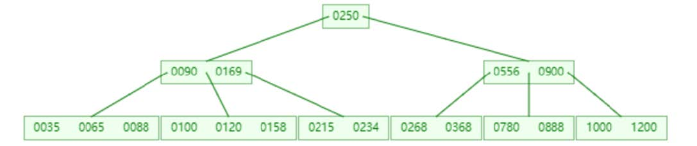
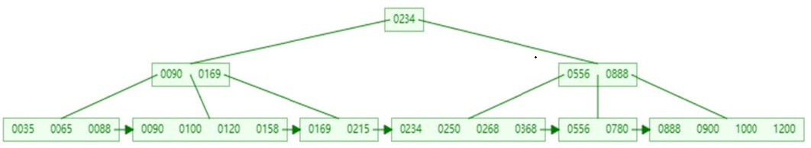
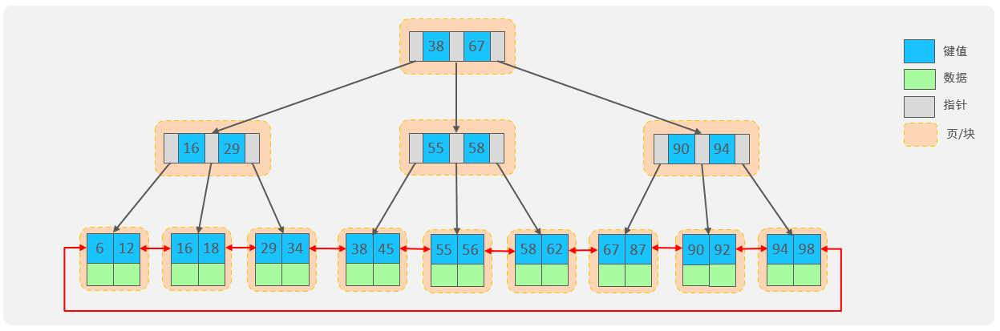
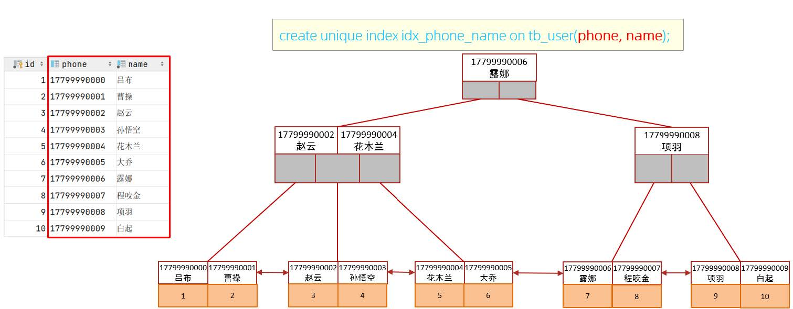
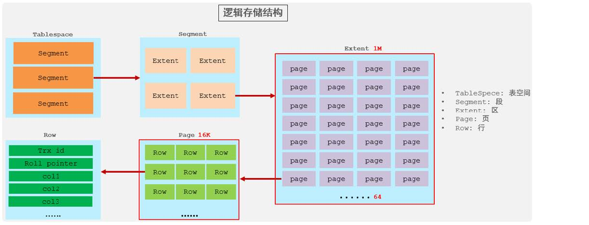
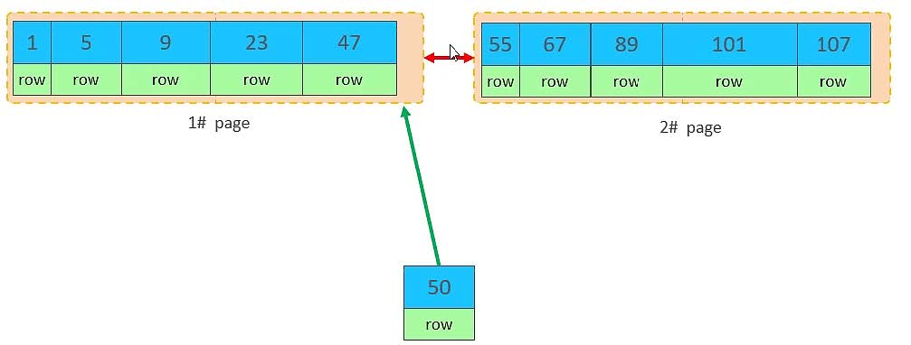
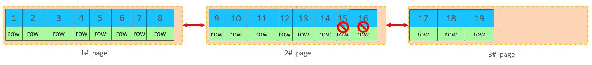
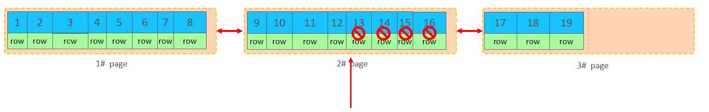
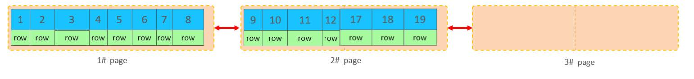

## MySQL笔记（上）

## 1 MySQL数据库

### 1.1 关系型数据库

概念：建立在关系模型上由多张互相连接的二维表组成的数据库

特点：

- 使用表存储数据，格式统一，便于维护
- 使用SQL语言操作，标准统一，使用方便

## 2 SQL

### **2.1 SQL通用语法**

1. SQL语句可以单行或多行书写，以分号结尾
1. SQL语句可以使用空格/缩进增强语句可读性
1. MySQL数据库的SQL语句不区分大小写，关键字使用大写
1. 注释
   - 单行注释：--  注释内容 或  # 注释内容（MySQL特有）
   - 多行注释：/\*  注释内容  */

### **2.2 SQL分类**

DDL：数据定义语言，用来定义数据库对象（数据库，表，字段）

DML：数据操作语言，对数据进行增删改

DQL：数据查询语 言，查询数据库中表的记录

DCL：数据控制语言，用来创建用户，控制数据库的访问权限

### **2.3 DDL**

#### **2.3.1 数据库操作**

**1. 查询**

```sql
--查询所有数据库
SHOW DATABASES;
--查询当前数据库
SELECT DATABASE();
```

**2.创建**

`CREATE DATABASE[IF NOT EXISTS] 数据库名 [DEFAULT CHARSET 字符集][COLLATE 排列规则];`

**3.删除**

`DROP DATABASE[IF EXISTS]数据库名;`

**4.使用**

`USE 数据库名;`

（带了[ ]的表示可以不添加）

#### 2.3.2 表操作

**1.查询当前数据库所有表**

`SHOW TABLES;`

**2.查询表结构**

`DESC 表名;`

**3.查询指定表的建表语句**

`SHOW CTEATE TABLE 表名;`

**4.表创建**

```sql
CREATE TABLE 表名(
    字段1 字段1类型[COMMENT 字段1注释],
    字段2 字段2类型[COMMENT 字段2注释],
    ······
    字段n 字段n类型[COMMENT 字段n注释]
)[COMMENT 表注释];
```

**5.表修改**

- **添加字段**
  `ALTER TABLE 表名 ADD 字段名 数据类型 [COMMENT 注释][约束];`

- **修改字段类型**
  `ALTER TABLE 表名 MODIFY 字段名 新数据类型;`

- **修改字段名及字段类型**
  `ALTER TABLE 表名 CHANGE 旧字段名 新字段名 数据类型 [COMMENT 注释][约束] ;`

- **删除字段**
  `ALTER TABLE 表名 DROP 字段名;`
- **修改表名**
  `ALTER TABLE 表名 RENAME TO 新表名;`

**6.表删除**

- **删除表**
  `DROP TABLE[IF EXISTS]  表名;`
- **删除指定表，并重新创建该表**
  `TRUNCATE TABLE 表名;`

### 2.4 DML

#### 2.4.1 添加数据

- 给指定字段添加数据
  `INSERT INTO 表名(字段名1,字段名2,...)VALUES(值1，值2，...);`
- 给全部字段添加数据
  `INSERT INTO 表名 VALUES(值1，值2，...);`

- 批量添加数据

  `INSERT INTO 表名 [(字段名1，字段名2，···)] VALUES(值1，值2)，(值1，值2)，···;`

- 字符串和日期类的数据类型应加上引号

#### 2.4.2修改数据

- 修改数据
  `UPDATE 表名 SET 字段名1=值1，字段名2=值2，···[WHERE 条件];`

- 删除数据
  `DELETE FROM 表名 [WHERE 条件];`

### 2.5 DQL

#### 2.5.1 查询基本语法

```sql
SELECT	字段列表
FROM 	表名列表
WHERE	条件列表
GROUP BY	
		分组字段列表
HAVING	分组后条件列表
ORDER BY
		排序字段列表
LIMIT	分页参数	
```

查询多个字段

```
SELECT 字段1[AS 别名1]，字段2[AS 别名2]，··· FROM 表名;
SELECT * FROM 表名;
```

去除重复记录

`SELECT DISTINCT 字段列表 FROM 表名;`

#### 2.5.2 条件查询

| <>或！=         | 不等于                                  |
| --------------- | :-------------------------------------- |
| BETWEEN ··· AND | 在某个范围之内的值，闭区间              |
| IN(···)         | 与IN中的任意一个值匹配                  |
| LIKE 占位符     | 模糊匹配（__为单个字符，%为任意个字符） |
| IS NULL         | 是NULL，信息为空                        |
| AND 或 &&       | 并且，多个条件同时成立                  |
| OR 或 \|\|      | 或者，多个条件至少成立一个              |
| NOT 或 ！       | 非                                      |

#### 2.5.3 聚合函数

| 聚合函数 | 功能     |
| -------- | -------- |
| COUNT    | 统计数量 |
| MAX      | 最大值   |
| MIN      | 最小值   |
| AVG      | 平均值   |
| SUM      | 求和     |

- NULL值不参与聚合函数的运算

- `SELECT 聚合函数(字段列表) FROM 表名;`

#### 2.5.4 分组查询

`SELECT 字段列表 FROM 表名 [WHERE 条件] GROUP BY 分组字段名 [HAVING 分组后过滤条件];`

WHERE 与 HAVING 的区别

- 执行时机不同：WHERE是分组前过滤列表，HAVING是分组后过滤组合
- 判断条件不同：WHERE不能对聚合函数判断，HAVING可以

分组之后，查询的字段一般为聚合函数和分组字段，其他字段无意义

#### 2.5.5 排序查询

`SELECT 字段列表 FROM 表名 ORDER BY 字段1 排序方式，字段2 排序方式`

ASC：升序（默认值，方向为从上往下）

DESC：降序

#### 2.5.6 分页查询

`SELECT 字段列表 FROM 表名 LIMIT [起始索引，] 查询记录数;`

结果范围是  [ 起始索引 + 1 , 起始索引 + 查询记录数 ],

分页查询的要求

- 起始索引从0开始，（查询页码 - 1）* 每页显示记录数
- 分页查询是数据库的方言，不同的数据库有不同的实现，MySQL里是LIMIT
- 如果查询的是第一页数据，起始所有可以省略，简写为 LIMIT ，查询记录数

### 2.4 DCL

#### 2.4.1 管理用户

1.查询用户

```
USE MYSQL;
SELECT * FROM USER;
```

2.创建用户

`CTRATE USER '用户名'@'主机名' IDENTIFIED BY '密码';`

3.修改用户密码

`ALTER USER'用户名'@'主机名' IDENTIFIED WITH MYSQL_NATIVE_PASSWORD BY '新密码';  `

4.删除用户

`DROP USER'用户名'@'主机名'; `

- 主机名使用%表明使用所有主机
- 主要是DBA（数据库管理员）使用

#### 2.4.2 权限控制

查询权限

`SHOW FRANTS FOR '用户名'@'主机名';`

授予权限

`GRANT 权限列表 ON 数据库名.表名 TO '用户名'@'主机名';`

撤销权限

`REVOKE 权限列表 ON 数据库名.表名 FROM '用户名'@'主机名';` `

- 权限列表 的 所有权限为 ALL [PRIVILEGES] 
- 数据库名和表名都可用*代表所有

| 权限                           | 操作对象           |
| ------------------------------ | ------------------ |
| SELECT, INSERT, UPDATE, DELETE | 对数据的操作       |
| ALTER                          | 修改表             |
| DROP                           | 删除数据库/表/视图 |
| CTEATE                         | 创建数据库/表      |

## 3 函数

 定义：函数是指可以直接被另一段程序调用的程序或代码

### 3.1 字符串函数

| 函数                     | 功能                                  |
| ------------------------ | ------------------------------------- |
| CONCAT(S1,S2,···,Sn)     | 字符串拼接                            |
| LOWER(STR)               | 转化成小写                            |
| UPPER(STR)               | 转化成大写                            |
| LPAD(STR,N,PAD)          | 左填充，用pad填充str的左边直至长度为n |
| RPAD(STR,N,PAD)          | 右填充                                |
| TRIM(STR)                | 去掉字符串头尾的空格                  |
| SUBSTRING(STR,START,LEN) | 返回用start开始的长度len的字符串      |

### 3.2 数值函数

| 函数       | 功能                         |
| ---------- | ---------------------------- |
| CEIL(X)    | 向上取整                     |
| FLOOR(X)   | 向下取整                     |
| MOD(X,Y)   | 返回x/y的模                  |
| RAND()     | 返回0~1的随机数              |
| ROUND(X,Y) | 求x四舍五入的值，保留y位小数 |

生成6位数的验证码

```mysql
SELECT LPAD(ROUND(RAND()*1000000,0),6,0);
```

### 3.3 日期函数

| 函数                              | 功能                           |
| --------------------------------- | ------------------------------ |
| CURDATE()                         | 返回当前日期                   |
| CURTIME()                         | 返回当前时间                   |
| NOW()                             | 返回当前日期和时间             |
| YEAR(DATE)                        | 获取指定date的年份             |
| MONTH(DATE)                       | 获取指定date的月份             |
| DAY(DATE)                         | 获取指定date的日期             |
| DATE_ADD(DATE,INTERVAL  EPR 类型) | 返回date + EPR的时间           |
| DATEDIFF(DATE1,DATE2)             | 返回date1，2之间的天数(左减右) |

### 3.4 流程函数

| 函数                                                         | 功能                                                         |
| ------------------------------------------------------------ | ------------------------------------------------------------ |
| IF(VALUE,T,F)                                                | value为true，返回T，否则F                                    |
| IFNULL(VALUE1,VALUE2)                                        | value1为NULL返回value2，否则返回本身                         |
| CASE [EXPR] <br />WHEN  [VAL1] THEN[RES1] ...<br />ELSE[DEFAULT]END | expr = val n, 返回 res n<br />如果没有expr，则判断val1，<br />val1为true，返回res1，···否则返回default |

## 4 约束

### 4.1 概述

概念：约束时作用于表中字段上的规则，用于限制存储在表中的数据

目的：保证数据库中数据的正确，有效性和完整性

分类：

|   约束   | 描述                                                         | 关键字      |
| :------: | :----------------------------------------------------------- | ----------- |
| 非空约束 | 限制字段数据不能为null                                       | NOT NULL    |
| 唯一约束 | 保证该字段所有数据都是唯一的                                 | NIQUE       |
| 主键约束 | 主键是一行数据的唯一标识，要求非空且唯一<br />自增: AUTO_INCREMENT | PRIMARY KEY |
| 默认约束 | 保存数据如果未指定值，则采用默认值                           | DEFALUT     |
| 检查约束 | 保证字段值满足某个条件                                       | CHECK       |
| 外键约束 | 用来建立两个表之间的连接，保证数据的一致性和完整性           | FOREIGN KEY |

可以在创建表/修改表的时候添加约束

### 4.1 外键约束

概念：用来让两张表的数据建立连接，保证数据的一致性和完整性。

添加外键

```mysql
CTEATE TABLE 表名(
	字段名 数据类型
    ···
    [CONSTRAINT][外键名称] FOREIGN KEY(外键字段名) REFERENCES 主表(主表列名)
)；

ALTER TABLE 表名 
ADD CONSTRAINT 外键名称 FOREIGN KEY(外键字段名) REFERENCES 主表(主表列名)
```

删除外键

`ALTER TABLE 表名 DROP FOREIGN KEY 外键名称;`

删除和更新行为

| 行为        | 说明                                                         |
| ----------- | ------------------------------------------------------------ |
| NO ACTION   | 当在父表中删除/更新对应记录时，首先检查该记录是否有对应外键，如果有则不 允许删除/更新。 (与 RESTRICT 一致) 默认行为 |
| RESTRICT    | 当在父表中删除/更新对应记录时，首先检查该记录是否有对应外键，如果有则不 允许删除/更新。 (与 NO ACTION 一致) 默认行为 |
| CASCADE     | 当在父表中删除/更新对应记录时，首先检查该记录是否有对应外键，如果有，则 也删除/更新外键在子表中的记录 |
| SET NULL    | 当在父表中删除对应记录时，首先检查该记录是否有对应外键，如果有则设置子表 中该外键值为null（这就要求该外键允许取null）。 |
| SET DEFAULT | 父表有变更时，子表将外键列设置成一个默认的值 (Innodb不支持)  |

```
ADD CONSTRAINT 外键名称 FOREIGN KEY(外键字段名) REFERENCES 主表(主表列名)
ON UPDATE CASCADE ON DELETE CASCADE
```

## 5 多表查询

### 5.1 多表关系

**5.1.1 一对多**

例子：部门与员工

实现： 在多的一方建立外键，指向一的主键

**5.1.2 多对多**

例子：学生与课程的关系

实现：建立第三章中间表，中间表至少包含两个外键，分别关联两方主键（课程表）

**5.1.3 一对一**

例子：用户与用户

实现：在任意的一方加入外键，关联另一方的主键，并设置外键为（UNIQUE）

### 5.2 多表查询概述

**分类**

连接查询 

内连接：相当于查询A、B交集部分数据 

外连接： 

- 左外连接：查询左表所有数据，以及两张表交集部分数据 

- 右外连接：查询右表所有数据，以及两张表交集部分数据 

自连接：当前表与自身的连接查询，自连接必须使用表别名

子查询

### 5.3 内连接

隐式内连接

`SELECT 字段列表 FROM 表1，表2 WHERE 条件;`

显示内连接

`SELECT 字段列表 FROM 表1 [INNER] JOIN 表2 ON 连接条件;`

- 多表查询可以给表起别名，起了别名不能使用原名

### 5.4 外连接

左外连接

`SELECT  字段列表   FROM   表1  LEFT  [ OUTER ]  JOIN 表2  ON  条件 ...;`

右外连接

`SELECT  字段列表   FROM   表1  RIGHT  [ OUTER ]  JOIN 表2  ON  条件 ...; `

- 外连接包括内连接的内容和对应的额外内容

- 左外连接和右外连接可互相转换

### 5.5 自连接

`SELECT  字段列表  FROM  表A  别名A  JOIN  表A  别名B  ON  条件 ... WHERE ... ;`

### 5.6 联合查询

```
SELECT  字段列表   FROM   表A  ...  
UNION [ ALL ]
SELECT  字段列表  FROM   表B  ....;
```

- 不带 all 会合并重复值

- 查询的列表字段应相同

### 5.7 子查询

`SELECT  *  FROM   t1   WHERE  column1 =  ( SELECT  column1  FROM  t2 )`

**5.7.1 列子查询**  

子查询返回的结果是一列（可以是多行），这种子查询称为列子查询。 

常用的操作符：IN 、NOT IN 、 ANY 、SOME 、 ALL

| 操作符     | 描述                                 |
| ---------- | ------------------------------------ |
| IN         | 在指定的集合范围之内，多选一         |
| NOT IN     | 不在指定的集合范围之内               |
| ANY / SOME | 子查询返回列表中，有任意一个满足即可 |
| ALL        | 子查询返回列表的所有值都必须满足     |

**5.7.2 行子查询**

子查询返回的结果是一行（可以是多列），这种子查询称为行子查询。 

常用的操作符：= 、<> 、IN 、NOT IN

```
SELECT ... FROM ...
where（列1，列2）=（SELECT 列1，列2  FROM ... WHERE...）;
```

**5.6.5 表子查询**

子查询返回的结果是多行多列，这种子查询称为表子查询。

常用的操作符：IN

```SELECT ... FROM ...
SELECT ... FROM ...
where（列1，列2）=（SELECT 列1，列2  FROM ... WHERE...）;
```

- `SELECT * FROM EMP E LEFT JOIN DEPT D ON E.DEPT_ID = D.ID`
  作为子查询会报错，因为EMP DEPT 都有ID，合成一个表后会冲突

## 6 事务

### 6.1 概述

事务是一组操作的集合，它是一个不可分割的工作单位，事务会把所有的操作作为一个整体一起向系统提交或撤销操作请求，即这些操作要么同时成功，要么同时失败。

举例：金额的转账必须在一个事务内，避免出现异常导致金钱总额增加或减少

### 6.2 事务操作

查看/设置事务提交方式

```
SELECT  @@autocommit ;  #查看事务的提交方式
SET   @@autocommit = 0  #0为手动提交，1为自动提交
```

提交事务

`COMMIT;`

回滚事务 

`ROLLBACK;` 

开启事务 

`START  TRANSACTION   或  BEGIN ;`

- 用select语句可查询事务提交后的视图，但原表数据并没有改变
- 事务出错后可回滚事务重置操作

- 设置事务提交方式是全局设置的，而开启事务是只限下次事务

### 6.3 事务的四大特性

- 原子性（Atomicity）：事务是不可分割的最小操作单元，要么全部成功，要么全部失败。
-  一致性（Consistency）：事务完成时，必须使所有的数据都保持一致状态。
- 隔离性（Isolation）：数据库系统提供的隔离机制，保证事务在不受外部并发操作影响的独立 环境下运行。 （同时进行的两个事务不会互相影响）
- 持久性（Durability）：事务一旦提交或回滚，它对数据库中的数据的改变就是永久的。

### 6.4 并发事务问题

| 问题       | 描述                                                         |
| :--------- | ------------------------------------------------------------ |
| 赃读       | 一个事务读到另外一个事务还没有提交的数据                     |
| 不可重复读 | 一个事务先后读取同一条记录，但两次读取的数据不同，称之为不可重复读 |
| 幻读       | 一个事务按照条件查询数据时，没有对应的数据行，但是在插入数据时，又发现这行数据 已经存在，好像出现了 "幻影" |

### 6.5 事务的隔离级别

| 隔离级别              | 脏读 | 不可重复读 | 幻读 |
| --------------------- | ---- | ---------- | ---- |
| Read uncommitted      | √    | √          | √    |
| Read committed        | ×    | √          | √    |
| Repeatable Read(默认) | ×    | ×          | √    |
| Serializable          | ×    | ×          | ×    |

1). 查看事务隔离级别 

`SELECT @@TRANSACTION_ISOLATION;`

2). 设置事务隔离级别  

`SET  [ SESSION | GLOBAL ]  TRANSACTION  ISOLATION  LEVEL  { READ UNCOMMITTED |  READ COMMITTED | REPEATABLE READ | SERIALIZABLE }`

注意：事务隔离级别越高，数据越安全，但是性能越低

## 7 存储引擎

### 7.1 存储引擎介绍

存储引擎就是存储数据、建立索引、更新/查询数据等技术的实现方式 。存储引擎是基于表的，而不是 基于库的，所以存储引擎也可被称为表类型。

```
CREATE TABLE  表名(
字段1  字段1类型   [ COMMENT  字段1注释 ] ,
......
字段n  字段n类型   [COMMENT  字段n注释 ] 
) ENGINE = INNODB   [ COMMENT  表注释 ] 
```

### 7.2 存储引擎特点

#### 7.2.1 InnoDB  

**1). 介绍** 

InnoDB是一种兼顾高可靠性和高性能的通用存储引擎，
在 MySQL 5.5 之后，InnoDB是默认的  MySQL 存储引擎。 

**2). 特点** 

- DML操作遵循ACID模型，支持事务； 

- 行级锁，提高并发访问性能； 

- 支持外键FOREIGN KEY约束，保证数据的完整性和正确性

**3). 文件** 

xxx.ibd：xxx代表的是表名，innoDB引擎的每张表都会对应这样一个表空间文件，存储该表的表结 构（frm-早期的 、sdi-新版的）、数据和索引

参数：innodb_file_per_table

**4). 逻辑存储结构**

- 表空间 : InnoDB存储引擎逻辑结构的最高层，ibd文件其实就是表空间文件，在表空间中可以 包含多个Segment段。 
- 段 : 表空间是由各个段组成的， 常见的段有数据段、索引段、回滚段等。InnoDB中对于段的管 理，都是引擎自身完成，不需要人为对其控制，一个段中包含多个区。 
- 区 : 区是表空间的单元结构，每个区的大小为1M。 默认情况下， InnoDB存储引擎页大小为 16K， 即一个区中一共有64个连续的页。
- 页 : 页是组成区的最小单元，页也是InnoDB 存储引擎磁盘管理的最小单元，每个页的大小默 认为 16KB。为了保证页的连续性，InnoDB 存储引擎每次从磁盘申请 4-5 个区。 
- 行 : InnoDB 存储引擎是面向行的，也就是说数据是按行进行存放的，在每一行中除了定义表时 所指定的字段以外，还包含两个隐藏字段(后面会详细介绍)

#### 7.2.2 MyISAM

**1). 介绍** 

MyISAM是MySQL早期的默认存储引擎。 

**2). 特点** 

- 不支持事务，不支持外键 
- 支持表锁，不支持行锁 
- 访问速度快 

**3). 文件** 

- xxx.sdi：存储表结构信息 
- xxx.MYD: 存储数据 
- xxx.MYI: 存储索引

#### 7.2.3 Memory  

**1). 介绍** 

Memory引擎的表数据时存储在内存中的，由于受到硬件问题、或断电问题的影响，只能将这些表作为 临时表或缓存使用。 

**2). 特点** 

内存存放 

hash索引（默认） 

**3).文件** 

xxx.sdi：存储表结构信息

#### 7.2.4 区别与特点

|     特点     |      InnoDB       | MyISAM | Memory |
| :----------: | :---------------: | :----: | :----: |
|   存储限制   |       64TB        |   有   |   有   |
|   事务安全   |     ==支持==      |   -    |   -    |
|    锁机制    |     ==行锁==      |  表锁  |  表锁  |
|  B+tree索引  |       支持        |  支持  |  支持  |
|   Hash索引   |         -         |   -    |  支持  |
|   全文索引   | 支持(5.6版本之后) |  支持  |   -    |
|   空间使用   |        高         |   低   |  N/A   |
|   内存使用   |        高         |   低   |  中等  |
| 批量插入速度 |        低         |   高   |   高   |
|   支持外键   |     ==支持==      |   -    |   -    |

### 7.3 存储引擎的选择

- InnoDB: 是Mysql的默认存储引擎，支持事务、外键。如果应用对事务的完整性有比较高的要
  求，在并发条件下要求数据的一致性，数据操作除了插入和查询之外，还包含很多的更新、删除操作，那么InnoDB存储引擎是比较合适的选择。
- MyISAM ： 如果应用是以读操作和插入操作为主，只有很少的更新和删除操作，并且对事务的完
  整性、并发性要求不是很高，那么选择这个存储引擎是非常合适的。
- MEMORY：将所有数据保存在内存中，访问速度快，通常用于临时表及缓存。MEMORY的缺陷就是
  对表的大小有限制，太大的表无法缓存在内存中，而且无法保障数据的安全性。

## 8 索引

### 8.1 介绍

索引（index）是帮助MySQL**高效获取数据**的**数据结构(有序**)。在数据之外，数据库系统还维护着满足特定查找算法的数据结构，这些数据结构以某种方式引用（指向）数据， 这样就可以在这些数据结构上实现高级查找算法，这种数据结构就是索引。

特点：
| 优势                                                         | 劣势                                                 |
| :----------------------------------------------------------- | ---------------------------------------------------- |
| 提高数据检索的效率，降低数据库的IO成本                       | 索引列也是要占用空间的。                             |
| 通过索引列对数据进行排序，降低数据排序的成本，降低CPU的消耗。 | 索引降低更新表的速度，如对表进行增删改时，效率降低。 |

### 8.2 结构

#### 8.2.1 概述

| 索引结构            | 描述                                                         |
| ------------------- | ------------------------------------------------------------ |
| B+Tree索引          | 最常见的索引类型，大部分引擎都支持 B+ 树索引                 |
| Hash索引            | 底层数据结构是用哈希表实现的，只有精确匹配索引列的查询才有效，不支持范围查询 |
| R-tree(空间索引)    | 空间索引是MyISAM引擎的一个特殊索引类型，主要用于地理空间数据类型，通常使用较少 |
| Full-text(全文索引) | 是一种通过建立倒排索引，快速匹配文档的方式。类似于 Lucene, Solr, ES |

引擎对索引的支持

| 索引        | InnoDB          | MyISAM | Memory |
| ----------- | --------------- | ------ | ------ |
| B+tree索引  | 支持            | 支持   | 支持   |
| Hash 索引   | 不支持          | 不支持 | 支持   |
| R-tree 索引 | 不支持          | 支持   | 不支持 |
| Full-text   | 5.6版本之后支持 | 支持   | 不支持 |

#### 8.2.2 B[+]树

**1）B树**

https://www.cs.usfca.edu/~galles/visualization/BPlusTree.html

- 5阶的B树，每一个节点最多存储4个key，对应5个指针。
- 一旦节点存储的key数量到达5，就会裂变，中间元素向上分裂。
- 在B树中，非叶子节点和叶子节点都会存放数据。



**2）B+树**

- 所有的数据都会出现在叶子节点。
- 叶子节点形成一个单向链表。
- 非叶子节点仅仅起到索引数据作用，具体的数据都是在叶子节点存放的。



**3）MySQL B+Tree**

MySQL索引数据结构对经典的B+Tree进行了优化。在原B+Tree的基础上，增加一个指向相邻叶子节点
的链表指针，就形成了带有顺序指针的B+Tree，提高区间访问的性能，利于排序。

**4）为什么InnoDB存储引擎选择使用B+tree索引结构?**

- A. 相对于二叉树，层级更少，搜索效率高；
- B. 对于Btree，非叶子节点保存数据，导致一页中存储的键值、指针减少，只能增加树的高度
- C. 相对Hash索引，B+tree支持范围匹配及排序操作； 



#### 8.2.3 Hash

哈希索引就是采用一定的hash算法，将键值换算成新的hash值，映射到对应的槽位上，然后存储在
hash表中。

2). 特点

- Hash索引只能用于对等比较(=，in)，不支持范围查询（between，>，< ，...）
- 无法利用索引完成排序操作
- 效率通常要高于B+tree索引，通常 (不存在hash冲突的情况) 只需要一次检索

### 8.3 索引分类

| 分类     | 含义                                             | 特点                     | 关键字   |
| :------- | :----------------------------------------------- | :----------------------- | :------- |
| 主键索引 | 针对于表中主键创建的索引                         | 默认自动创建，只能有一个 | PRIMARY  |
| 唯一索引 | 避免同一个表中某数据列中的值重复                 | 可以有多个               | UNIQUE   |
| 常规索引 | 快速定位特定数据                                 | 可以有多个               |          |
| 全文索引 | 查找的是文本中的关键词<br />而不是比较索引中的值 | 可以有多个               | FULLTEXT |

而在在InnoDB存储引擎中，根据索引的存储形式，又可以分为以下两种：

| 分类                       | 含义                                                     | 特点                 |
| :------------------------- | :------------------------------------------------------- | :------------------- |
| 聚集索引 (Clustered Index) | 将数据存储与索引放到了一块<br />叶子节点保存了**行数据** | 必须有，而且只有一个 |
| 二级索引 (Secondary Index) | 将数据与索引分开存储<br />叶子节点关联了对应的主键       | 可以存在多个         |

**3）聚集索引规则**

- 如果存在主键，主键索引就是聚集索引。
- 如果不存在主键，将使用第一个唯一（UNIQUE）索引作为聚集索引。
- 如果表没有主键，或没有合适的唯一索引，则InnoDB会自动生成一个rowid作为隐藏的聚集索
  引。

> 聚集索引的叶子节点下挂的是这一行的数据 。
> 二级索引的叶子节点下挂的是该字段值对应的主键值。

**4）具体的查找过程**

`select * from user where name = 'Arm';`

- 由于是根据name字段进行查询，所以先根据name='Arm'到name字段的**二级索引**中进行匹配查
  找。但是在二级索引中只能查找到 Arm 对应的主键值 10。
- 由于查询返回的数据是*，所以此时，还需要根据主键值10，到**聚集索引**中查找10对应的记录，最
  终找到10对应的行row。
-  最终拿到这一行的数据，直接返回即可。

> 回表查询： 这种先到二级索引中查找数据，找到主键值，然后再到聚集索引中根据主键值，获取
> 数据的方式，就称之为回表查询。

5）**主键索引的存储数据**

页是一个固定大小的存储空间，一页为16k，每个节点分配一个页

假设:

> 一行数据大小为1k，一页中可以存储16行这样的数据。InnoDB的指针占用6个字节的空间，主键即使为bigint，占用字节数为8。

高度为2：

> n * 8 + (n + 1) * 6 = 16\*1024 , 算出n约为 1170
> 1171 * 16 = 18736
> 也就是说，如果树的高度为2，则可以存储 18000 多条记录。

高度为3：

> 1171 * 1171 * 16 = 21939856
> 也就是说，如果树的高度为3，则可以存储 2200w 左右的记录。

### 8.4 索引语法

1). 创建索引

`CREATE [ UNIQUE | FULLTEXT ] INDEX index_name ON table_name (字段名,...) ;`

2). 查看索引

`SHOW INDEX FROM table_name ;`

3). 删除索引

`DROP INDEX index_name ON table_name ;`

### 8.5 性能分析

#### 8.5.1 sql语句执行频率

命令：`show [session | global] status `

作用：提供服务器状态信息。

- session 是查看当前会话 ;
- global 是查询全局数据 ;

`SHOW GLOBAL STATUS LIKE 'Com_______';`七个 ' _ ' 字符

Com_delete: 删除次数

Com_insert: 插入次数

Com_select: 查询次数

Com_update: 更新次数

> 通过上述指令，我们可以查看到当前数据库到底是以查询为主，还是以增删改为主，从而为数据
> 库优化提供参考依据。
>
> 以增删改为主，我们可以考虑不对其进行索引的优化。
>
> 以查询为主，要考虑对数据库的索引进行优化。

#### 8.5.2 慢查询日志

慢查询日志记录了所有执行时间超过指定参数（long_query_time，单位：秒，默认10秒）的所有
SQL语句的日志。

查看是否开启慢查询：`show variables like 'slow_query_log';`

开启慢查询日志

```mysql
# mysql外的Linuxs系统，打开/etc/my.cnf文件
vi /etc/my.cnf

## 在文件里面添加如下两行代码
# 开启MySQL慢日志查询开关
slow_query_log=1
# 设置慢日志的时间为2秒，SQL语句执行时间超过2秒，就会视为慢查询，记录慢查询日志
long_query_time=2

#重启mysql
systemctl 1 restart mysqld
```

在文件`/var/lib/mysql/localhost-slow.log`即可查看

#### 8.5.3 profile

`select @@have_profiling;`查看当前mysql是否支持profile

`select @@profiling;`查看当前profile是否打开

`set profiling = 1;`打开profile开关

```mysql
-- 查看每一条SQL的耗时基本情况
show profiles;

-- 查看指定query_id的SQL语句各个阶段的耗时情况
show profile  for  query query_id;

-- 查看指定query_id的SQL语句CPU的使用情况
show profile  cpu for  query query_id;

```


#### 8.5.4 explain

`EXPLAIN/DESC   SELECT   字段列表   FROM   表名   WHERE  条件 ;`

获取 MySQL 如何执行 SELECT 语句的信息，包括在 SELECT 语句执行过程中表如何连接和连接的顺序。

| 字段         | 含义                                                         |
| :----------- | :----------------------------------------------------------- |
| id           | select查询的序列号，表示查询中执行select子句或者是操作表的顺序<br /> (id相同，执行顺序从上到下；id不同，值越大，越先执行)。 |
| select_type  | 表示 SELECT 的类型，常见的取值有 **SIMPLE** (简单表，即不使用表连接或者子查询)、**PRIMARY** (主查询，即外层的查询)、**UNION** (UNION 中的第二个或者后面的查询语句)、**SUBQUERY** (不依赖外部的子查询) 等 |
| type         | 表示连接类型，性能由好到差的连接类型为<br />NULL、system、const、eq_ref、ref、range、index、all 。 |
| possible_key | 显示可能应用在这张表上的索引，一个或多个。                   |
| key          | 实际使用的索引，如果为NULL，则没有使用索引。                 |
| key_len      | 表示索引中使用的字节数，该值为索引字段最大可能长度，并非实际使用长度<br />在不损失精确性的前提下，长度越短越好 。 |
| rows         | MySQL认为必须要执行查询的行数，在innodb引擎的表中，是一个估计值，可能并不总是准确的。 |
| filtered     | 表示返回结果的行数占需读取行数的百分比， filtered 的值越大越好。 |

### 8.6 索引使用

#### 8.6.1 最左前缀法

联合索引中，要遵守最左前缀法则。最左前缀法则指的是查询从索引的最左列开始，
并且不跳过索引中的列。如果跳跃某一列，索引将会部分失效(后面的字段索引失效)。

举例，

> `create index idx_user_pro_age_sta on tb_user(profession,age,status);`
>
> 这个联合索引涉及到三个字段，顺序分别为：profession， age，status。
>
> 对于最左前缀法则指的是：查询时，最左边的列，即profession必须存在，否则索引全部失效。而且中间不能跳过某一列，否则该列后面的字段索引将失效。
>
> 
>
> `where profession = '软件工程' and age = 31 and status = '0';`
>
> `where profession = '软件工程' and age = 31 ；`
>
> 以上两行均可成功
>
> `where profession = '软件工程' and status = '0';`
>
> `where  age = 31 ;`
>
> `where status = '0';`
>
> 以上三行不可成功
>
> - 注意：where后面的语句顺序不会影响索引的使用
> - `where profession = '软件工程' and age = 31 and status = '0';`
> - `where profession = '软件工程' and status = '0' and age = 31;`
> - 两者等价，均使用了索引

#### 8.6.2 范围查询

联合索引中，出现范围查询(>,<)，范围查询右侧的列索引失效。

尽量使用 \>= 和<= 代替

举例

> `where profession = '软件工程' and age > 30 and status = '0';`
>
> `where profession = '软件工程' and age >= 30 and status = '0';`
>
> 第一行status没有索引，第二行有
>
> 在业务允许的情况下，尽可能的使用类似于 >= 或 <= 这类的范围查询，而避免使用 > 或 <

#### 8.6.3 索引失效

**1）索引列运算**

索引列上进行运算操作， 索引将失效

举例

> 若phone有索引，使用
>
> `where  substring(phone,10,2) = '15'；`
>
> 将使索引失效

**2）字符串不加引号**

字符串类型字段使用时，不加引号，索引将失效

> `where phone = '17799990015';`
>
> `where phone = 17799990015;`会使索引失效

**3）模糊查询**

尾部模糊匹配，索引不会失效。如果是头部模糊匹配，索引失效。

> `where  profession like '软件%';`不失效
>
> `where  profession like '%工程';`失效
>
> `where  profession like '%工%';`失效

**4）or连接条件**

or连接的条件，左右两侧字段都有索引时，索引才会生效.

一方有一方没有，全部失效

> `where profession = '软件工程' or age = 31 ；`
>
> `where id = 1 or age = 31 ；`
>
> 1 生效，2 两者都失效
>
> 因为 1 的profession和age是联合索引
>
> 而age单独无索引，即使id有索引，两者也都会失效

**5）数据分布影响**

如果MySQL评估使用索引比全表更慢，则不使用索引。

查询时MySQL会评估，走索引快，还是全表扫描快，如果全表扫描更快，则放弃索引走全表扫描

#### 8.6.4 SQL提示

若一个查询同时满足两个索引，sql提示可以用指定索引查询

SQL提示：在SQL语句中加入一些人为的提示来达到优化操作的目的。

1). use index ： 建议使用指定索引（仅仅是建议，mysql内部还会再次进行评估）。

2). ignore index ： 忽略指定的索引。

3). force index ： 强制使用索引。

`select 内容 from 表名 [use index(索引名)] where 条件;`

#### 8.6.5 覆盖索引

覆盖索引： 查询使用了索引，需要查询的数据在该索引中全部能够找到 。

| Extra                    | 含义                                                         |
| :----------------------- | :----------------------------------------------------------- |
| Using where; Using Index | 查找使用了索引，需要的数据都在索引列中能找到<br />不需要回表查询数据 |
| Using index condition    | 查找使用了索引，但是需要的数据不全在索引列中<br />需要回表查询数据 |

> 回表查询： 先到二级索引中查找数据，找到主键值
>
> 然后再根据主键值扫描聚集索引，获取额外的数据

应尽量减少回表查询，查询时覆盖索引 或 建立对应的联合索引

#### 8.6.6 前缀索引

当字段类型为字符串时，有时候需要索引很长的字符串，浪费大量的磁盘IO， 影响查询效率。
此时可以只将字符串的一部分前缀，建立索引，这样可以节约索引空间，提高索引效率。

语法：`create index  idx_xxxxx_n  on  table_name(column(n)) ;`

例子：`create index  idx_email_5  on  tb_user(email(5));`

前缀长度 n 可以根据索引的选择性来决定

- 选择性是指不重复的索引值（基数）和数据表的记录总数的比值
- 索引选择性越高则查询效率越高，
- 唯一索引的选择性是1，索引选择性最好，性能也是最好的。

> 注意：
>
> - 若存在前缀相同的索引项，则会进行回表查询，直到找到正确的项
>
> - 重复项过多，即选择性越小，查询效率越低

#### 8.6.7 单列索引与联合索引

单列索引：即一个索引只包含单个列。

联合索引：即一个索引包含了多个列。

> 两个单列索引  用and并列后，查询时只会使用其中一个索引，此时会回表查询
>
> 若建立联合索引则不会



#### 8.6.8 索引设计原则

1). 针对于数据量较大，且查询比较频繁的表建立索引。

2). 针对于常作为查询条件（where）、排序（order by）、分组（group by）操作的字段建立索引。

3).针对于 字符串过长的 字段，建立前缀索引。


4). 尽量选择区分度高的列作为索引，尽量建立唯一索引
		区分度越高，使用索引的效率越高。

5). 尽量使用联合索引，减少单列索引
		联合索引很多时候可以覆盖索引，节省存储空间，避免回表，提高查询效率。

6). 要控制索引的数量
		索引越多，维护索引结构的代价也就越大，会影响增删改的效率。

7). 如果索引列不能存储NULL值，请在创建表时使用NOT NULL约束它。
		当优化器知道每列是否包含NULL值时，它可以更好地确定哪个索引最有效地用于查询。

## 9 SQL优化

### 9.1 插入数据

#### 9.1.1 insert

插入

```mysql
insert  into  tb_test  values(1,'tom'); 
insert  into  tb_test  values(2,'cat'); 
insert  into  tb_test  values(3,'jerry');
```

**1). 批量插入数据**

`Insert  into  tb_test  values(1,'Tom'),(2,Cat'),(3,'Jerry');'`

**2). 手动控制事务**

```mysql
start  transaction;
insert  into  tb_test  values(1,'Tom'),(2,'Cat'),(3,'Jerry'); 
commit;
```

**3).主键顺序插入**

```
主键乱序插入 : 8  1  9  21  88  2  4  15  89  5  7  3
主键顺序插入 : 1  2  3  4  5  7  8  9  15  21  88  89
```

主键顺序插入性能高于乱序插入

#### 9.1.2 大量插入数据

如果一次性需要插入大批量数据(比如: 几百万的记录)，使用insert语句插入性能较低
此时可以使用MySQL数据库提供的load指令进行插入。

```mysql
-- 客户端连接服务端时，加上参数  --local-infile
mysql --local-infile  -u  root  -p

-- 设置全局参数local_infile为1，开启从本地加载文件导入数据的开关
set  global  local_infile = 1;

-- 执行load指令将准备好的数据，加载到表结构中
load  data  local  infile  '/home/用户名/文件名' into  table  tb_user  
fields terminated  by  ','  lines  terminated  by  '\n' ;
```

主键也要顺序插入以提高性能

### 9.2 主键优化

**1). 数据组织方式**
在InnoDB存储引擎中，表数据都是根据主键顺序组织存放的，这种存储方式的表称为索引组织表
(index organized table IOT)。

行数据，都是存储在聚集索引的叶子节点上的



在InnoDB引擎中，数据行是记录在逻辑结构 page 页中的，每一个页的大小是固定16K。
一个页中所存储的行是有限的，如果数据页剩余空间不能存储数据行
会将数据行存储到下一个页中，并留下一个指针指向实际位置。 

**2). 页分裂**
每个页至少包含2行数据(如果一行数据过大，会行溢出)，根据主键排列。

A. 主键顺序插入效果

- 从磁盘中申请页， 主键顺序插入
- 第一个页没有满，继续往第一页插入
- 当第一个页写满之后，再写入第二个页，页与页之间会通过指针连接
- 当第二页写满了，再往第三页写入，以此类推

B. 主键乱序插入效果

-  加入1#,2#页都已经写满了，此时再插入id为50的记录



- 此时会开辟一个新的页 3#
- 先将1#页后一半的数据，移动到3#页，然后在3#页，插入50


- 此时，这三个页之间的数据顺是有问题，重新设置链表指针。`1# -> 3# -> 2#`

> 上述的这种现象，称之为 "页分裂"，是比较耗费性能的操作。

**3). 页合并**

- 当对已有数据进行删除时
- 实际上数据并没有被物理删除，只是被标记（flaged）为删除
  并且它的空间变得允许被其他记录声明使用。



- 当页中删除的记录达到 MERGE_THRESHOLD（默认为页的50%）
  InnoDB会开始寻找最靠近的页（前或后），判断是否可以将两个页合并以优化空间使用。





这个里面所发生的合并页的这个现象，就称之为 "页合并"。

> MERGE_THRESHOLD：合并页的阈值，可以自己设置，在创建表或者创建索引时指定。

**4). 索引设计原则**

- 满足业务需求的情况下，尽量降低主键的长度。

  > 二级索引叶子节点会存储主键，主键过长会大量占用磁盘空间

- 插入数据时，尽量选择顺序插入，选择使用AUTO_INCREMENT自增主键。

- 尽量不要使用UUID做主键或者是其他自然主键，如身份证号。

  > uuid：随机字符串；原因与 1 同理

- 业务操作时，避免对主键的修改。

### 9.3 order by 优化

**1）MySQL的排序，有两种方式：**

**Using filesort** : 通过表的索引或全表扫描，读取满足条件的数据行，然后在排序缓冲区sort buffer中完成排序操作，所有不是通过索引直接返回排序结果的排序都叫 FileSort 排序。

**Using index** : 通过**有序索引**顺序扫描直接返回有序数据，不需要额外排序，操作效率高。

> Using index的性能高，而Using filesort的性能低
>
> 在优化排序操作时，尽量要优化为 Using index。

**2）排序辨别方式**

对不存在索引的数据进行排序时 是FileSort排序

对联合索引进行排序时

- 需要满足最左前缀法则，否则会出现 filesort

- 若一个升序一个降序，也会出现filesort

  > 为解决这个问题，可以创建一个索引，这个联合索引中 column1 升序排序，column2 倒序排序。
  >
  > `create  index  idx_name  on  tb_name(column 1 asc ,column 2 desc);`

**3）order by优化原则:**

- 根据排序字段建立合适的索引，多字段排序时，也遵循最左前缀法则。
- 尽量使用覆盖索引。
- 多字段排序, 一个升序一个降序，此时需要注意联合索引在创建时的规则（ASC/DESC）。
- 如果不可避免的出现filesort，大数据量排序时，可以适当增大排序缓冲区大小sort_buffer_size(默认256k)。

### 9.4 group by 优化

分组有两种方式：useing index 和 using temporary

A.	在分组操作时，可以通过索引来提高效率。

B.	分组操作时，索引的使用也是满足最左前缀法则的

### 9.5 limit 优化

`SELECT 字段列表 FROM 表名 LIMIT [起始索引，] 查询记录数;`

起始索引越往后，分页查询效率越低

当在进行分页查询时，如果执行 limit 2000000,10 ，此时需要MySQL排序前2000010 记录，仅仅返回 2000000 - 2000010 的记录，其他记录丢弃，查询排序的代价非常大 

优化思路: 一般分页查询时，通过创建 覆盖索引 能够比较好地提高性能
可以加入应用了 覆盖查询的子查询 形式进行优化。

> `select  *  from  user  order by id  limit 2000000,10`
>
> 可改为
>
> `select  x.*  `
>
> `from  user x,(select id   from user   order by id   limit 2000000,10) y   `
>
> `where x.id = y.id `

### 9.6 count优化

**1）问题**

如果数据量很大，在执行count操作时，是非常耗时的

- MyISAM 引擎把一个表的总行数存在了磁盘上，因此执行 count(*) 的时候会直接返回这个数，效率很高； 但是如果是带条件的count，MyISAM效率也低。

- 而InnoDB 引擎执行 count(*) 的时候，需要把数据一行一行地从引擎里面读出来，然后累积计数。

**2）count用法**

count() 是一个聚合函数，对于返回的结果集，一行行地判断，如果参数不是NULL，累计值就加 1，否则不加，最后返回累计值。
用法：count（*）、count（主键）、count（字段）、count（数字）

| count用法   | 含义                                                         |
| :---------- | :----------------------------------------------------------- |
| count(主键) | InnoDB 引擎会遍历整张表，把每一行的 主键id 值都取出来，返回给服务层<br>服务层拿到主键后，直接按行进行累加(主键不可能为null) |
| count(字段) | 1）没有not null 约束：<br />InnoDB 引擎会遍历整张表，把每一行的字段值都取出来，返回给服务层<br />服务层判断是否为null，不为null，计数累加。<br>2）有not null 约束：<br />InnoDB 引擎会遍历整张表，把每一行的字段值都取出来，返回给服务层<br />服务层直接按行进行累加。 |
| count(数字) | InnoDB 引擎遍历整张表，但不取值。<br />服务层对于返回的每一行，放一个数字“1”进去，直接按行进行累加。 |
| count(*)    | InnoDB引擎并不会把全部字段取出来，而是专门做了优化，不取值<br />服务层直接按行进行累加。 |

>按照效率排序的话，count(字段) < count(主键 id) < count(1) ≈ count(*)，所以尽
>量使用 count(*)。

### 9.7 update优化

在事务处理中，update对索引操作是会进行行锁，锁定这一行，在提交后释放。

如果操作对象，查找是没有索引，则会变为表锁，整张表操作受限

>InnoDB的行锁是针对索引加的锁，不是针对记录加的锁 ,并且该索引不能失效，否则会从行锁
>升级为表锁 。

