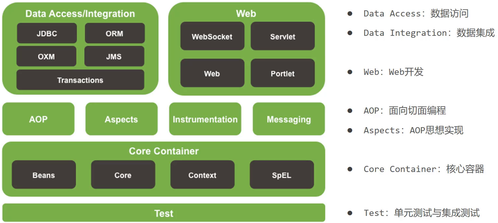
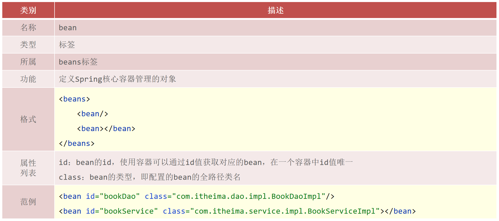
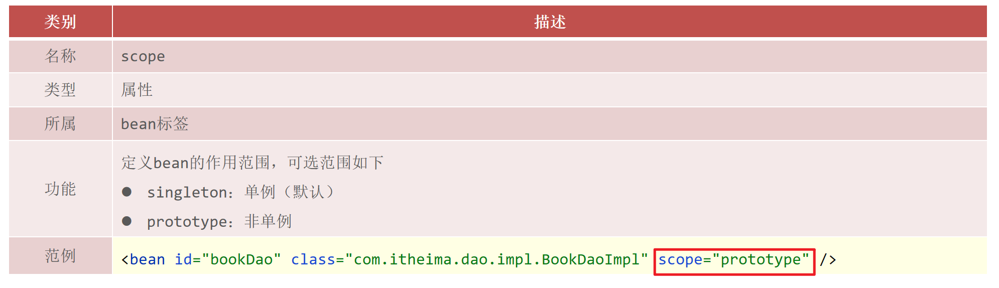
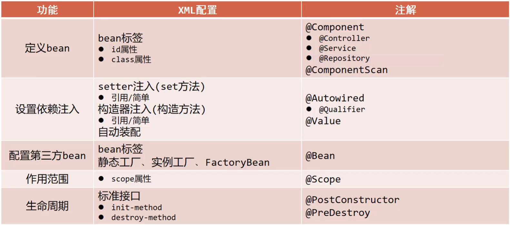

## SSM笔记

## 1 Spring


官网：https://spring.io，

* Spring Framework:Spring框架，是Spring中最早最核心的技术，也是所有其他技术的基础。
* SpringBoot:Spring是来简化开发，而SpringBoot是来帮助Spring在简化的基础上能更快速进行开发。
* SpringCloud:这个是用来做分布式之微服务架构的相关开发。

Spring狭义上指的是==Spring Framework==

### 1.1 Spring Framework



(1)核心层

* Core Container:核心容器，这个模块是Spring最核心的模块，其他的都需要依赖该模块

(2)AOP层

* AOP:面向切面编程，它依赖核心层容器，目的是==在不改变原有代码的前提下对其进行功能增强==
* Aspects:AOP是思想,Aspects是对AOP思想的具体实现

(3)数据层

* Data Access:数据访问，Spring全家桶中有对数据访问的具体实现技术
* Data Integration:数据集成，Spring支持整合其他的数据层解决方案，比如Mybatis
* Transactions:事务，Spring中事务管理是Spring AOP的一个具体实现，也是后期学习的重点内容

(4)Web层

* 这一层的内容将在SpringMVC框架具体学习

(5)Test层

* Spring主要整合了Junit来完成单元测试和集成测试

### 1.2 IOC / DI

#### 1.2.1 介绍

1. ==IOC（Inversion of Control）控制反转==

(1)什么是控制反转？

* 使用对象时，由主动new产生对象转换为由==外部==提供对象，此过程中对象创建控制权由程序转移到外部
  此思想称为IOC，控制反转。
  * 业务层要用数据层的类对象，现在不new了，交给`[外部]`来创建对象
  * `[外部]`就反转控制了数据层对象的创建权

(2)Spring和IOC之间的关系

* Spring技术对IOC思想进行了实现
* Spring提供了一个容器，称为==IOC容器==，用来充当IOC思想中的"外部"

(3)IOC容器的作用

* IOC容器负责对象的创建、初始化等一系列工作，其中包含了数据层和业务层的类对象
* 被创建或被管理的对象在IOC容器中统称为==Bean==
* IOC容器中放的就是一个个的Bean对象

2. ==DI（Dependency Injection）依赖注入==

在容器中建立bean与bean之间的依赖关系的整个过程，称为依赖注入
* 业务层（service）对象要用数据层（dao）的类对象才能工作
* 以前靠new，现在靠`[外部，即IOC容器]`来给注入进来
* 这种思想就是依赖注入，它是IOC思想的具体实现

> 这两个概念的最终目标就是:==充分解耦==，具体实现靠:
> * 使用IOC容器管理bean（IOC)
> * 在IOC容器内将有依赖关系的bean进行关系绑定（DI）
>
> 最终结果：使用对象时不仅可以直接从IOC容器中获取，并且获取到的bean已经绑定了所有的依赖关系.

#### 1.2.2 IOC实现

**步骤1:创建Maven项目**

**步骤2:添加Spring的依赖jar包**

pom.xml

```xml
    <dependency>
        <groupId>org.springframework</groupId>
        <artifactId>spring-context</artifactId>
        <version>5.2.10.RELEASE</version>
    </dependency>
```

**步骤3:添加案例中需要的类**

```java
public interface BookDao {
    public void save();
}
public class BookDaoImpl implements BookDao {
    public void save() {
        System.out.println("book dao save ...");
    }
}

public interface BookService {
    public void save();
}
public class BookServiceImpl implements BookService {
    private BookDao bookDao = new BookDaoImpl();
    public void save() {
        System.out.println("book service save ...");
        bookDao.save();
    }
}
```

**步骤4:添加spring配置文件**

**采用构造方法实例化**
resources下添加spring配置文件，选择XML Configuration File，名称为applicationContext.xml，并完成bean的配置

```xml
<bean id="bookDao" class="com.itheima.dao.impl.BookDaoImpl"/>
<bean id="bookService" class="com.itheima.service.impl.BookServiceImpl"/>
```

==注意事项：bean定义时id属性在同一个上下文中(配置文件)不能重复==

**步骤5:获取IOC容器**

使用Spring提供的接口完成IOC容器的创建，创建App类，编写main方法

```java
public class App {
    public static void main(String[] args) {
        //获取IOC容器
		ApplicationContext ctx = new ClassPathXmlApplicationContext("applicationContext.xml"); 
    }
}
```

**步骤6:从容器中获取对象进行方法调用**

```java
public class App {
    public static void main(String[] args) {
        //获取IOC容器
		ApplicationContext ctx = new ClassPathXmlApplicationContext("applicationContext.xml"); 
        
        BookDao bookDao = (BookDao) ctx.getBean("bookDao");
        bookDao.save();
        BookService bookService = (BookService) ctx.getBean("bookService");
        bookService.save();
    }
}
```

#### 1.2.3 DI实现

**步骤1: 去除代码中的new，为属性提供setter方法**

```java
public class BookServiceImpl implements BookService {
    //删除业务层中使用new的方式创建的dao对象
    private BookDao bookDao;

    public void save() {
        System.out.println("book service save ...");
        bookDao.save();
    }
    //提供对应的set方法
    public void setBookDao(BookDao bookDao) {
        this.bookDao = bookDao;
    }
}

```

**步骤2:修改配置完成注入**

在配置文件中添加依赖注入的配置

```xml
	<bean id="bookDao" class="com.itheima.dao.impl.BookDaoImpl"/>

    <bean id="bookService" class="com.itheima.service.impl.BookServiceImpl">
        
        <!--配置server与dao的关系-->
        <property name="bookDao" ref="bookDao"/>
    </bean>
```

==注意:配置中的两个bookDao的含义是不一样的==

* name="bookDao"中`bookDao`的作用是让Spring的IOC容器在获取到名称后，将首字母大写，前面加set找对应的`setBookDao()`方法
* ref="bookDao"中`bookDao`的作用是让Spring能在IOC容器中找到id为`bookDao`的Bean对象
* 找到set方法和Bean对象后，由Spring调用方法注入Bean对象

### 1.3 Bean

#### 1.3.1 bean基础配置

对于bean的基础配置，id，class

```
<bean id="" class=""/>
```



**name：配置别名**

```xml
<!--name:为bean指定别名，别名可以有多个，使用逗号，分号，空格进行分隔-->
<bean id="bookService" name="service service4 bookEbi"
	  class="com.itheima.service.impl.BookServiceImpl">
	<property name="bookDao" ref="bookDao"/>
</bean>
```

**scope：指定单列**



#### 1.3.2 bean的创建

##### 1）构造方法实例化

```java
public class BookDaoImpl implements BookDao {
    public BookDaoImpl(int i) {
        System.out.println("book dao constructor is running ....");
    }
    public void save() {
        System.out.println("book dao save ...");
    }

}
```

运行程序，

程序会报错，说明Spring底层使用的是类的无参构造方法。

> 无构造方法时，系统自带无参构造方法
> 有构造方法时，系统不提供无参构造，需要自己设计

##### 2）静态工厂实例化

创建一个工厂类OrderDaoFactory并提供一个==静态方法==

```java
//静态工厂创建对象
public class OrderDaoFactory {
    public static OrderDao getOrderDao(){
        return new OrderDaoImpl();
    }
}
```

在spring的配置文件application.properties中添加以下内容:

```xml
<bean id="orderDao" class="com.itheima.factory.OrderDaoFactory" factory-method="getOrderDao"/>
```

class:工厂类的类全名

factory-mehod:具体工厂类中创建对象的方法名

##### 3）实例工厂实例化

创建一个工厂类OrderDaoFactory并提供一个普通方法
注意此处方法不是静态方法

```java
public class UserDaoFactory {
    public UserDao getUserDao(){
        return new UserDaoImpl();
    }
}
```

在spring的配置文件中添加以下内容:

```xml
<bean id="userFactory" class="com.itheima.factory.UserDaoFactory"/>
<bean id="userDao" factory-method="getUserDao" factory-bean="userFactory"/>
```

实例化工厂运行的顺序是:

* 创建实例化工厂对象,对应的是第一行配置
* 调用对象中的方法来创建bean，对应的是第二行配置

  * factory-bean:工厂的实例对象

  * factory-method:工厂对象中的具体创建对象的方法名

##### 4）FactoryBean

对**实例工厂实例化**的优化

创建一个UserDaoFactoryBean的类，实现FactoryBean接口，重写接口的方法

```java
public class UserDaoFactoryBean implements FactoryBean<UserDao> {
    //代替原始实例工厂中创建对象的方法
    public UserDao getObject() throws Exception {
        return new UserDaoImpl();
    }
    //返回所创建类的Class对象
    public Class<?> getObjectType() {
        return UserDao.class;
    }
    //指定是否是单列（可不写，默认为单例）
    public boolean isSingleton() {
        return true;
    }
}
```

在Spring的配置文件中进行配置

```xml
<bean id="userDao" class="com.itheima.factory.UserDaoFactoryBean"/>
```

#### 1.3.3 bean的生命周期

##### 1）生命周期

1. 添加初始化和销毁方法

我们在BooDaoImpl类中分别添加两个方法，==方法名任意==

```java
public class BookDaoImpl implements BookDao {
    public void save() {
        System.out.println("book dao save ...");
    }
    //表示bean初始化对应的操作
    public void init(){
        System.out.println("init...");
    }
    //表示bean销毁前对应的操作
    public void destory(){
        System.out.println("destory...");
    }
}
```

2. 配置生命周期

在配置文件添加配置，如下:

```xml
<bean id="bookDao" class="com.itheima.dao.impl.BookDaoImpl" init-method="init" destroy-method="destory"/>
```

3. 运行程序

init方法执行了，但是destroy方法却未执行

##### 2）close容器

* ApplicationContext中没有close方法

* 需要将ApplicationContext更换成ClassPathXmlApplicationContext

  ```java
  ClassPathXmlApplicationContext ctx = new 
      ClassPathXmlApplicationContext("applicationContext.xml");
  ```

* 调用ctx的close()方法

  ```
  ctx.close();
  ```

* 运行程序，就能执行destroy方法的内容

##### 3）注册钩子关闭容器

* 在容器未关闭之前，提前设置好回调函数，让JVM在退出之前回调此函数来关闭容器

* 调用ctx的registerShutdownHook()方法

  ```
  ctx.registerShutdownHook();
  ```

  **注意:**ApplicationContext中也没有此方法

相同点:这两种都能用来关闭容器

不同点:close()是在调用的时候关闭，registerShutdownHook()是在JVM退出前调用关闭。

##### 4）生命周期的控制

Spring提供了两个接口来完成生命周期的控制

添加两个接口`InitializingBean`， `DisposableBean`并实现接口中的两个方法`afterPropertiesSet`和`destroy`

```java
public class BookServiceImpl implements BookService, InitializingBean, DisposableBean {
   //其他方法
    public void destroy() throws Exception {
        System.out.println("service destroy");
    }
    public void afterPropertiesSet() throws Exception {
        System.out.println("service init");
    }
}
```

### 1.4 依赖注入

#### 1.4.1 setter注入

引用数据类型注入，为bean的依赖注入，前面有

简单类型

在BookDaoImpl类中声明对应的简单数据类型的属性,并提供对应的setter方法

```java
public class BookDaoImpl implements BookDao {

    private String databaseName;
    private int connectionNum;

    //set方法
    
    public void save() {
        System.out.println("book dao save ..."+databaseName+","+connectionNum);
    }
}
```

在applicationContext.xml配置文件中使用property标签注入

```xml
	<bean id="bookDao" class="com.itheima.dao.impl.BookDaoImpl">
        <property name="databaseName" value="mysql"/>
     	<property name="connectionNum" value="10"/>
    </bean>
```

引用数据是`ref`，简单数据是`value`

#### 1.4.2 构造器注入

##### 引用数据类型

在BookServiceImpl类中添加带有bookDao参数的构造方法

```java
public class BookServiceImpl implements BookService{
    private BookDao bookDao;
    private UserDao userDao;

    public BookServiceImpl(BookDao bookDao,UserDao userDao) {
        this.bookDao = bookDao;
        this.userDao = userDao;
    }

    public void save() {
        System.out.println("book service save ...");
        bookDao.save();
        userDao.save();
    }
}
```

在applicationContext.xml中配置

```xml
	<bean id="bookDao" class="com.itheima.dao.impl.BookDaoImpl"/>
    <bean id="userDao" class="com.itheima.dao.impl.UserDaoImpl"/>
    <bean id="bookService" class="com.itheima.service.impl.BookServiceImpl">
        <constructor-arg name="bookDao" ref="bookDao"/>
        <constructor-arg name="userDao" ref="userDao"/>
    </bean>
```

标签\<constructor-arg>中

* name属性对应的值为构造函数中方法形参的参数名，必须要保持一致。

* ref属性指向的是spring的IOC容器中其他bean对象。

##### 简单数据类型注入

修改BookDaoImpl类，添加构造方法

```java
public class BookDaoImpl implements BookDao {
    private String databaseName;
    private int connectionNum;

    public BookDaoImpl(String databaseName, int connectionNum) {
        this.databaseName = databaseName;
        this.connectionNum = connectionNum;
    }

    public void save() {
        System.out.println("book dao save ..."+databaseName+","+connectionNum);
    }
}
```

```xml
	<bean id="bookDao" class="com.itheima.dao.impl.BookDaoImpl">
        <constructor-arg name="databaseName" value="mysql"/>
        <constructor-arg name="connectionNum" value="666"/>
    </bean>
```

#### 1.4.3 自动装配

对setter注入更改
自动装配用于引用类型依赖注入，不能对简单类型进行操作

```xml
	<bean id="bookDao" class="com.itheima.dao.impl.BookDaoImpl"/>
    <bean id="bookService" class="com.itheima.service.impl.BookServiceImpl">
        <property name="bookDao" ref="bookDao"/>
    </bean>
```

(1)将`<property>`标签删除

(2)在`<bean>`标签中添加autowire属性

**按照类型注入**

```xml
	<bean id="bookDao" class="com.itheima.dao.impl.BookDaoImpl"/>
    <!--autowire属性：开启自动装配，通常使用按类型装配-->
    <bean id="bookService" class="com.itheima.service.impl.BookServiceImpl" autowire="byType"/>
```

==注意事项:==

* 需要注入属性的类中对应属性的setter方法不能省略
* 被注入的对象必须要被Spring的IOC容器管理
* 按照类型在Spring的IOC容器中如果找到多个对象，会报`NoUniqueBeanDefinitionException`

**按照名称注入**

```xml
	<bean id="bookDao" class="com.itheima.dao.impl.BookDaoImpl"/>
    <!--autowire属性：开启自动装配，通常使用按类型装配-->
    <bean id="bookService" class="com.itheima.service.impl.BookServiceImpl" autowire="byName"/>
```

按照名称注入中的名称指的是 id="bookDao"

> 1. 自动装配用于引用类型依赖注入，不能对简单类型进行操作
> 2. 使用按类型装配时（byType）必须保障容器中相同类型的bean唯一，推荐使用
> 3. 自动装配优先级低于setter注入与构造器注入，同时出现时自动装配配置失效

#### 1.4.4 集合注入

**1）注入数组类型数据**

```xml
<property name="array">
    <array>
        <value>100</value>
        <value>200</value>
        <value>300</value>
    </array>
</property>
```

**2）注入List类型数据**

```xml
<property name="list">
    <list>
        <value>itcast</value>
        <value>itheima</value>
        <value>boxuegu</value>
    </list>
</property>
```

**3）注入Set类型数据**

```xml
<property name="set"><!--会自动过滤相同项 -->
    <set>
        <value>itcast</value>
        <value>itheima</value>
        <value>boxuegu</value>
    </set>
</property>
```

**4）注入Map类型数据**

```xml
<property name="map">
    <map>
        <entry key="country" value="china"/>
        <entry key="province" value="henan"/>
        <entry key="city" value="kaifeng"/>
    </map>
</property>
```

**5）注入Properties类型数据**

```xml
<property name="properties">
    <props>
        <prop key="country">china</prop>
        <prop key="province">henan</prop>
        <prop key="city">kaifeng</prop>
    </props>
</property>
```

### 1.5 配置管理第三方Bean

**环境准备**

* pom.xml添加依赖

  ```xml
  <dependencies>
      <dependency>
          <groupId>org.springframework</groupId>
          <artifactId>spring-context</artifactId>
          <version>5.2.10.RELEASE</version>
      </dependency>
  </dependencies>
  ```

* resources下添加spring的配置文件applicationContext.xml

#### 1.5.1 实现Druid管理

**步骤1:导入`druid`的依赖**

pom.xml中添加依赖

```xml
<dependency>
    <groupId>com.alibaba</groupId>
    <artifactId>druid</artifactId>
    <version>1.1.16</version>
</dependency>
```

**步骤2:配置第三方bean**

在applicationContext.xml配置文件中添加`DruidDataSource`的配置

```xml
<?xml version="1.0" encoding="UTF-8"?>
<beans xmlns="http://www.springframework.org/schema/beans"
       xmlns:xsi="http://www.w3.org/2001/XMLSchema-instance"
       xsi:schemaLocation="
            http://www.springframework.org/schema/beans
            http://www.springframework.org/schema/beans/spring-beans.xsd">
	<!--管理DruidDataSource对象-->
    <bean id="dataSource" class="com.alibaba.druid.pool.DruidDataSource">
        <property name="driverClassName" value="com.mysql.jdbc.Driver"/>
        <property name="url" value="jdbc:mysql://localhost:3306/spring_db"/>
        <property name="username" value="root"/>
        <property name="password" value="root"/>
    </bean>
</beans>
```

**说明:**

* driverClassName:数据库驱动
* url:数据库连接地址
* username:数据库连接用户名
* password:数据库连接密码
* 数据库连接的四要素要和自己使用的数据库信息一致。

**步骤3:从IOC容器中获取对应的bean对象**

```java
public class App {
    public static void main(String[] args) {
       ApplicationContext ctx = new ClassPathXmlApplicationContext("applicationContext.xml");
       DataSource dataSource = (DataSource) ctx.getBean("dataSource");
       System.out.println(dataSource);
    }
}
```

#### 1.5.2 加载properties文件

**步骤1:准备properties配置文件**

resources下创建一个jdbc.properties文件,并添加对应的属性键值对

```properties
jdbc.driver=com.mysql.jdbc.Driver
jdbc.url=jdbc:mysql://127.0.0.1:3306/spring_db
jdbc.username=root
jdbc.password=root
```

**步骤2:开启`context`命名空间**

在applicationContext.xml中开`context`命名空间，加入

```xml
<beans 
       xmlns:context="http://www.springframework.org/schema/context"
       xsi:schemaLocation="
            http://www.springframework.org/schema/context
            http://www.springframework.org/schema/context/spring-context.xsd">
</beans>
```

**步骤3:加载properties配置文件**

在配置文件中使用`context`命名空间下的标签来加载properties配置文件

```xml
<context:property-placeholder location="jdbc.properties"/>
```

**步骤4:完成属性注入**

使用`${key}`来读取properties配置文件中的内容并完成属性注入

```xml
<?xml version="1.0" encoding="UTF-8"?>
<beans xmlns="http://www.springframework.org/schema/beans"
       xmlns:xsi="http://www.w3.org/2001/XMLSchema-instance"
       xmlns:context="http://www.springframework.org/schema/context"
       xsi:schemaLocation="
            http://www.springframework.org/schema/beans
            http://www.springframework.org/schema/beans/spring-beans.xsd
            http://www.springframework.org/schema/context
            http://www.springframework.org/schema/context/spring-context.xsd">
    
    <context:property-placeholder location="jdbc.properties"/>
    <bean id="dataSource" class="com.alibaba.druid.pool.DruidDataSource">
        <property name="driverClassName" value="${jdbc.driver}"/>
        <property name="url" value="${jdbc.url}"/>
        <property name="username" value="${jdbc.username}"/>
        <property name="password" value="${jdbc.password}"/>
    </bean>
</beans>
```

#### 1.5.3 注意事项

**问题一**:键值对的key为`username`引发的问题

1.在properties中配置键值对的时候，如果key设置为`username`

```
username=root666
```

2.在applicationContext.xml注入该属性

```xml
    <bean id="bookDao" class="com.itheima.dao.impl.BookDaoImpl">
        <property name="name" value="${username}"/>
    </bean>
```

3.运行后，在控制台打印的却不是`root666`，而是自己电脑的用户名

> 原因：`<context:property-placeholder/>`标签会优先加载系统的环境变量

解决方法：加上`system-properties-mode="NEVER"`,表示不加载系统属性

```xml
<context:property-placeholder location="jdbc.properties" 
system-properties-mode="NEVER"/>
```

另一个解决方案就是避免使用`username`作为属性的`key`。

**问题二**:当有多个properties配置文件需要被加载，该如何配置?

```xml
    <!--方式一 -->
    <context:property-placeholder location="jdbc.properties, jdbc2.properties" 
system-properties-mode="NEVER"/>
    <!--方式二，所有以properties结尾的文件都会被加载-->
    <context:property-placeholder location="*.properties" 
system-properties-mode="NEVER"/>
    <!--方式三，标准的写法，`classpath:`代表的是从根路径下开始查找 -->
    <context:property-placeholder location="classpath:*.properties" 
system-properties-mode="NEVER"/>
    <!--方式四，最全面，可以加载所依赖的所有项目的根路径下的properties配置文件-->
    <context:property-placeholder location="classpath*:*.properties" 
system-properties-mode="NEVER"/>
```

### 1.6 容器

Bean的三种获取方式

```java
BookDao bookDao = (BookDao) ctx.getBean("bookDao");
```

```
BookDao bookDao = ctx.getBean("bookDao"，BookDao.class);
```

```
BookDao bookDao = ctx.getBean(BookDao.class);
```

### 1.7 注解开发



#### 1.7.1 bean的自定义开发

**步骤1:删除原XML配置**

将配置文件中的`<bean>`标签删除掉

```xml
<bean id="bookDao" class="com.itheima.dao.impl.BookDaoImpl"/>
```

**步骤2:Service上添加注解**

在BookServiceImpl类上添加`@Component`注解

```java
@Component("bookServiceImpl")
public class BookServiceImpl implements BookService {
    //方法
}
```

==注意:@Component注解不可以添加在接口上，因为接口是无法创建对象的。==

**步骤3:配置Spring的注解包扫描**

为了让Spring框架能够扫描到写在类上的注解，需要在配置文件上进行包扫描

```xml
<beans>
    <context:component-scan base-package="com.itheima"/>
</beans>
```

**说明:**

component-scan

* component:组件,Spring将管理的bean视作自己的一个组件
* scan:扫描

base-package指定Spring框架扫描的包路径，它会扫描指定包及其子包中的所有类上的注解。

* 包路径越多[如:com.itheima.dao.impl]，扫描的范围越小速度越快
* 包路径越少[如:com.itheima],扫描的范围越大速度越慢
* 一般扫描到项目的组织名称即Maven的groupId下[如:com.itheima]即可。

**步骤4:运行程序**

@Component注解如果不起名称，会有一个默认值就是`当前类名首字母小写`，也可以按照名称获取

```java
//按名称获取bean
BookService bookService = (BookService)ctx.getBean("bookServiceImpl");
System.out.println(bookService);
//按类型获取bean
BookService bookService = ctx.getBean(BookService.class);
System.out.println(bookService);
```

>对于@Component注解，还衍生出了其他三个注解`@Controller`、`@Service`、`@Repository`
>
>表现层(Controller)：@Controller
>
>业务层(Service)：@Service
>
>数据层(Dao)：@Repository

#### 1.7.2 纯注解开发

不使用``applicationContext.xml`

**步骤1:创建配置类**

创建一个配置类`SpringConfig`

```java
public class SpringConfig {
}

```

**步骤2:标识该类为配置类**

在配置类上添加`@Configuration`注解，将其标识为一个配置类,替换`applicationContext.xml`

```java
@Configuration
public class SpringConfig {
}
```

**步骤3:用注解替换包扫描配置**

在配置类上添加包扫描注解`@ComponentScan`替换`<context:component-scan base-package=""/>`

```java
@Configuration
@ComponentScan("com.itheima")
public class SpringConfig {
}
```

**步骤4:创建运行类并执行**

创建一个新的运行类`AppForAnnotation`

```java
public class AppForAnnotation {

    public static void main(String[] args) {
        ApplicationContext ctx = new AnnotationConfigApplicationContext(SpringConfig.class);
    }
}
```

**知识点1**：@Scope

| 名称 | @Scope                                                       |
| ---- | ------------------------------------------------------------ |
| 类型 | 类注解                                                       |
| 位置 | 类定义上方                                                   |
| 作用 | 设置该类创建对象的作用范围<br/>可用于设置创建出的bean是否为单例对象 |
| 属性 | value（默认）：定义bean作用范围，<br/>==默认值singleton（单例），可选值prototype（非单例）==
例子：@Scope("prototype") |

**知识点2**：Bean的生命周期

在BookDaoImpl中添加两个方法，`init`和`destroy`,方法名可以任意
只需要在对应的方法上添加`@PostConstruct`和`@PreDestroy`注解即可。

```java
@Repository
public class BookDaoImpl implements BookDao {
    public void save() {
        System.out.println("book dao save ...");
    }
    @PostConstruct //在构造方法之后执行，替换 init-method
    public void init() {
        System.out.println("init ...");
    }
    @PreDestroy //在销毁方法之前执行,替换 destroy-method
    public void destroy() {
        System.out.println("destroy ...");
    }
}

```

需要注意`destroy`只有在容器关闭的时候，才会执行

添加上：`ctx.close(); //关闭容器`

==**注意:**@PostConstruct和@PreDestroy注解如果找不到，需要导入下面的jar包==

```java
<dependency>
  <groupId>javax.annotation</groupId>
  <artifactId>javax.annotation-api</artifactId>
  <version>1.3.2</version>
</dependency>
```

#### 1.7.3 依赖注入（注解）

**1) bean类型注入**

```java
@Service
public class BookServiceImpl implements BookService {
    @Autowired
    private BookDao bookDao;
    
//	  public void setBookDao(BookDao bookDao) {
//        this.bookDao = bookDao;
//    }
    public void save() {
        System.out.println("book service save ...");
        bookDao.save();
    }
}
```

**注意:**

* @Autowired可以写在属性上，也可也写在setter方法上，最简单的处理方式是`写在属性上并将setter方法删除掉`
* 若对应BookDao接口如果有多个实现类，先给实现类起别名@Repository`("bookDao1")`
  在注入的地方添加上`@Qualifier("bookDao1")`
  @Qualifier不能独立使用，必须和@Autowired一起使用

**2）简单数据类型注入**

使用`@Value`注解，将值写入注解的参数中就行了

```java
@Repository("bookDao")
public class BookDaoImpl implements BookDao {
    
    @Value("itheima")
    private String name;
    
    public void save() {
        System.out.println("book dao save ..." + name);
    }
}
```

**3）注解读取properties配置文件**

1. resource下准备properties文件

jdbc.properties

```properties
name=itheima888
```

2. 使用注解加载properties配置文件

在配置类上添加`@PropertySource`注解

```java
@Configuration
@ComponentScan("com.itheima")
@PropertySource("jdbc.properties")
public class SpringConfig {
}

```

3. 使用@Value读取配置文件中的内容

```java
@Repository("bookDao")
public class BookDaoImpl implements BookDao {
    @Value("${name}")
    private String name;
    public void save() {
        System.out.println("book dao save ..." + name);
    }
}
```

**注意:**

* 如果读取的properties配置文件有多个，可以使用`@PropertySource`的属性来指定多个

  ```java
  @PropertySource({"jdbc.properties","jdbc2.properties"})
  ```

* `@PropertySource`注解属性中不支持使用通配符`*`,运行会报错

  ```java
  @PropertySource({"*.properties"})
  ```

* `@PropertySource`注解属性中可以把`classpath:`加上,代表从当前项目的根路径找文件

  ```java
  @PropertySource({"classpath:jdbc.properties"})
  ```

### 1.8 注解管理第三方bean

#### 1.8.1 步骤

1. 导入对应的jar包

```xml
<dependency>
    <groupId>com.alibaba</groupId>
    <artifactId>druid</artifactId>
    <version>1.1.16</version>
</dependency>
```

2. 在配置类中添加一个方法

注意该方法的返回值就是要创建的Bean对象类型

```java
@Configuration
public class SpringConfig {
    public DataSource dataSource(){
        DruidDataSource ds = new DruidDataSource();
        ds.setDriverClassName("com.mysql.jdbc.Driver");
        ds.setUrl("jdbc:mysql://localhost:3306/spring_db");
        ds.setUsername("root");
        ds.setPassword("root");
        return ds;
    }
}
```

3. 在DataSource方法上添加`@Bean`注解

@Bean注解的作用是将方法的返回值制作为Spring管理的一个bean对象

4. 从IOC容器中获取对象并打印

```java
public class App {
    public static void main(String[] args) {
        AnnotationConfigApplicationContext ctx = new AnnotationConfigApplicationContext(SpringConfig.class);
        DataSource dataSource = ctx.getBean(DataSource.class);
        System.out.println(dataSource);
    }
}
```

#### 1.8.2 引入外部配置类

如果把所有的第三方bean都配置到Spring的配置类`SpringConfig`中，不利于代码阅读和分类管理

对于数据源的bean,我们新建一个`JdbcConfig`配置类，并把数据源配置到该类下。

```java
@Configuration
public class JdbcConfig {
	@Bean
    public DataSource dataSource(){
        DruidDataSource ds = new DruidDataSource();
        //set方法
        return ds;
    }
}
```

**Spring配置类加载JdbcConfig**

**方法1**：使用包扫描引入

在Spring的配置类上添加包扫描

```java
@Configuration
@ComponentScan("com.itheima.config")
public class SpringConfig {
}
```

JdbcConfig类要放入到`com.itheima.config`包下

**方法2**：使用`@Import`引入

JdbcConfig类去除@Configuration注解

在Spring配置类中引入

```java
@Configuration
@Import({JdbcConfig.class})
public class SpringConfig {
}
```

注意：

* @Import注解在配置类中只能写一次

* @Import参数需要的是一个数组，可以引入多个配置类。

  `@Import({JdbcConfig.class,jdbcConfig2.class})`

#### 1.8.3 为第三方bean注入资源

**1）简单数据类型**

原代码

```java
public class JdbcConfig {	
	@Bean
	public DataSource dataSource(){
        DruidDataSource ds = new DruidDataSource();
        ds.setDriverClassName("com.mysql.jdbc.Driver");
        ds.setUrl("jdbc:mysql://localhost:3306/spring_db");
    	//其他方法
    }
}
```

数据库的四要素不应该写死在代码

可使用`@Value`注解引入值

```java
public class JdbcConfig {	
	@Value("com.mysql.jdbc.Driver")
    private String driver;
    @Value("jdbc:mysql://localhost:3306/spring_db")
    private String url;
    //其他方法
    @Bean
    public DataSource dataSource(){
        DruidDataSource ds = new DruidDataSource();
        ds.setDriverClassName(driver);
        ds.setUrl(url);
        //其他方法
}
```

注入jdbc.properties配置文件的数据

> 1.resources目录下添加jdbc.properties
>
> 2.配置文件中提供四个键值对分别是数据库的四要素
>
> 3.使用@PropertySource加载jdbc.properties配置文件
>
> 4.修改@Value注解属性的值，将其修改为`${key}`，key就是键值对中的键的值

**2）引用数据类型**

构建DataSource对象的时候，如果需要用到BookDao对象

1. 在SpringConfig中扫描BookDao

```java
@Configuration
//扫描的目的是让Spring能管理到BookDao,也就是说要让IOC容器中有一个bookDao对象
@ComponentScan("com.itheima.dao")
@Import({JdbcConfig.class})
public class SpringConfig {
}
```

2. 在JdbcConfig类的方法上添加参数

```java
@Bean
public DataSource dataSource(BookDao bookDao){
    System.out.println(bookDao);
    //其他方法
    return ds;
}
```

==引用类型注入只需要为bean定义方法设置形参即可，容器会根据类型自动装配对象。==

### 1.9 Spring整合

#### **mybatis**

pom.xml

```xml
<dependency>
    <!--Spring操作数据库需要该jar包-->
    <groupId>org.springframework</groupId>
    <artifactId>spring-jdbc</artifactId>
    <version>5.2.10.RELEASE</version>
</dependency>
<dependency>
    <!--
		Spring与Mybatis整合的jar包
		这个jar包mybatis在前面，是Mybatis提供的
	-->
    <groupId>org.mybatis</groupId>
    <artifactId>mybatis-spring</artifactId>
    <version>1.3.0</version>
</dependency>
```

原配置

```xml
<configuration>
    <!--读取外部properties配置文件-->
    <properties resource="jdbc.properties"></properties>
    <!--别名扫描的包路径-->
    <typeAliases>
        <package name="com.itheima.domain"/>
    </typeAliases>
    <!--数据源-->
    <environments default="mysql">
        <environment id="mysql">
            <transactionManager type="JDBC"></transactionManager>
            <dataSource type="POOLED">
                <property name="driver" value="${jdbc.driver}"></property>
                <property name="url" value="${jdbc.url}"></property>
                <property name="username" value="${jdbc.username}"></property>
                <property name="password" value="${jdbc.password}"></property>
            </dataSource>
        </environment>
    </environments>
    <!--映射文件扫描包路径-->
    <mappers>
        <package name="com.itheima.dao"></package>
    </mappers>
</configuration>
```

转化为

```java
public class MybatisConfig {
    //定义bean，SqlSessionFactoryBean，用于产生SqlSessionFactory对象
    @Bean
    public SqlSessionFactoryBean sqlSessionFactory(DataSource dataSource){
        SqlSessionFactoryBean ssfb = new SqlSessionFactoryBean();
        //设置模型类的别名扫描
        ssfb.setTypeAliasesPackage("com.itheima.domain");
        //设置数据源
        ssfb.setDataSource(dataSource);
        return ssfb;
    }
    //定义bean，返回MapperScannerConfigurer对象
    @Bean
    public MapperScannerConfigurer mapperScannerConfigurer(){
        MapperScannerConfigurer msc = new MapperScannerConfigurer();
        msc.setBasePackage("com.itheima.dao");
        return msc;
    }
}
```

#### **JUnit**

pom.xml

```xml
<dependency>
    <groupId>junit</groupId>
    <artifactId>junit</artifactId>
    <version>4.12</version>
    <scope>test</scope>
</dependency>

<dependency>
    <groupId>org.springframework</groupId>
    <artifactId>spring-test</artifactId>
    <version>5.2.10.RELEASE</version>
</dependency>
```

test目录下

```java
//设置类运行器
@RunWith(SpringJUnit4ClassRunner.class)
//设置Spring环境对应的配置类
@ContextConfiguration(classes = {SpringConfiguration.class}) //加载配置类
//@ContextConfiguration(locations={"classpath:applicationContext.xml"})//加载配置文件
public class AccountServiceTest {
    //支持自动装配注入bean
    @Autowired
    private AccountService accountService;
    @Test
    public void testFindById(){
        System.out.println(accountService.findById(1));

    }
    @Test
    public void testFindAll(){
        System.out.println(accountService.findAll());
    }
}
```

## 2 AOP

### 2.1 概念

* 连接点(JoinPoint)：程序执行过程中的任意位置，粒度为执行方法、抛出异常、设置变量等
  * 在SpringAOP中，理解为需要执行的方法
* 切入点(Pointcut):匹配连接点的式子
  * 在SpringAOP中，指**需要增强的方法**
* 通知(Advice):在切入点处执行的操作，也就是共性功能
  * 在SpringAOP中，指**存放共性功能的方法**
* 通知类：定义通知的类
* 切面(Aspect):描述通知与切入点的对应关系。

### 2.2 入门案例