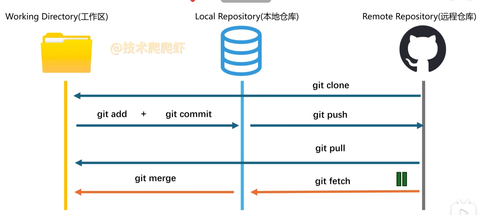

git笔记

 `git init` ：对文件夹进行git初始化，让它由git管理

`.gitignore`文件：使某个文件不被git管理

```
secret.txt          # 忽略任意目录下的 secret.txt
/secret.txt         # 只忽略仓库根目录下的 secret.txt
logs/               # 忽略整个 logs 目录
*.log               # 忽略所有 .log 文件
!important.log      # 不忽略 important.log
```

1. 已跟踪文件加入gitignore

`.gitignore` 对已跟踪文件无效，要先从 Git 索引里移除，但保留本地文件：

```
git rm --cached secret.txt

# 如果是目录
git rm -r --cached logs/

# 然后加入忽略并提交
echo "secret.txt" >> .gitignore
git add .gitignore
git commit -m "停止跟踪 secret.txt"
```

2. 只想本地忽略，不想提交 `.gitignore`

```
找到 .git/info/exclude文件
```



`git clone`：将远端仓库保存在本地，并新建本地仓库

`git add`：将工作区提交到暂存区

`git commit`：将暂存区提交到本地仓库

`git push`：将本地仓库提交到远程仓库

`git pull`：将远程仓库拉取到工作区

`git merge`：将远程仓库拉取到本地仓库

`git getch`：将本地仓库拉取到工作区

|          | discard                  | reset                                  | revert                       |
| :------: | :----------------------- | :------------------------------------- | :--------------------------- |
| **行为** | 放弃还没commit的文件更改 | 把仓库强制回退到某个历史状态           | 生成反向commit抵消某次commit |
| **场景** | 未提交                   | **单人**使用的分支<br>还未提交远端仓库 | 多人协作的分支               |

### 命令速查表

| 目的                                               | 命令                                |
| -------------------------------------------------- | ----------------------------------- |
| 看工作区、暂存区状态                               | `git status`                        |
| 全部加入暂存区                                     | `git add -A\地址`                   |
| 提交                                               | `git commit [-m "说明信息"]`        |
| 上传                                               | `git push`                          |
| 拉取                                               | `git pull`                          |
| 查看commit历史                                     | `git log --oneline`                 |
| 比较工作区、暂存区<br />比较暂存区 、上一次 commit | `git diff`<br />`git diff --staged` |
| 丢弃改动                                           | `git restore 文件`                  |
| 换分支                                             | `git switch 分支名`                 |

**日常只记这四条：** `git status` → `git add -A` → `git commit -m "说明"` → `git push`

git log

- **按 `Q` 键（大写或小写均可）**：立刻退出日志界面，回到命令行。
- **按 `空格键` 或 `Page Down`**：向下翻一页。
- **按 `B` 键 或 `Page Up`**：向上翻一页。
- **输入 `/关键词` 后回车**：在日志里搜索，按 `N` 找下一个，`Shift+N` 找上一个。