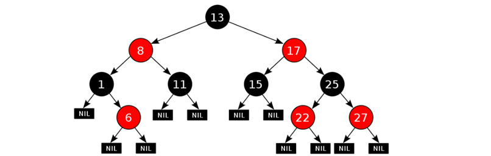
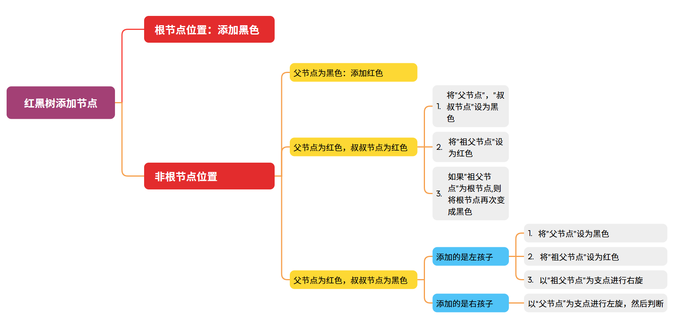

## javaSE笔记(中)

## 8 常见算法

### 8.1 查找算法

#### 8.1.1 顺序查找

也叫做基本查找

- 适用于存储结构为数组或者链表。

#### 8.1.2 二分查找

也叫做折半查找

- 元素必须是有序的，顺序或逆序。

```java
public static int binarySearch(int[] arr, int number){
    //定义两个变量记录要查找的范围
    int min = 0;
    int max = arr.length - 1;

    //利用循环不断的去找要查找的数据
    while((min > max){
        int mid = (min + max) / 2;
        
        if(arr[mid] > number){
            max = mid - 1;
        }else if(arr[mid] < number){
            min = mid + 1;
        }else{
            return mid;
        }
    }
	//如果没找到，返回-1
	return -1;
}
```
#### 8.1.3 插值查找

折半查找：mid=low	+	1/2	*(high-low);

插值查找：mid=low	+	(key-a[low])/(a[high]-a[low])	*(high-low)，

很少使用，仅了解

#### 8.1.4 斐波那契查找

斐波那契数列：1, 1, 2, 3, 5, 8, 13, 21, 34, 55, 89…….

随着斐波那契数列的递增，前后两个数的比值会越来越接近0.618，即黄金比例

斐波那契查找：mid=low	+	F(k-1) - 1

很少使用，仅了解

#### 8.1.5 分块查找 

分块查找的过程：

1. 把数据分成N小块，块与块之间数据不能重复。
2. 给每一块创建对象单独存储到数组当中
3. 查找数据：先在数组中 查找 数据属于哪一块，然后在块中顺序查找

block类存储块

```java
class Block{
    private int max;//最大值
    private int startIndex;//起始索引
    private int endIndex;//结束索引

	//构造函数
    public Block() {}

    public Block(int max, int startIndex, int endIndex) {
        this.max = max;
        this.startIndex = startIndex;
        this.endIndex = endIndex;
    }
    
    //max,startIndex,endIndex的get和set方法
    //getXxx{}，setXxx{}
    
    public String toString() {
        return "Block{max = " + max + ", startIndex = " + startIndex + ", endIndex = " + endIndex + "}";
    }
}
```

分块查找方法

```Java
    //分块查找 查询 number的索引
    private static int getIndex(Block[] blockArr, int[] arr, int number) {
        //1.确定number是在那一块当中
        int indexBlock = findIndexBlock(blockArr, number);

        if(indexBlock == -1){
            //表示number不在数组当中
            return -1;
        }

        //2.获取这一块的起始索引和结束索引   --- 30
        int startIndex = blockArr[indexBlock].getStartIndex();
        int endIndex = blockArr[indexBlock].getEndIndex();

        //3.遍历
        for (int i = startIndex; i <= endIndex; i++) {
            if(arr[i] == number){
                return i;
            }
        }
        return -1;
    }


    //确定number所在块
    public static int findIndexBlock(Block[] blockArr,int number){ //100

        //如果number小于max，表示number是在这一块当中的
        for (int i = 0; i < blockArr.length; i++) {
            if(number <= blockArr[i].getMax()){
                return i;
            }
        }
        return -1;
    }

```

### 8.2 排序算法

#### 8.2.1 冒泡排序

步骤：

1. 相邻的元素两两比较，大的放右边，小的放左边
2. 第一轮比较后，确定最大值，第二轮可以少循环一次，后面以此类推


```java
        //外循环：执行轮数
        for (int i = 0; i < arr.length - 1; i++) {
            //内循环：每一轮中比较数据并找到当前的最大值
            //-i：提高效率，每一轮执行的次数应该比上一轮少一次。
            for (int j = 0; j < arr.length - 1 - i; j++) {
                
                if(arr[j] > arr[j + 1]){
                    int temp = arr[j];
                    arr[j] = arr[j + 1];
                    arr[j + 1] = temp;
                }
            }
		}
```

#### 8.2.2 选择排序

1. 第一次循环从0索引开始，跟后面的元素一一比较，找到最小值
2. 第 i 次循环从 i - 1 索引开始，每次循环找到最小值，将其与开始索引交换


```java
        //外循环：几轮
        //i:表示这一轮中，哪个索引上的数据需要跟后面的数据进行比较并交换
        for (int i = 0; i < arr.length -1; i++) {
            //内循环：找出最小值
            int minIndex = i;
            for (int j = i + 1; j < arr.length; j++) {
                if(arr[j] < arr[minIndex]){
                    minIndex = j;
                }
            }
            //交换开始索引与最小值索引
            int temp = arr[i];
            arr[i] = arr[minIndex];
            arr[minIndex] = temp;
        }
```

#### 8.2.3 插入排序

1. 先进行判断，从0索引开始，到哪个索引开始无序
2. [0 , i - 1]上的值有序，[0 ,  i] 为无序
3. 将索引 i 的值在 [0 , i - 1]填入正确位置，使[0 , i]上的值有序


```java
        //1.找到无序的哪一组数组是从哪个索引开始的。
        int startIndex = -1;
        for (int i = 0; i < arr.length; i++) {
            if(arr[i] > arr[i + 1]){
                startIndex = i + 1;
                break;
            }
        }

        //2.从startIndx开始，将后面的元素逐次加入到前面的有序数组里
        for (int i = startIndex; i < arr.length; i++) {

            //记录当前要插入数据的索引
            int j = i;

            //将 j 不断向前比较交换，直到填入对应的位置停止
            while(j > 0 && arr[j] < arr[j - 1]){
                int temp = arr[j];
                arr[j] = arr[j - 1];
                arr[j - 1] = temp;
                
                j--;
            }

        }
```

#### 8.2.4 快速排序 

1. 从数列中挑出一个元素，称为 "基准数";（一般都是左边第一个数字）
2. 创建两个指针，一个从前往后走，一个从后往前走。
3. 先执行后面的指针，找出第一个比基准数小的数字
4. 再执行前面的指针，找出第一个比基准数大的数字
5. 交换两个指针指向的数字
6. 若两个指针相遇，将 基准数 跟 指针 交换位置，称之为：基准数归位。
7. 第一轮结束之后，基准数左边的数字都是比基准数小的，基准数右边的数字都是比基准数大的。
8. 把基准数左右两边各看做一个序列，对两个序列按照刚刚的规则递归排序


```java
    public static void quickSorts(int[] arr , int left, int right){
        //如果长度为小于1，直接返回
        if(left >= right)
            return;
        
        //取基准数
        int baseNum = arr[left];
        int l = left;
        int r = right;
        
        //从两边开始，找对应的值并交换
        while(l < r){
            while(arr[r] >= baseNum && l < r){
                r--;
            }
            while(arr[l] <= baseNum && l < r){
                l++;
            }
            
            int temp = arr[l];
            arr[l] = arr[r];
            arr[r] = temp;
            
        }
        //两指针相遇时，将基准数与其交换
        arr[left] = arr[l];
        arr[l] = baseNum;
        
        //对基准数左、右数组分别进行排序
        quickSorts(arr,left,l - 1);
        quickSorts(arr,l + 1, right);
    }

```

### 8.3 Arrays类

| 方法名                                                      | 说明                     |
| :---------------------------------------------------------- | :----------------------- |
| public static String toString(数组)                         | 把数组拼接成一个字符串   |
| public static int binarySearch(数组, 查找的元素)            | 二分查找法查找元素       |
| public static int[] copyOf(原数组, 新数组长度)              | 拷贝数组                 |
| public static int[] copyOfRange(原数组, 起始索引, 结束索引) | 拷贝数组，[头，尾)       |
| public static void fill(数组, 元素)                         | 填充数组                 |
| public static void sort(数组)                               | 按照默认方式进行数组排序 |
| public static void sort(数组, 排序规则)                     | 按照指定的规则排序       |

```
Arrays.binarySearch,返回元素下标，若没查找到，返回"-" + "应插入的位置下标"
Arrays.copyOf,若新数组长度过大，多余内容用默认值补全；过小，省去后面内容
```

```java
//选择排序 + 二分查找 ; 在将元素插入前面时使用二分查找
//o1 - o2 : 升序排列
//o2 - o1 : 降序排列

//Integer[] arr = {2, 3, 1, 5, 6, 7, 8, 4, 9};
//匿名内部类
Arrays.sort(arr, new Comparator<Integer>() {
    @Override
    public int compare(Integer o1, Integer o2) {
        return o1 - o2;
    }
});
```

### 8.4 lambda

```java
//匿名内部类
Arrays.sort(arr, new Comparator<Integer>() {
    @Override
    public int compare(Integer o1, Integer o2) {
        return o1 - o2;
    }
});
//lambda 形式
Arrays.sort(arr, (Integer o1, Integer o2) -> {
        return o1 - o2;
    }
 );
//省略形式
Arrays.sort(arr, (o1, o2) -> o1 - o2);
```

**函数式编程**是一种思想特点：不关心谁去做（对象），而关心做什么（方法体）

- Lambda表达式可以用来简化匿名内部类的书写

- Lambda表达式只能简化**函数式接口**的匿名内部类的写法
  - 函数式接口：有且仅有一个抽象方法的**接口**叫做函数式接口
    ，接口上方可以加@FunctionalInterface注解

**lambda的省略规则：**

1. 参数类型可以省略不写。
2. 如果只有一个参数，参数类型可以省略，同时()也可以省略。
3. 如果Lambda表达式的方法体只有一行，(大括号，分号，return)可以省略不写，需同时省略。

```java
interface Swim{
    public abstract void swimming();
}
public static void method(Swim s){
    s.swimming();
}

//匿名内部类
method(new Swim() {
    @Override
    public void swimming() {
        System.out.println("正在游泳~~");
    }
});

//2. 利用lambda表达式进行改写
method(
    ()->{
        System.out.println("正在游泳~~");
    }
);
```

## 9 集合进阶

### 9.1 介绍

#### 9.1.1数组和集合的区别

- 相同点

  都是容器,可以存储多个数据

- 不同点

  - 数组的长度是不可变的,集合的长度是可变的

  - 数组可以存基本数据类型和引用数据类型

    集合只能存引用数据类型,如果要存基本数据类型,需要存对应的包装类

#### 9.1.2集合类体系结构


List系列集合：添加的元素是有序、可重复、有索引

Set系列集合：添加的元素是无序、不重复、无索引

### 9.2 Collection

#### 9.2.1 方法

Collection 是一个接口

| 方法名                     | 说明                               |
| :------------------------- | :--------------------------------- |
| boolean add(E e)           | 添加元素                           |
| boolean remove(Object o)   | 从集合中移除指定的元素             |
| boolean removeIf(Object o) | 根据条件进行移除                   |
| void   clear()             | 清空集合中的元素                   |
| boolean contains(Object o) | 判断集合中是否存在指定的元素       |
| boolean isEmpty()          | 判断集合是否为空                   |
| int   size()               | 集合的长度，也就是集合中元素的个数 |

```java
boolean add
    //在List里添加元素，永远返回true
    //在Set里添加元素，不存在返回false，存在返回true
boolean remove
    //删除成功返回true，失败返回false
boolean contains
    //底层是依赖equals方法进行判断是否存在
    //若集合内容是自定义对象，一定要对对象重写equals方法
    //没重写则默认使用父类Object方法，对地址值判断
```

#### 9.2.2 遍历

**1）迭代器遍历**

- 迭代器介绍

  - 迭代器：集合专用的遍历方式
  - Iterator<E> iterator(): 获取一个迭代器对象
    通过集合对象的iterator()方法得到

- Iterator中的常用方法

  ​	boolean hasNext( )：判断是否存在下一个元素
  ​	E next( )：获取当前位置的元素，移动指针到下一处

- Collection集合的遍历

  ```java
  public class IteratorDemo1 {
      public static void main(String[] args) {
          //创建集合对象
          Collection<String> c = new ArrayList<>();
  
          //添加元素
          c.add("hello");
          c.add("world");
          c.add("java");
  
          //Iterator<E> iterator()：返回此集合中元素的迭代器
          //通过集合的iterator()方法得到
          Iterator<String> it = c.iterator();
  
          //用while循环改进元素的判断和获取
          while (it.hasNext()) {
              String s = it.next();
              System.out.println(s);
          }
      }
  }
  ```

迭代器遍历完后，指针不会复位

迭代器遍历时，不能使用集合的方法进行增加或删除操作

- 迭代器中删除的方法

  ​	void remove(): 删除迭代器对象当前指向的元素

```java
        Iterator<String> it = list.iterator();
        while(it.hasNext()){
            String s = it.next();
            
            if("abc".equals(s)){
                it.remove();
            }
            
        }
		System.out.println(list);
```

**2）增强for遍历**

- 它是JDK5之后出现的,其内部原理是一个Iterator迭代器
- 所有单列集合和数组才可以使用增强for
- 增强for不会改变集合中原本数据

```java
        for(String str : list){
            System.out.println(str);
        }
```

**3）forEach方法，及lambda表达式**

```java
        collection.forEach(new Consumer<String>() {
            @Override
            public void accept(String s) {
                System.out.println(s);
            }
        });

        //lambda表达式
        coll.forEach(s -> System.out.println(s));
    }
```

#### 9.2.3 List集合

**1）List集合的特点**

- 存取有序
- 可以重复
- 有索引

**2）List集合的特有方法**

| 方法名                          | 描述                                    |
| ------------------------------- | --------------------------------------- |
| void add(int index,E   element) | 在指定索引处插入元素，原元素的索引后移. |
| E remove(int  index)            | 删除指定索引处的元素，返回被删除的元素  |
| E set(int index, E  element)    | 修改指定索引处的元素，返回被修改的元素  |
| E get(int  index)               | 返回指定索引处的元素                    |

**3）遍历**

```java
//创建集合并添加元素
List<String> list = new ArrayList<>();
list.add("aaa");
list.add("bbb");
list.add("ccc");

//列表迭代器
//获取一个列表迭代器的对象，里面的指针默认也是指向0索引的
//在迭代器基础上添加了一个add方法，在索引 后方 添加
ListIterator<String> it = list.listIterator();
while(it.hasNext()){
    String str = it.next();
    if("bbb".equals(str)){
        //list.add()会报错
        it.add("qqq");
    }// aaa bbb qqq ccc
}
System.out.println(list);
```

#### 9.2.4 ArrayList集合

- 利用空参创建的集合，在底层创建一个默认长度为0的数组
- 添加第一个元素时，底层会创建一个新的长度为10的数组
- 存满时，会扩容1.5倍
- 如果一次添加多个元素，1.5倍还放不下，则新创建数组的长度以实际为准

#### 9.2.5 LinkedList集合

底层是双链表，查询慢、增删快

**2）特有方法**

| 方法名                    | 说明                     |
| ------------------------- | ------------------------ |
| public void addFirst(E e) | 在表头插入指定的元素     |
| public void addLast(E e)  | 在表尾插入指定的元素     |
| public  E  getFirst()     | 返回列表中的第一个元素   |
| public  E  getLast()      | 返回列表中的最后一个元素 |
| public  E  removeFirst()  | 删除并返回第一个元素     |
| public  E  removeLast()   | 删除并返回最后一个元素   |

LinkedList添加元素原理


迭代器原理


9.2.

### 9.3 泛型

统一集合中存储数据的类型

<数据类型>

- 必须使用引用数据类型
- 不写泛型，默认Object类

#### 9.3.1 泛型类

当类的某个变量的数据类型不确定时，可以使用泛型类

```java
public class MyArrayList<E>{
    Object obj = new Object[10];
    int size;
    
    public boolean add(E e){
        obj[size] = e;
        size++;
        return true;
    }
    
    public E get(int index){
        return (E)obj[index];
    }
}
```

#### 9.3.2 泛型方法

当某个方法的形参类型不确定，可使用泛型方法

- 使用类名定义的泛型，如上面的add方法
- 在方法声明上定义自己的泛型

```java
public static<T> 返回值类型 show(T t){
    
}
```

#### 9.3.3 泛型接口

使接口适配各种引用类型

```java
public interface List<E>{
    
}
```

#### 9.3.4 泛型的通配符

？extends E ：表示可以传递E及其子类类型

？super E ：表示可以传递E及其父类类型

```java
public static void show(ArrayList<? extends People> people){
    
}
```

### 9.4 数据结构（树）

#### 9.4.1 二叉树

二叉树中,任意一个节点的度要小于等于2

+ 节点: 在树结构中,每一个元素称之为节点
+ 度: 每一个节点的子节点数量称之为度

树高：树的总层数

根节点：最顶层的节点

左子节点：左下方的节点

右子节点：右下方的节点

#### 9.4.2 二叉查找树

也称二叉排序树或者二叉搜索树

**1）二叉查找树的特点**

+ 每一个节点上最多有两个子节点
+ 左子树上所有节点的值都小于根节点的值
+ 右子树上所有节点的值都大于根节点的值

**2）二叉查找树添加节点规则**

+ 小的存左边
+ 大的存右边
+ 一样的不存

#### 9.4.3 遍历方式

前序遍历：从根节点开始，按照当前节点，左子节点，右子节点的顺序遍历

中序遍历：从左子节点开始，按照左子节点，当前节点，右子节点的顺序遍历

后序遍历：从左子节点开始，按照左子节点，右子节点，当前节点的顺序遍历

层序遍历：从第一层开始，从左往右一层一层遍历

#### 9.4.4 平衡二叉树

**1）平衡二叉树的特点**

+ 前提是二叉排序树
+ 二叉树左右两个子树的**高度差**不超过1
+ 任意节点的左右两个子树都是一颗平衡二叉树

**2）平衡二叉树旋转**

+ 旋转触发时机

  + 当添加一个节点之后,该树不再是一颗平衡二叉树
+ 旋转规则
  + 从添加的节点开始，查找不满足平衡二叉树的节点
    以不平衡的点作为支点，若左子树少，左旋，右子树少则右旋
+ 左旋

  + 不平衡点作为支点
  + 支点降级，作为左子节点
  + 原右子节点晋升到支点位置，若原右节点存在左子节点，把此节点作为支点的右子节点


- 右旋
  - 不平衡点作为支点
  - 支点降级，作为右子节点
  - 原左子节点晋升到支点位置，若原左节点存在右子节点，把此节点作为支点的左子节点

**3）平衡二叉树旋转的四种情况**

+ 左左

  + 左左: 当根节点左子树的左子树有节点插入,导致二叉树不平衡

  + 如何旋转: 直接对整体进行右旋即可

    

+ 左右

  + 左右: 当根节点左子树的右子树有节点插入,导致二叉树不平衡

  + 如何旋转: 先在左子树对应的节点位置进行左旋,在对整体进行右旋

    + 即先变为左左，然后整体右旋

    

+ 右右

  + 右右: 当根节点右子树的右子树有节点插入,导致二叉树不平衡

  + 如何旋转: 直接对整体进行左旋即可

    

+ 右左

  + 右左:当根节点右子树的左子树有节点插入,导致二叉树不平衡

  + 如何旋转: 先在右子树对应的节点位置进行右旋,在对整体进行左旋

    + 即先变为右右，然后整体左旋

    

#### 9.4.5 红黑树

也成为平衡二叉B树

**1）红黑树的特点**

- 特殊的二叉查找树，每个节点都有存储位表示颜色
- 每一个节点可以是红或者黑色
- 红黑树不是高度平衡的,它的平衡是通过"自己的红黑规则"进行实现的

**2）红黑规则**

1. 每一个节点是红色或者是黑色的
2. 根节点必须是黑色
3. 如果一个节点没有子节点或者父节点,则该节点相应的指针属性值为Nil，这些Nil视为叶节点
   即，每个叶节点(Nil)是黑色的
4. 两个红色节点不能相连
5. 对每一个节点,从该节点到其所有后代叶节点的简单路径上,均包含相同数目的黑色节点
   即，到每个后代叶节点（Nil）的路径上黑色节点个数相等



**3）红黑树添加节点的规则**

添加节点时,默认为红色,效率高

- 根节点位置：添加黑色

- 非根节点位置

  - 父节点为黑色：添加红色

  - 父节点为红色，叔叔节点为红色
    1. 将"父节点"，"叔叔节点"设为黑色
    2. 将"祖父节点"设为红色
    3. 如果"祖父节点"为根节点,则将根节点再次变成黑色
  - 父节点为红色，叔叔节点为黑色，且添加的是左孩子
    1. 将"父节点"设为黑色
    2. 将"祖父节点"设为红色
    3. 以"祖父节点"为支点进行右旋
  - 父节点为红色，叔叔节点为黑色，且添加的是右孩子
    - 以父节点为支点进行左旋，然后判断



