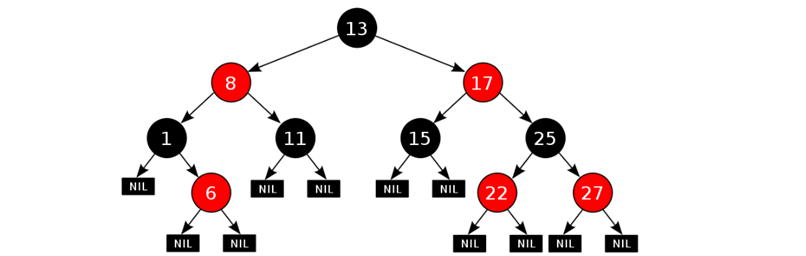
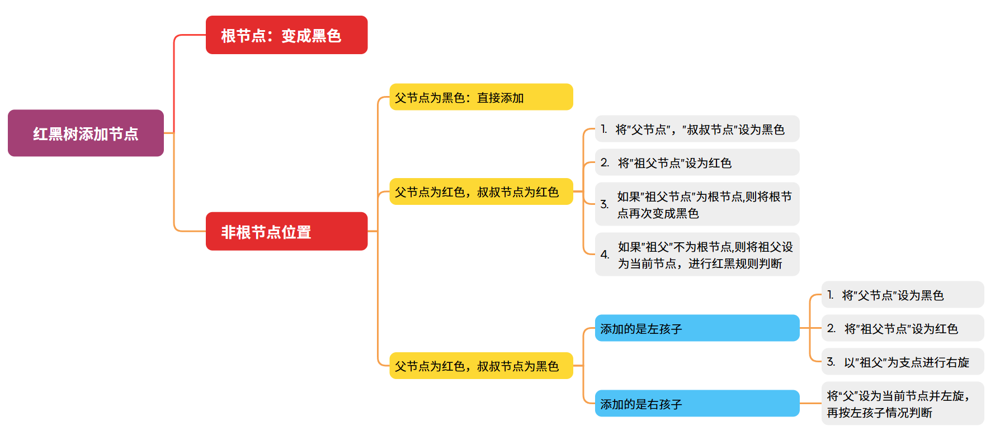

## javaSE笔记(中)

## 1 常见算法

### 1.1 查找算法

#### 1.1.1 顺序查找

也叫做基本查找

- 适用于存储结构为数组或者链表。

#### 1.1.2 二分查找

也叫做折半查找

- 元素必须是有序的，顺序或逆序。

```java
public static int binarySearch(int[] arr, int number){
    //定义两个变量记录要查找的范围
    int min = 0;
    int max = arr.length - 1;

    //利用循环不断的去找要查找的数据
    while((min > max){
        int mid = (min + max) / 2;
        
        if(arr[mid] > number){
            max = mid - 1;
        }else if(arr[mid] < number){
            min = mid + 1;
        }else{
            return mid;
        }
    }
	//如果没找到，返回-1
	return -1;
}
```
#### 1.1.3 插值查找

折半查找：mid=low	+	1/2	*(high-low);

插值查找：mid=low	+	(key-a[low])/(a[high]-a[low])	*(high-low)，

很少使用，仅了解

#### 1.1.4 斐波那契查找

斐波那契数列：1, 1, 2, 3, 5, 8, 13, 21, 34, 55, 89…….

随着斐波那契数列的递增，前后两个数的比值会越来越接近0.618，即黄金比例

斐波那契查找：mid=low	+	F(k-1) - 1

很少使用，仅了解

#### 1.1.5 分块查找 

分块查找的过程：

1. 把数据分成N小块，块与块之间数据不能重复。
2. 给每一块创建对象单独存储到数组当中
3. 查找数据：先在数组中 查找 数据属于哪一块，然后在块中顺序查找

block类存储块

```java
class Block{
    private int max;//最大值
    private int startIndex;//起始索引
    private int endIndex;//结束索引

	//构造函数
    public Block() {}

    public Block(int max, int startIndex, int endIndex) {
        this.max = max;
        this.startIndex = startIndex;
        this.endIndex = endIndex;
    }
    
    //max,startIndex,endIndex的get和set方法
    //getXxx{}，setXxx{}
    
    public String toString() {
        return "Block{max = " + max + ", startIndex = " + startIndex + ", endIndex = " + endIndex + "}";
    }
}
```

分块查找方法

```Java
    //分块查找 查询 number的索引
    private static int getIndex(Block[] blockArr, int[] arr, int number) {
        //1.确定number是在那一块当中
        int indexBlock = findIndexBlock(blockArr, number);

        if(indexBlock == -1){
            //表示number不在数组当中
            return -1;
        }

        //2.获取这一块的起始索引和结束索引   --- 30
        int startIndex = blockArr[indexBlock].getStartIndex();
        int endIndex = blockArr[indexBlock].getEndIndex();

        //3.遍历
        for (int i = startIndex; i <= endIndex; i++) {
            if(arr[i] == number){
                return i;
            }
        }
        return -1;
    }


    //确定number所在块
    public static int findIndexBlock(Block[] blockArr,int number){ //100

        //如果number小于max，表示number是在这一块当中的
        for (int i = 0; i < blockArr.length; i++) {
            if(number <= blockArr[i].getMax()){
                return i;
            }
        }
        return -1;
    }

```

### 1.2 排序算法

#### 1.2.1 冒泡排序

步骤：

1. 相邻的元素两两比较，大的放右边，小的放左边
2. 第一轮比较后，确定最大值，第二轮可以少循环一次，后面以此类推


```java
        //外循环：执行轮数
        for (int i = 0; i < arr.length - 1; i++) {
            //内循环：每一轮中比较数据并找到当前的最大值
            //-i：提高效率，每一轮执行的次数应该比上一轮少一次。
            for (int j = 0; j < arr.length - 1 - i; j++) {
                
                if(arr[j] > arr[j + 1]){
                    int temp = arr[j];
                    arr[j] = arr[j + 1];
                    arr[j + 1] = temp;
                }
            }
		}
```

#### 1.2.2 选择排序

1. 第一次循环从0索引开始，跟后面的元素一一比较，找到最小值
2. 第 i 次循环从 i - 1 索引开始，每次循环找到最小值，将其与开始索引交换


```java
        //外循环：几轮
        //i:表示这一轮中，哪个索引上的数据需要跟后面的数据进行比较并交换
        for (int i = 0; i < arr.length -1; i++) {
            //内循环：找出最小值
            int minIndex = i;
            for (int j = i + 1; j < arr.length; j++) {
                if(arr[j] < arr[minIndex]){
                    minIndex = j;
                }
            }
            //交换开始索引与最小值索引
            int temp = arr[i];
            arr[i] = arr[minIndex];
            arr[minIndex] = temp;
        }
```

#### 1.2.3 插入排序

1. 先进行判断，从0索引开始，到哪个索引开始无序
2. [0 , i - 1]上的值有序，[0 ,  i] 为无序
3. 将索引 i 的值在 [0 , i - 1]填入正确位置，使[0 , i]上的值有序


```java
        //1.找到无序的哪一组数组是从哪个索引开始的。
        int startIndex = -1;
        for (int i = 0; i < arr.length; i++) {
            if(arr[i] > arr[i + 1]){
                startIndex = i + 1;
                break;
            }
        }

        //2.从startIndx开始，将后面的元素逐次加入到前面的有序数组里
        for (int i = startIndex; i < arr.length; i++) {

            //记录当前要插入数据的索引
            int j = i;

            //将 j 不断向前比较交换，直到填入对应的位置停止
            while(j > 0 && arr[j] < arr[j - 1]){
                int temp = arr[j];
                arr[j] = arr[j - 1];
                arr[j - 1] = temp;
                
                j--;
            }

        }
```

#### 1.2.4 快速排序 

1. 从数列中挑出一个元素，称为 "基准数";（一般都是左边第一个数字）
2. 创建两个指针，一个从前往后走，一个从后往前走。
3. 先执行后面的指针，找出第一个比基准数小的数字
4. 再执行前面的指针，找出第一个比基准数大的数字
5. 交换两个指针指向的数字
6. 若两个指针相遇，将 基准数 跟 指针 交换位置，称之为：基准数归位。
7. 第一轮结束之后，基准数左边的数字都是比基准数小的，基准数右边的数字都是比基准数大的。
8. 把基准数左右两边各看做一个序列，对两个序列按照刚刚的规则递归排序


```java
    public static void quickSorts(int[] arr , int left, int right){
        //如果长度为小于1，直接返回
        if(left >= right)
            return;
        
        //取基准数
        int baseNum = arr[left];
        int l = left;
        int r = right;
        
        //从两边开始，找对应的值并交换
        while(l < r){
            while(arr[r] >= baseNum && l < r){
                r--;
            }
            while(arr[l] <= baseNum && l < r){
                l++;
            }
            
            int temp = arr[l];
            arr[l] = arr[r];
            arr[r] = temp;
            
        }
        //两指针相遇时，将基准数与其交换
        arr[left] = arr[l];
        arr[l] = baseNum;
        
        //对基准数左、右数组分别进行排序
        quickSorts(arr,left,l - 1);
        quickSorts(arr,l + 1, right);
    }

```

### 1.3 Arrays类

| 方法名                                                      | 说明                     |
| :---------------------------------------------------------- | :----------------------- |
| public static String toString(数组)                         | 把数组拼接成一个字符串   |
| public static int binarySearch(数组, 查找的元素)            | 二分查找法查找元素       |
| public static int[] copyOf(原数组, 新数组长度)              | 拷贝数组                 |
| public static int[] copyOfRange(原数组, 起始索引, 结束索引) | 拷贝数组，[头，尾)       |
| public static void fill(数组, 元素)                         | 填充数组                 |
| public static void sort(数组)                               | 按照默认方式进行数组排序 |
| public static void sort(数组, 排序规则)                     | 按照指定的规则排序       |

```
Arrays.binarySearch,返回元素下标，若没查找到，返回"-" + "应插入的位置下标"
Arrays.copyOf,若新数组长度过大，多余内容用默认值补全；过小，省去后面内容
```

```java
//选择排序 + 二分查找 ; 在将元素插入前面时使用二分查找
//o1 - o2 : 升序排列
//o2 - o1 : 降序排列

//Integer[] arr = {2, 3, 1, 5, 6, 7, 8, 4, 9};
//匿名内部类
Arrays.sort(arr, new Comparator<Integer>() {
    @Override
    public int compare(Integer o1, Integer o2) {
        return o1 - o2;
    }
});
```

### 1.4 lambda

形式：

`(参数)->{语句}`

```java
//匿名内部类
//Arrays.sort(数组,比较器)
Arrays.sort(arr, new Comparator<Integer>() {
    @Override
    public int compare(Integer o1, Integer o2) {
        return o1 - o2;
    }
});
//lambda 形式
Arrays.sort(arr, (Integer o1, Integer o2) -> {
        return o1 - o2;
    }
 );
//省略形式
Arrays.sort(arr, (o1, o2) -> o1 - o2);
```

**函数式编程**是一种思想特点：不关心谁去做（对象），而关心做什么（方法体）

- Lambda表达式可以用来简化匿名内部类的书写

- Lambda表达式只能简化**函数式接口**的匿名内部类的写法
  - 函数式接口：有且仅有一个抽象方法的**接口**叫做函数式接口
    ，接口上方可以加@FunctionalInterface注解

**lambda的省略规则：**

1. 参数类型可以省略不写。
2. 如果只有一个参数，参数类型可以省略，同时()也可以省略。
3. 如果Lambda表达式的方法体只有一行，(大括号，分号，return)可以省略不写，需同时省略。

```java
interface Swim{
    public abstract void swimming();
}
public static void method(Swim s){
    s.swimming();
}

//匿名内部类
method(new Swim() {
    @Override
    public void swimming() {
        System.out.println("正在游泳~~");
    }
});

//2. 利用lambda表达式进行改写
method(
    ()->{
        System.out.println("正在游泳~~");
    }
);
```

## 2 集合进阶

### 2.1 介绍

#### 2.1.1数组和集合的区别

- 相同点

  都是容器,可以存储多个数据

- 不同点

  - 数组的长度是不可变的,集合的长度是可变的

  - 数组可以存基本数据类型和引用数据类型

    集合只能存引用数据类型,如果要存基本数据类型,需要存对应的包装类

#### 2.1.2集合类体系结构


List系列集合：添加的元素是有序、可重复、有索引

Set系列集合：添加的元素是无序、不重复、无索引

### 2.2 Collection

#### 2.2.1 方法

Collection 是一个接口

| 方法名                     | 说明                               |
| :------------------------- | :--------------------------------- |
| boolean add(E e)           | 添加元素                           |
| boolean remove(Object o)   | 从集合中移除指定的元素             |
| boolean removeIf(Object o) | 根据条件进行移除                   |
| void   clear()             | 清空集合中的元素                   |
| boolean contains(Object o) | 判断集合中是否存在指定的元素       |
| boolean isEmpty()          | 判断集合是否为空                   |
| int   size()               | 集合的长度，也就是集合中元素的个数 |

```java
boolean add
    //在List里添加元素，永远返回true
    //在Set里添加元素，不存在返回false，存在返回true
boolean remove
    //删除成功返回true，失败返回false
boolean contains
    //底层是依赖equals方法进行判断是否存在
    //若集合内容是自定义对象，一定要对对象重写equals方法
    //没重写则默认使用父类Object方法，对地址值判断
```

#### 2.2.2 遍历

**1）迭代器遍历**

- 迭代器介绍

  - 迭代器：集合专用的遍历方式
  - Iterator<E> iterator(): 获取一个迭代器对象
    通过集合对象的iterator()方法得到

- Iterator中的常用方法

  ​	boolean hasNext( )：判断是否存在下一个元素
  ​	E next( )：获取当前位置的元素，移动指针到下一处

- Collection集合的遍历

  ```java
  public class IteratorDemo1 {
      public static void main(String[] args) {
          //创建集合对象
          Collection<String> c = new ArrayList<>();
  
          //添加元素
          c.add("hello");
          c.add("world");
          c.add("java");
  
          //Iterator<E> iterator()：返回此集合中元素的迭代器
          //通过集合的iterator()方法得到
          Iterator<String> it = c.iterator();
  
          //用while循环改进元素的判断和获取
          while (it.hasNext()) {
              String s = it.next();
              System.out.println(s);
          }
      }
  }
  ```

迭代器遍历完后，指针不会复位

迭代器遍历时，不能使用集合的方法进行增加或删除操作

- 迭代器中删除的方法

  ​	void remove(): 删除迭代器对象当前指向的元素

```java
        Iterator<String> it = list.iterator();
        while(it.hasNext()){
            String s = it.next();
            
            if("abc".equals(s)){
                it.remove();
            }
            
        }
		System.out.println(list);
```

**2）增强for遍历**

- 它是JDK5之后出现的,其内部原理是一个Iterator迭代器
- 所有单列集合和数组才可以使用增强for
- 增强for不会改变集合中原本数据

```java
        for(String str : list){
            System.out.println(str);
        }
```

**3）forEach方法，及lambda表达式**

```java
        collection.forEach(new Consumer<String>() {
            @Override
            public void accept(String s) {
                System.out.println(s);
            }
        });

        //lambda表达式
        collection.forEach(s -> System.out.println(s));
    }
```

#### 2.2.3 List集合

**1）List集合的特点**

- 存取有序
- 可以重复
- 有索引

**2）List集合的特有方法**

| 方法名                          | 描述                                    |
| ------------------------------- | --------------------------------------- |
| void add(int index,E   element) | 在指定索引处插入元素，原元素的索引后移. |
| E remove(int  index)            | 删除指定索引处的元素，返回被删除的元素  |
| E set(int index, E  element)    | 修改指定索引处的元素，返回被修改的元素  |
| E get(int  index)               | 返回指定索引处的元素                    |

**3）遍历**

```java
//创建集合并添加元素
List<String> list = new ArrayList<>();
list.add("aaa");
list.add("bbb");
list.add("ccc");

//列表迭代器
//获取一个列表迭代器的对象，里面的指针默认也是指向0索引的
//在迭代器基础上添加了一个add方法，在索引 后方 添加
ListIterator<String> it = list.listIterator();
while(it.hasNext()){
    String str = it.next();
    if("bbb".equals(str)){
        //list.add()会报错
        it.add("qqq");
    }// aaa bbb qqq ccc
}
System.out.println(list);
```

#### 2.2.4 ArrayList集合

- 利用空参创建的集合，在底层创建一个默认长度为0的数组
- 添加第一个元素时，底层会创建一个新的长度为10的数组
- 存满时，会扩容1.5倍
- 如果一次添加多个元素，1.5倍还放不下，则新创建数组的长度以实际为准

#### 2.2.5 LinkedList集合

底层是双链表，查询慢、增删快

**2）特有方法**

| 方法名                    | 说明                     |
| ------------------------- | ------------------------ |
| public void addFirst(E e) | 在表头插入指定的元素     |
| public void addLast(E e)  | 在表尾插入指定的元素     |
| public  E  getFirst()     | 返回列表中的第一个元素   |
| public  E  getLast()      | 返回列表中的最后一个元素 |
| public  E  removeFirst()  | 删除并返回第一个元素     |
| public  E  removeLast()   | 删除并返回最后一个元素   |

LinkedList添加元素原理


迭代器原理


#### 2.2.6 Hash

哈希：通过哈希函数将任意形式的输入转换为固定长度的哈希值

特点

- 固定长度：输入内容不论多长，长度大小固定
- 雪崩效应：输入改变一点点，哈希值截然不同
- 不可逆：不能逆推原内容，因此不能作为加密解密的手段

用途：

- 快速查找：把hash值相同的放在一起，查找速度为(O1)
- 数据校验：大型文件下载后，比较hash值，看是否被篡改或损坏

哈希值：根据hashCode方法计算出来的int类型的整数

- 方法定义在Object类中，所有对象都可以调用，默认使用地址值计算
- 一般都会重写hashCode方法，利用属性值计算
- 没重写，不同对象相同属性计算的hash值不同

#### 2.2.7 HashSet

采用Hash表存储数据

**作用**：去重，若添加的元素在数组中已存在，则默认不添加

**存储形式**：jdk8之前，用数组加链表；jdk8之后，用数组加链表加红黑树

**步骤**

- 创建一个默认长度16，默认加载因子为0.75的数组，数组名table
- 根据元素的哈希值跟数组的长度计算出应存入的位置
- 如果位置有元素，则调用equals方法比较属性值
- 一样：不存   ； 不一样：存入数组，形成链表

> JDK8以前：新元素存入数组，老元素挂在新元素下面
>
> JDK8以后：新元素直接挂在老元素下面

**扩容机制**

- 数组长度扩容：长度 x 加载因子 < 元素个数，会扩容成原先的两倍
- 链表扩容：链表长度 > 8，数组长度 > 64，转换成红黑树

#### 2.2.8 LinkedHashSet

有序、不重复、无索引

- 有序指的是存储和取出元素的顺序一致

- 每次添加元素，会与上一个添加的元素形成双向链表
- 添加完毕后首尾又会形成一个双向链表

遍历时，使用双向链表遍历；HashSet遍历按照数组下标，所以无序

#### 2.2.10 TreeSet

+ 不可以存储重复元素

+ 没有索引

+ 可以将元素按照规则进行排序（自动排序）

  + TreeSet()：根据其元素的自然排序进行排序（按AscII表排序）

  > 类要实现Comparable接口和compareTo方法

  + TreeSet(Comparator comparator) ：根据指定的比较器进行排序

  > 用Comparator匿名内部类实现自主排序

底层用红黑树排序

### 2.3 泛型

统一集合中存储数据的类型

<数据类型>

- 必须使用引用数据类型
- 不写泛型，默认Object类

#### 2.3.1 泛型类

当类的某个变量的数据类型不确定时，可以使用泛型类

```java
public class MyArrayList<E>{
    Object obj = new Object[10];
    int size;
    
    public boolean add(E e){
        obj[size] = e;
        size++;
        return true;
    }
    
    public E get(int index){
        return (E)obj[index];
    }
}
```

#### 2.3.2 泛型方法

当某个方法的形参类型不确定，可使用泛型方法

- 使用类名定义的泛型，如上面的add方法
- 在方法声明上定义自己的泛型

```java
public static<T> 返回值类型 show(T t){
    
}
```

#### 2.3.3 泛型接口

使接口适配各种引用类型

```java
public interface List<E>{
    
}
```

#### 2.3.4 泛型的通配符

？extends E ：表示可以传递E及其子类类型

？super E ：表示可以传递E及其父类类型

```java
public static void show(ArrayList<? extends People> people){
    
}
```

### 2.4 数据结构（树）

#### 2.4.1 二叉树

二叉树中,任意一个节点的度要小于等于2

+ 节点: 在树结构中,每一个元素称之为节点
+ 度: 每一个节点的子节点数量称之为度

树高：树的总层数

根节点：最顶层的节点

左子节点：左下方的节点

右子节点：右下方的节点

#### 2.4.2 二叉查找树

也称二叉排序树或者二叉搜索树

**1）二叉查找树的特点**

+ 每一个节点上最多有两个子节点
+ 左子树上所有节点的值都小于根节点的值
+ 右子树上所有节点的值都大于根节点的值

**2）二叉查找树添加节点规则**

+ 小的存左边
+ 大的存右边
+ 一样的不存

#### 2.4.3 遍历方式

前序遍历：从根节点开始，按照当前节点，左子节点，右子节点的顺序遍历

中序遍历：从左子节点开始，按照左子节点，当前节点，右子节点的顺序遍历

后序遍历：从左子节点开始，按照左子节点，右子节点，当前节点的顺序遍历

层序遍历：从第一层开始，从左往右一层一层遍历

#### 2.4.4 平衡二叉树

**1）平衡二叉树的特点**

+ 前提是二叉排序树
+ 二叉树左右两个子树的**高度差**不超过1
+ 任意节点的左右两个子树都是一颗平衡二叉树

**2）平衡二叉树旋转**

+ 旋转触发时机

  + 当添加一个节点之后,该树不再是一颗平衡二叉树
+ 旋转规则
  + 从添加的节点开始，查找不满足平衡二叉树的节点
    以不平衡的点作为支点，若左子树少，左旋，右子树少则右旋
+ 左旋

  + 不平衡点作为支点
  + 支点降级，作为左子节点
  + 原右子节点晋升到支点位置，若原右节点存在左子节点，把此节点作为支点的右子节点


- 右旋
  - 不平衡点作为支点
  - 支点降级，作为右子节点
  - 原左子节点晋升到支点位置，若原左节点存在右子节点，把此节点作为支点的左子节点

**3）平衡二叉树旋转的四种情况**

+ 左左

  + 左左: 当根节点左子树的左子树有节点插入,导致二叉树不平衡

  + 如何旋转: 直接对整体进行右旋即可

    

+ 左右

  + 左右: 当根节点左子树的右子树有节点插入,导致二叉树不平衡

  + 如何旋转: 先在左子树对应的节点位置进行左旋,在对整体进行右旋

    + 即先变为左左，然后整体右旋

    

+ 右右

  + 右右: 当根节点右子树的右子树有节点插入,导致二叉树不平衡

  + 如何旋转: 直接对整体进行左旋即可

    

+ 右左

  + 右左:当根节点右子树的左子树有节点插入,导致二叉树不平衡

  + 如何旋转: 先在右子树对应的节点位置进行右旋,在对整体进行左旋

    + 即先变为右右，然后整体左旋

    

#### 2.4.5 红黑树

也成为平衡二叉B树

**1）红黑树的特点**

- 特殊的二叉查找树，每个节点都有存储位表示颜色
- 每一个节点可以是红或者黑色
- 红黑树不是高度平衡的,它的平衡是通过"自己的红黑规则"进行实现的

**2）红黑规则**

1. 每一个节点是红色或者是黑色的
2. 根节点必须是黑色
3. 如果一个节点没有子节点或者父节点,则该节点相应的指针属性值为Nil，这些Nil视为叶节点
   即，每个叶节点(Nil)是黑色的
4. 两个红色节点不能相连
5. 对每一个节点,从该节点到其所有后代叶节点的简单路径上,均包含相同数目的黑色节点
   即，到每个后代叶节点（Nil）的路径上黑色节点个数相等



**3）红黑树添加节点的规则**

添加节点时,默认为红色,效率高

- 根节点位置：变成黑色并添加

- 非根节点位置

  - 父节点为黑色：直接添加

  - 父节点为红色，叔叔节点为红色
    1. 将"父节点"，"叔叔节点"设为黑色
    2. 将"祖父节点"设为红色
    3. 如果"祖父节点"为根节点,则将根节点再次变成黑色
    4. 如果"祖父"不为根节点,则将祖父设为当前节点，进行红黑规则判断
  - 父节点为红色，叔叔节点为黑色，且添加的是左孩子
    1. 将"父节点"设为黑色
    2. 将"祖父节点"设为红色
    3. 以"祖父节点"为支点进行右旋
  - 父节点为红色，叔叔节点为黑色，且添加的是右孩子
    
    - 将“父”设为当前节点并左旋，再按左孩子情况判断
    
      > 叔叔为黑色的情况是，父红叔红，将祖父节点设为当前节点的情况下



### 2.5 Map

#### 2.5.1 Map

**1）概述**

```java
interface Map<K,V>  K：键的类型；V：值的类型
```

Map集合的特点

- 双列集合,一个键对应一个值
- 键不可以重复,值可以重复

**2）方法**

| 方法名                              | 说明                                 |
| ----------------------------------- | ------------------------------------ |
| V   put(K key,V   value)            | 添加元素                             |
| V   remove(Object key)              | 根据键删除键值对元素                 |
| V   get(K  key)                     | 根据键找值                           |
| void   clear()                      | 移除所有的键值对元素                 |
| boolean containsKey(Object key)     | 判断集合是否包含指定的键             |
| boolean containsValue(Object value) | 判断集合是否包含指定的值             |
| boolean isEmpty()                   | 判断集合是否为空                     |
| int size()                          | 集合的长度，也就是集合中键值对的个数 |

- 示例代码

  ```java
  public class MapDemo02 {
      public static void main(String[] args) {
          //创建集合对象
          Map<String,String> map = new HashMap<String,String>();
  
          //V put(K key,V value)：添加元素
          map.put("张无忌","赵敏");//返回null
          map.put("郭靖","黄蓉");
          map.put("杨过","小龙女");
          
          //若存在相同键，替代并返回旧值
          map.put("张无忌","小西");//返回赵敏
          
          
          //V remove(Object key)：根据键删除键值对元素
          System.out.println(map.remove("郭靖"));//返回黄蓉
  
          //int size()：集合的长度，也就是集合中键值对的个数
          System.out.println(map.size());
          
          //输出集合对象
          System.out.println(map);
          
      }
  }
  ```

#### 2.5.2 Map遍历

**方法一：**

- 获取所有键的集合。用keySet()方法实现
- 遍历键的集合，获取到每一个键。用增强for实现  
- 根据键去找值。用get(Object key)方法实现

```java
        //获取所有键的集合。用keySet()方法实现
        Set<String> keySet = map.keySet();
        //遍历键的集合，获取到每一个键。用增强for实现
        for (String key : keySet) {
            //根据键去找值。用get(Object key)方法实现
            String value = map.get(key);
            System.out.println(key + "," + value);
        }
```

**方法二：**

- 获取所有键值对对象的集合
  - Set<Map.Entry<K,V>>   entrySet()：返回所有键值对对象的Set集合
  - Map.Entry 是接口，entrySet()方法 会自动创建一堆Node类的对象，放进Set集合
- 遍历键值对对象的集合，得到每一个键值对对象，用增强for实现
- 根据键值对对象获取键和值；用getKey()得到键，用getValue()得到值

```java
        //获取所有键值对对象的集合
        Set<Map.Entry<String, String>> entrySet = map.entrySet();
        //遍历键值对对象的集合，得到每一个键值对对象
        for (Map.Entry<String, String> me : entrySet) {
            //根据键值对对象获取键和值
            String key = me.getKey();
            String value = me.getValue();
            System.out.println(key + "," + value);
        }
```

**方法三：**

- 使用 forEach(new  BiConsumer <K,V> ())  方法

```java
		map.forEach(( [K] key, [V] value)->
			System.out.println(key + "," + value)
		);
```

#### 2.5.3 hashMap

**HashMap的特点**

- 无序、不重复、无索引
- 没有特有方法，沿用Map里面的方法。
- HashMap跟HashSet底层原理是一模一样的，都是哈希表结构
- HashMap的键若存储自定义对象，要重写 equals() 方法和 hashCode() 方法

**插入步骤**

1. 利用键和hashCode()方法计算哈希值，（与值无关）
2. 找到对应的哈希值，用equals()方法比较键属性值
   - 若键相同，覆盖entry对象
   - 若键不同，添加新的entry对象
   - 长度>8，数组长度>=64，自动转换成红黑树

#### 2.5.4 LinkedHashMap

- 由键决定：有序、不重复、无索引。
- 这里的有序指的是保证存储和取出的元素顺序一致
- 原理：每个键值对元素多了一个双链表的机制记录存储的顺序。

#### 2.5.5 TreeMap

TreeMap

- 由键决定：不重复、无索引、可排序
- 可排序：默认按照键的从小到大进行排序，也可以自己规定键的排序规则
  - 实现Comparable接口和compareTo方法，指定比较规则。（用于自定义类）
  - 创建集合时传递Comparator比较器对象，指定比较规则。
- TreeMap跟TreeSet底层原理一样，都是红黑树结构的。


## 3 综合

### 3.1 可变参数

在**JDK5**之后，如果我们定义一个方法需要接受多个参数，并且类型一致，我们可以对其简化.

**格式**：`参数类型... 形参名`

**底层：**其实就是一个数组

举例

```java
    public static int getSum(int... arr) {
   		int sum = 0;
   	     for (int a : arr) {
         sum += a;
        }
   		 return sum;
    }
```

> **注意：**
>
> 1.一个方法只能有一个可变参数
>
> 2.如果方法中有多个参数，**可变参数要放到最后。**

### 3.2 Collections

`java.utils.Collections`是集合工具类，用来对集合进行操作。

| 方法名                                         | 说明                         |
| ---------------------------------------------- | ---------------------------- |
| void shuffle(List<T> list)                     | 打乱集合顺序                 |
| boolean addAll(Collection<T> c, T... elements) | 往集合中添加一些元素         |
| void sort(List<T> list)                        | 将集合中元素按照默认规则排序 |
| void sort(List<T> list，Comparator<? super T>  | 将集合中元素按照指定规则排序 |


### 3.3 不可变集合

长度不可变，内容也无法修改的集合

**1）不可变的list集合**

`List<String> list = List.of("张三", "李四", "王五", "赵六");`

**2）不可变的set集合**

`Set<String> set = Set.of("张三", "李四", "王五", "赵六");`

> 参数一定要唯一

**3）不可变的map集合**

` Map<String, String> map = Map.of("张三", "南京", "张三", "北京", "王五", "上海",);`

> - 键是不能重复的
> - Map里面的of方法，参数是有上限的，最多只能传递20个参数，10个键值对
>   - 一个方法的形参只能有一个可变参数
> - 如果我们要传递10个以上键值对对象，在Map中用 ofEntries()方法
>
> ```java
> public class map {
>     public static void main(String[] args) {
>         HashMap<String, String> hm = new HashMap<>();
>         
>         //1.创建一个普通的Map集合
>         hm.put("张三", "南京");
>         hm.put("李四", "北京");
>         hm.put("王五", "上海");
>         //。。。
>         //。。。
>         //以下省略，总个数大于10
> 
>         //2.利用上面的数据来获取一个不可变的集合
>         //获取到所有的键值对对象（Entry对象）
>         Set<Map.Entry<String, String>> entries = hm.entrySet();
>         
>         //toArray方法在底层会比较集合的长度跟数组的长度两者的大小
>         //如果集合的长度 > 数组的长度 ：数据在数组中放不下，重新创建数组
>         //如果集合的长度 <= 数组的长度：数据在数组中放的下，直接用原数组
>         Map.Entry[] arr = entries.toArray(new Map.Entry[0];);
>         Map map = Map.ofEntries(arr);
> 
>         
>         //以下为合并后写法
>         Map<> map = Map.ofEntries(hm.entrySet().toArray(new Map.Entry[0]));
>         
>         //以下为简写，jdk10以后添加
>         Map<String, String> map = Map.copyOf(hm);
>     }
> }
> ```
>

## 4 Stream流

### 4.1 生成Stream流的方式

- Collection体系集合

  使用默认方法stream()生成流

- Map体系集合

  1. 把Map转成Set集合，间接的生成流，map.keySet().stream().
  2. 把Map转成Entry键值对集合，生成流，map.entrySet().stream().

- 数组

  通过Arrays中的静态方法stream生成流，Arrays.stream(arr).

- 同种数据类型的多个数据

  通过Stream接口的静态方法of(T... values)生成流，Stream.of (数据 / 数组).

  > 数组必须是引用数据类型的，如果传递基本数据类型，是会把整个数组当做一个元素，放到Stream当中。

### 4.2 stream中间方法

| 方法名                                            | 说明                                                       |
| ------------------------------------------------- | ---------------------------------------------------------- |
| Stream\<T> filter(Predicate predicate)            | 用于对流中的数据进行过滤                                   |
| Stream\<T> limit(long maxSize)                    | 返回此流中的元素组成的流，截取前指定参数个数的数据         |
| Stream\<T> skip(long n)                           | 跳过指定参数个数的数据，返回由该流的剩余元素组成的流       |
| static \<T> Stream\<T> concat(Stream a, Stream b) | 合并a和b两个流为一个流                                     |
| Stream\<T> distinct()                             | 返回由该流的不同元素（根据Object.equals(Object) ）组成的流 |
| Stream\<T> map( Function <T , R> mapper           | 转换流中的数据类型                                         |

**1）filter**

`list.stream().filter(s ->s.startsWith("张")).forEach(s-> System.out.println(s));`

**2）limit**：只输出前面几个数据

`list.stream().limit(3).forEach(s-> System.out.println(s));`

**3）skip**：跳过前面几个数据，输出后面数据

`list.stream().skip(3).forEach(s-> System.out.println(s));`

**4）concat**：合并a，b里面的元素

`Stream.concat(s1,s2)`

**5）distinct**：去掉重复元素

**6）map**： 转换流中的数据类型

第一个类型：流中原本的数据类型

第二个类型：要转化后的类型

```java
ArrayList<String> list = new ArrayList<>();
Collections.addAll(list,"小明-18","小红-20");
list.stream().map(s-> Integer.parseInt(s.split("-")[1])).forEach(...);
```

### 4.3 stream终结方法

| 名称                                   | 说明                       |
| -------------------------------------- | -------------------------- |
| void forEach(Consumer action)          | 遍历                       |
| long count()                           | 统计                       |
| T[ ]  toArray( IntFunction<T\>)        | 收集流中的数据，放到数组中 |
| 集合<T\>  collect(Collector collector) | 收集流中的数据，放到集合中 |

**1）toArray**

`String[] arr2 = list.stream().toArray(value -> new String[value]);`

**2）collect**

收集到单列集合

```java
ArrayList<String> list = new ArrayList<>();
Collections.addAll(list, "张无忌-男-15", "周芷若-女-14", "赵敏-女-13", "张强-男-20",
    "张三丰-男-100", "张翠山-男-40", "张良-男-35", "王二麻子-男-37", "谢广坤-男-41");

// 收集List集合当中
// 需求： 我要把所有的男性收集起来
List<String> newList1 = list.stream()
    .filter(s -> "男".equals(s.split("-")[1]))
    .collect(Collectors.toList());

// 收集Set集合当中
// 需求： 我要把所有的男性收集起来
Set<String> newList2 = list.stream()
    .filter(s -> "男".equals(s.split("-")[1]))
    .collect(Collectors.toSet());
System.out.println(newList2);
```

收集到map集合

```java
// 需求：键为姓名，值为年龄
// 注意：键不能相同，否则报错
Map<String, Integer> map = list.stream()
	.filter(s -> "男".equals(s.split("-")[1]))
	.collect(Collectors. toMap(
		s -> s.split("-")[0],
		s -> Integer.parseInt(s.split("-")[2]))
            );

System.out.print1n(map);
```

## 5 方法引用

### 5.1 概述

**概念**：把已有方法拿过来使用，当作函数式接口的抽象方法的方法体

**方法引用符**：::

```java
//匿名内部类形式
Arrays.sort(arr, new Comparator<Integer>() {
   @Override
   public int compare(Integer o1, Integer o2) {
   return o2 - o1;
   }
  });
 

//lambda表达式
Arrays.sort(arr, (o1, o2)->{
    return o2 - o1;
});


//方法引用形式
Arrays.sort(arr, 类名::subtraction);


// 可以是Java已经写好的，也可以是一些第三方的工具类
public static int subtraction(int num1, int num2) {
    return num2 - num1;
}
```

>  方法引用规则
>
> 1. 引用处需要是函数式接口
> 2. 被引用的方法需要已经存在
> 3. 被引用方法的 形参 和 返回值 需要跟抽象方法的保持一致
> 4. 被引用方法的功能需要满足当前的要求


### 5.2 引用静态方法

**格式**：类名::静态方法

```java
//1.创建集合并添加元素
ArrayList<String> list = new ArrayList<>();
Collections.addAll(list,"1", "2", "3", "4", "5");

//2.把他们都变成int类型
list.stream().map(new Function<String, Integer>() {
   @Override
   public Integer apply(String s) {
   return Integer.parseInt(s);;
   }
}).forEach(s -> System.out.println(s));*/


//方法引用形式
list.stream()
    .map(Integer::parseInt)
    .forEach(s -> System.out.println(s));
```

### **5.3 引用成员方法**

**格式**：对象 : : 成员方法

**其他类**：其他类对象::方法名  
**本类**：this : : 方法名 
**父类**：super : : 方法名

本类，父类时不能用在静态方法，静态方法无this，super

### 5.4 引用构造方法

**格式**：类名 : : new

```java
public Student(String str) {
    String[] arr = str.split(regex: ",");
    this.name = arr[0];
    this.age = Integer.parseInt(arr[1]);
}

List<Student> newList = list.stream()
    .map(Student::new)
    .collect(Collectors.toList());
```

构造方法不需要返回值，已经生成了对象

### 5.5 类名引用成员方法

格式：类名 : : 成员方法

方法引用的规则：
1. 需要有函数式接口
2. 被引用的方法必须已经存在
3. 被引用方法的形参，需要跟抽象方法的第二个形参到最后一个形参保持一致，返回值需要保持一致。
4. 被引用方法的功能需要满足当前的需求

抽象方法形参的详解：
第一个参数：表示被引用方法的调用者，决定了可以引用哪些类中的方法
在Stream流当中，第一个参数一般都表示流里面的每一个数据。
假设流里面的数据是字符串，那么使用这种方式进行方法引用，只能引用String这个类中的方法

第二个参数到最后一个参数：跟被引用方法的形参保持一致，如果没有第二个参数，说明被引用的方法需要是无参的成员方法

```java
//1. 创建集合对象
ArrayList<String> list = new ArrayList<>();
//2. 添加数据
Collections.addAll(list, "aaa", "bbb", "ccc", "ddd");
//3. 变成大写后进行输出
//map(String::toUpperCase)
//拿着流里面的每一个数据，去调用String类中的toUpperCase方法，方法的返回值就是转换之后的结果。
list.stream().map(String::toUpperCase).forEach(s -> System.out.println(s));
```

### 5.5 引用数组的构造方法

**格式**：数据类型[ ] : : new

**通常形式**：`T[] arr= list.stream().toArray(T[] :: new);`list 集合里存 T 数据类型

## 6 异常

### 6.1 概述

**异常** ：指的是程序在执行过程中，出现的非正常的情况，最终会导致JVM的非正常停止

> 异常指的并不是语法错误,语法错了,编译不通过,不会产生字节码文件,根本不能运行.

**分类**


* **编译时期异常**:没有继承RuntimeException异常。在编译时必须处理，否则不能运行。
* **运行时期异常**:Runtime异常。在运行时期,检查出异常.

### 6.2 try-catch

```java
try{
     编写可能会出现异常的代码
}catch(异常类型  e){
     处理异常的代码
     //记录日志/打印异常信息/继续抛出异常
}
```

目的：让程序继续执行，不会因为异常而终止运行

1. try语句无异常，执行try语句块，不执行catch语句块

2. try语句可能有多个异常，用多个catch语句，父类要写在下面

   ​	识别第一个异常后，会直接跳转到catch语句，不执行后续try语句

3. 异常没有被try-catch语句捕获，程序仍会暂停

### 6.3 异常方法

| 方法名                        | 说明                         |
| ----------------------------- | ---------------------------- |
| public String getMessage()    | 返回异常描述信息字符串       |
| public String toString()      | 返回异常的类型和异常描述信息 |
| public void printStackTrace() | 在控制台打印异常的错误信息   |

### 6.4 throw[s]

**throw**

格式：`throw new 异常类名(参数);`

抛出一个异常对象，将这个异常对象传递到调用者处，并结束当前方法的执行。

调用者处可以用try-catch语句捕获

**throws**

格式：`修饰符 返回值类型 方法名(参数) throws 异常类名1,异常类名2…{   }	`

表示当前方法不处理异常，提醒该方法的调用者来处理异常

主要针对编译时异常

### 6.5 自定义异常

1. 定义异常类
2. 写继承关系
3. 空参构造
4. 带参构造

## 7 File

### 7.1 构造方法

| 方法名                                   | 说明                                   |
| ---------------------------------------- | -------------------------------------- |
| public File(String pathname)             | 根据文件路径创建文件对象               |
| public File(String parent, String child) | 根据父级路径和子级路径创建文件对象     |
| public File(File parent, String child)   | 根据父级文件对象，子级路径创建文件对象 |

父级路径：除文件名的路径

子级路径：文件名，带后缀

文件路径：父级路径 + “ \\\”  + 子级路径

### 7.2 成员方法

#### 7.2.1 判断、获取方法

| 方法名称                        | 说明                                 |
| ------------------------------- | ------------------------------------ |
| public boolean isDirectory()    | 判断此路径名表示的File是否为文件夹   |
| public boolean isFile()         | 判断此路径名表示的File是否为文件     |
| public boolean exists()         | 判断此路径名表示的File是否存在       |
| public long length()            | 返回文件的大小（字节数量）,文件夹为0 |
| public String getAbsolutePath() | 返回文件的绝对路径                   |
| public String getPath()         | 返回定义文件时使用的路径             |
| public String getName()         | 返回文件的名称，带后缀               |
| public long lastModified()      | 返回文件的最后修改时间（时间毫秒值） |

#### 7.2.2 创建、删除方法

| 方法名称                       | 说明                             |
| ------------------------------ | -------------------------------- |
| public boolean createNewFile() | 创建一个新的空文件，父级必须存在 |
| public boolean mkdir()         | 创建单级文件夹                   |
| public boolean mkdirs()        | 创建多级文件夹                   |
| public boolean delete()        | 删除文件、空文件夹               |

createNewFile()，可创建无后缀文件，但无法创建同名文件夹

#### 7.2.3 获取并遍历

`public File[] listFiles()`：获取路径下所有内容

- 当调用者File表示的路径不存在时，返回null
- 当调用者File表示的路径是文件时，返回null
- 当调用者File表示的路径是一个空文件夹时，返回一个长度为0的数组
- 当调用者File表示的路径是一个有内容的文件夹时，将里面所有文件和文件夹的路径放在File数组中返回，包含隐藏文件
- 当调用者File表示的路径是需要权限才能访问的文件夹时，返回null

#### 7.2.4 其他获取并遍历

| 方法名称                                       | 说明                                     |
| ---------------------------------------------- | ---------------------------------------- |
| public static File[] listRoots()               | 列出可用的文件系统根                     |
| public String[] list()                         | 获取当前该路径下所有内容                 |
| public String[] list(FilenameFilter filter)    | 利用文件名过滤器获取当前该路径下所有内容 |
| public File[] listFiles()                      | 获取当前该路径下所有内容                 |
| public File[] listFiles(FileFilter filter)     | 利用文件名过滤器获取当前该路径下所有内容 |
| public File[] listFiles(FilenameFilter filter) | 利用文件名过滤器获取当前该路径下所有内容 |

FilenameFilter 和 FileFilter 为函数式接口，前者参数为文件路径，后者为父级文件对象，子级路径