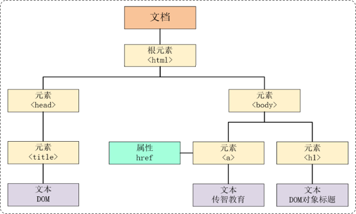
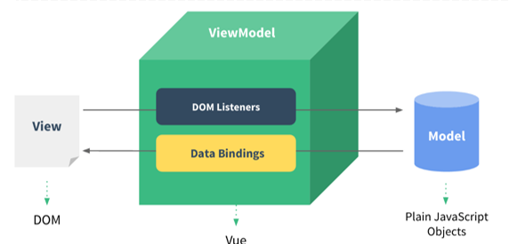
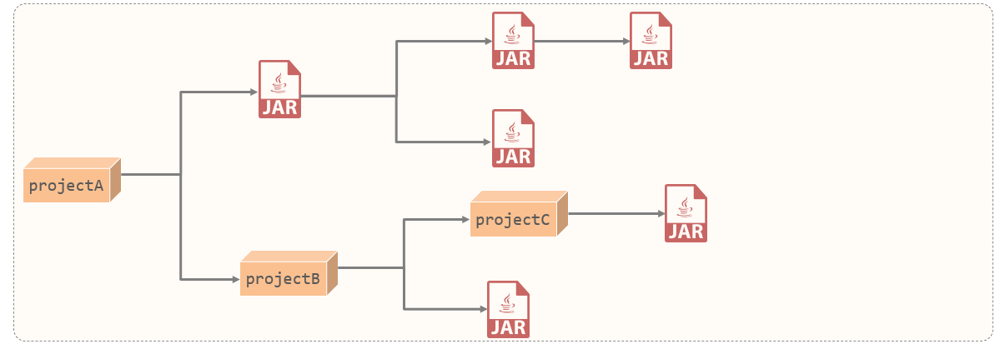
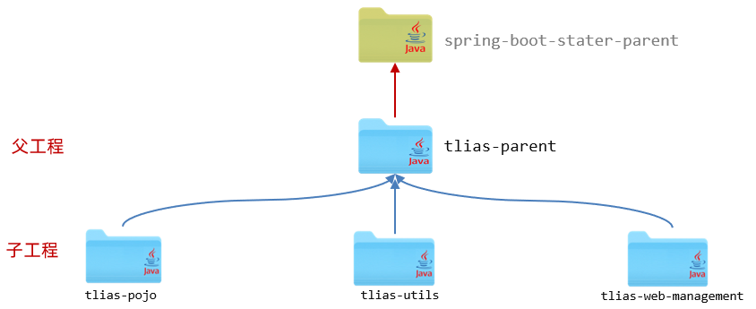

## javaWeb笔记（上）

## 1 介绍

### 1.1 Web标准

- HTML：负责网页的结构（页面元素和内容）。

- CSS：负责网页的表现（页面元素的外观、位置等页面样式，如：颜色、大小等）。

- JavaScript：负责网页的行为（交互效果）。

### 1.2 HTML,CSS

**1). 什么是HTML ?**

> **HTML: **HyperText Markup Language，超文本标记语言。
>
> - 超文本：超越了文本的限制，比普通文本更强大。除了文字信息，还可以定义图片、音频、视频等内容。
>
> - 标记语言：由标签构成的语言
>   - HTML标签都是**预定义**好的。例如：使用 <h1> 标签展示标题，使用<a>展示超链接，使用展示图片，<video>展示视频。
>   - HTML代码直接在浏览器中运行，HTML标签由浏览器解析。

**2). 什么是CSS ?**

> **CSS:** Cascading Style Sheet，层叠样式表，用于控制页面的样式（表现）。

### 1.3 HTML-快速入门

**1). HTML页面的基础结构标签**

~~~html
<html>
	<head>
    	<title> </title>
    </head>
    <body>
       
    </body>
</html>
~~~

&lt;title&gt;中定义标题显示在浏览器的标题位置，&lt;body&gt;中定义的内容会呈现在浏览器的内容区域

**2). HTML中的标签特点**

- HTML标签不区分大小写
- HTML标签的属性值，采用单引号、双引号都可以
- HTML语法相对比较松散 (建议大家编写HTML标签的时候尽量严谨一些)

### 1.4 基础标签 & 样式

#### 1.4.1 标签

**1).图片标签img:**

​    src: 图片资源路径

​    width: 宽度(px, 像素 ; % , 相对于父元素的百分比)

​    height: 高度(px, 像素 ; % , 相对于父元素的百分比)

**路径书写方式:**

```
绝对路径:
     1. 绝对磁盘路径: 
C:\Users\Administrator\Desktop\HTML\img\news_logo.png

     2. 绝对网络路径: https://i2.sinaimg.cn/dy/deco/2012/0613/yocc20120613img01/news_logo.png


相对路径:
        ./ : 当前目录 , ./ 可以省略的
        ../: 上一级目录
        
        设置高宽为对应的像素长度
        若只设置一个，另一个为等比例放大/缩小
        
        设置大小为原图像的百分之多少
        
```

**2). 标题标签 h 系列**

```html
A. 标题标签: <h1> - <h6>
    
	<h1>111111111111</h1>
	<h2>111111111111</h2>
	<h3>111111111111</h3>
	<h4>111111111111</h4>
	<h5>111111111111</h5>
	<h6>111111111111</h6>
	
B. 效果 : h1为一级标题，字体也是最大的 ； h6为六级标题，字体是最小的。
```

**3). 水平分页线标签 <hr>**

**4). 不分行span标签**<span>

#### 1.4.2 标题样式

##### **1.4.2.1 css引入方式**

具体有3种引入方式，语法如下表格所示：

| 名称     | 语法描述                                             | 示例                                             |
| -------- | ---------------------------------------------------- | ------------------------------------------------ |
| 行内样式 | 在标签内使用style属性，属性值是css属性键值对         | &lt;h1 style="xxx:xxx;"><br />中国新闻网&lt;/h1> |
| 内嵌样式 | 定义&lt;style&gt;标签，在标签内部定义css样式         | &lt;style> h1 {<br />} &lt;/style>               |
| 外联样式 | 写在一个单独的.css文件中，定义&lt;link&gt;标签来引用 | &lt;link rel="stylesheet" href="css/news.css">   |

方法一：行内样式 

```
写在body里面
    <h1 style = "color: red;">焦点访谈：中国底气 新思想夯实大国粮仓</h1>
```

方法二：内嵌样式

```
写在head里面
	<style>
        h1{
            color:red;
        }
    </style>
```

方式三：外联样式

```
css里面
h1{
            color:red;
}

html的head里面
<link rel = "stylesheet" href = "相对路径">
```

##### **1.4.2.2  颜色表示** 

在前端程序开发中，颜色的表示方式常见的有如下三种：

| **表示方式**   | **表示含义**                      | **取值**                                    |
| -------------- | --------------------------------- | ------------------------------------------- |
| 关键字         | 预定义的颜色名                    | red、green、blue...                         |
| rgb表示法      | 红绿蓝三原色，每项取值范围：0-255 | rgb(0,0,0)、rgb(255,255,255)、rgb(255,0,0)  |
| 十六进制表示法 | #开头，将数字转换成十六进制表示   | #000000、#ff0000、#cccccc，简写：#000、#ccc |

```
color:red;
color:rgb(255,0,0);
color:#ff0000 || #f00（简写形式每位代表相同的两个数字）
```

##### **1.4.2.3 CSS选择器**

**选择器通用语法如下**：

```css
选择器名   {
    css样式名：css样式值;
    css样式名：css样式值;
}
```

**1）元素（标签）选择器：** 

- 选择器的名字必须是标签的名字
- 作用：选择器中的样式会作用于所有同名的标签上

~~~
元素名称 {
    css样式名:css样式值；
}
~~~

例子如下：

~~~css
 h1{
     color: red;
 }

<h1> 内容 </h1>
~~~

**2）id选择器:**

- 选择器的名字前面需要加上#
- 作用：选择器中的样式会作用于指定id的标签上
  有且只有一个标签（id是唯一的）

~~~
#id属性值 {
    css样式名:css样式值；
}
~~~

例子如下：

~~~css
#hid {
    color: blue;
}

<h1 id = "hid"> 内容 </h1>
~~~

**3）类选择器：**

- 选择器的名字前面需要加上 .
- 作用：选择器中的样式会作用于所有class的属性值和该名字一样的标签上
  类可以有多个

~~~
.class属性值 {
    css样式名:css样式值；
}
~~~

例子如下：

~~~css
.cls{
     color: green;
    front-size: 12px //设置字体大小
 }

<h1 class = "cls"> 内容 </h1>
~~~

**4）选择器优先级**

id > 类 > 标签

#### **1.4.3 超链接**

- 标签: &lt;a href="..." target="..."> 名字 </a>
- 属性:
  - href: 指定资源访问的url
  - target: 指定在何处打开资源链接
    - _self: 默认值，在当前页面打开
    - _blank: 在空白页面打开

**CSS属性**

设置文本为标准文本   text-decoration :   none  ；

#### 1.4.4 正文排版

**1). 视频、音频标签**

- **视频标签: &lt;video>**
  - 属性: 
    - src: 规定视频的url
    - controls: 显示播放控件
    - width: 播放器的宽度
    - height: 播放器的高度


`<video src = "相对路径" controls width = "950px"> </video>`

- **音频标签: &lt;audio>**
  - 属性:
    - src: 规定音频的url
    - controls: 显示播放控件

`<audio src = "相对路径" controls> </video>`

**2). 段落标签**

- **换行标签: &lt;br>**
  - 注意: 在HTML页面中,我们在编辑器中通过回车实现的换行, 仅仅在文本编辑器中会看到换行效果, 浏览器是不会解析的, HTML中换行需要通过br标签

- **段落标签: &lt;p>**
  - 如: &lt;p>  内容 &lt;/p>  （段落之间会自动换行）
  - 首行缩进：text

```
p{
     text-indent: 35px;  /* 设置首行缩进 */
     line-height: 40px;  /* 设置行高 */  
     text-align: left/center/right;  /* 对齐方式 */ 
}
```

**3). 文本格式标签**

| 效果   | 标签 | 标签(强调) |
| ------ | ---- | ---------- |
| 加粗   | b    | strong     |
| 倾斜   | i    | em         |
| 下划线 | u    | ins        |
| 删除线 | s    | del        |

前面的标签 b、i、u、s 就仅仅是实现加粗、倾斜、下划线、删除线的效果，是没有强调语义的。 而后面的strong、em、ins、del在实现效果的同时，还带有强调语义。

> **注意事项:** 
>
> - 在HTML页面中无论输入了多少个空格, 最多只会显示一个。 可以使用空格占位符（&nbsp；）来生成空格，如果需要多个空格，就使用多次占位符。
>
> - 那在HTML中，除了空格占位符以外，还有一些其他的占位符(了解, 只需要知道空格的占位符写法即可)，如下：
>
>   - | 显示结果 | 描述   | 占位符  |
>     | :------- | :----- | :------ |
>     |          | 空格   | \&nbsp; |
>     | <        | 小于号 | \&lt;   |
>     | >        | 大于号 | \&gt;   |
>     | &        | 和号   | \&amp;  |
>     | "        | 引号   | \&quot; |
>     | '        | 撇号   | \&apos; |

#### 1.4.5 页面布局

##### 1.4.5.1 盒子模型

- 盒子：页面中所有的元素（标签），都可以看做是一个 盒子，由盒子将页面中的元素包含在一个矩形区域内，通过盒子的视角更方便的进行页面布局

- 盒子模型组成：内容区域（content）、内边距区域（padding）、边框区域（border）、外边距区域（margin）

##### 1.4.5.2布局标签

- 布局标签：实际开发网页中，会大量频繁的使用 div 和 span 这两个没有语义的布局标签。

- 标签：<div> <span>

- 特点：

  - div标签：

    - 一行只显示一个（独占一行）

    - 宽度默认是父元素的宽度，高度默认由内容撑开

    - 可以设置宽高（width、height）

  - span标签：

    - 一行可以显示多个，后面内容占相同的一行

    - 宽度和高度默认由内容撑开

    - 不可以设置宽高（width、height）

```html
<style>
    div {
        width: 200px;  /* 宽度 */
        height: 200px;  /* 高度 */
        box-sizing: border-box; /* 指定width height为盒子的高宽 */
        background-color: white; /* 背景色 */
            
        padding: 20px 20px 20px 20px; 
        /* 内边距, 上 右 下 左 , 边距都一行, 可以简写: padding: 20px;*/ 
        border: 10px solid red; 
        /* 边框, 宽度 线条类型 颜色 */
        margin: 30px 30px 30px 30px; 
        /* 外边距, 上 右 下 左 , 边距都一行, 可以简写: margin: 30px; */
    }
</style>
```

```html
#center{
    width:65%;
    /* margin: 0 17.5% 0 17.5%; */
    margin: 0 auto; // 上下为 0 % ，左右自动居中
} 设置页面居中
```

### 1.5 表格、表单标签

#### 1.5.1 表格标签

**场景：**在网页中以表格（行、列）形式整齐展示数据

**标签：**

- &lt;table> : 用于定义整个表格, 可以包裹多个 &lt;tr>， 常用属性如下： 
  - border：规定表格边框的宽度
  - width：规定表格的宽度
  - cellspacing: 规定单元之间的空间

- &lt;tr> : 表格的行，可以包裹多个 &lt;td>  
- &lt;td> : 表格单元格(普通)，可以包裹内容 , 如果是表头单元格，可以替换为 &lt;th>  

```html
<table border="1px" cellspacing="0"  width="600px">
    <tr>
        <th>序号</th>
        <th>品牌</th>
    </tr>
    
    <tr>
        <td>1</td>
        <td>华为</td>
    </tr>
    
    <tr>
        <td>2</td>
        <td>阿里巴巴</td>
    </tr>
</table>
```

#### 1.5.2  表单标签

- 表单场景: 表单就是在网页中负责数据采集功能的，如：注册、登录的表单。 

- 表单标签: &lt;form>
- 表单属性:
  - action: 规定表单提交时，向何处发送表单数据，表单提交的URL。
  - method: 规定用于发送表单数据的方式，常见为： GET、POST。
    - GET：表单数据是拼接在url后面的， 如： 网址?username=Tom&age=12，url中能携带的表单数据大小是有限制的。
    - POST： 表单数据是在请求体（消息体）中携带的，大小没有限制。


```html
<form action="" method="get">
        用户名：<input type = "text" name = "username">
        年龄：<input type = "text" name = "age">

        <input type = "submit" value = "提交">
    </form>
```

#### 1.5.3 表单项标签

- &lt;input>: 表单项 , 通过type属性控制输入形式。

  | type取值                 | **描述**                             |
  | ------------------------ | ------------------------------------ |
  | text                     | 默认值，定义单行的输入字段           |
  | password                 | 定义密码字段                         |
  | radio                    | 定义单选按钮                         |
  | checkbox                 | 定义复选框                           |
  | file                     | 定义文件上传按钮                     |
  | date/time/datetime-local | 定义日期/时间/日期时间               |
  | number                   | 定义数字输入框                       |
  | email                    | 定义邮件输入框                       |
  | hidden                   | 定义隐藏域                           |
  | submit / reset / button  | 定义提交按钮 / 重置按钮 / 可点击按钮 |

- &lt;select>: 定义下拉列表, &lt;option> 定义列表项

- &lt;textarea>: 文本域

## 2 JavaScript

JavaScript（简称：JS） 是一门跨平台、面向对象的脚本语言。是用来控制网页行为的，它能使网页可交互

### 2.1 js引入方式

**内部脚本**：将JS代码定义在HTML页面中

- JavaScript代码必须位于&lt;script&gt;&lt;/script&gt;标签之间
- 在HTML文档中，可以在任意地方，放置任意数量的&lt;script&gt;
- 一般会把脚本置于&lt;body&gt;元素的底部，可改善显示速度

`<script> alter('Hello JS');<script>`

**外部脚本**：将 JS代码定义在外部 JS文件中，然后引入到 HTML页面中

- 外部JS文件中，只包含JS代码，不包含<script&gt;标签
- 引入外部js的&lt;script&gt;标签，必须是双标签

`<script src = "js文件路径"> <script>`

### 2.2 js 基础语法

**1）语法规则**

- 区分大小写：与 Java 一样，变量名、函数名以及其他一切东西都是区分大小写的

- 每行结尾的分号可有可无

- 大括号表示代码块

- 注释：

  - 单行注释：// 注释内容

  - 多行注释：/* 注释内容 */

**2）输出语句**

| api              | 描述                    |
| ---------------- | ----------------------- |
| window.alert()   | 写入警告框              |
| document.write() | 写入HTML 输出           |
| console.log()    | 写入浏览器控制台（F12） |

**3）变量**

JavaScript 中用 var 关键字（variable 的缩写）来声明变量 。
ECMAScript 6 新增了 let ，const关键字

JavaScript 是一门弱类型语言，变量可以存放不同类型的值 。

变量名需要遵循如下规则：

- 组成字符可以是任何字母、数字、下划线（_）或美元符号（$）
- 数字不能开头
- 建议使用驼峰命名

| 关键字 | 解释                                       |
| ------ | ------------------------------------------ |
| var    | 全局变量                                   |
| let    | 相比较var，let只在代码块内生效             |
| const  | 声明一个只读的常量，常量一旦声明，不能修改 |

### 2.3 数据类型和运算符

**1）原始类型**

| 数据类型  | 描述                                               |
| --------- | -------------------------------------------------- |
| number    | 数字（整数、小数、NaN(Not a Number)）              |
| string    | 字符串，单双引皆可                                 |
| boolean   | 布尔。true，false                                  |
| null      | 对象为空。返回 object（沿用至今的bug）             |
| undefined | 当声明的变量未初始化时，该变量的默认值是 undefined |

- 使用 typeof 运算符可以获取数据类型

```javascript
var a = 20;
alert(typeof  a);
```

**2）运算符**

| 运算规则   | 运算符                               |
| ---------- | ------------------------------------ |
| 算术运算符 | + , - , * , / , % , ++ , --          |
| 赋值运算符 | = , += , -= , *= , /= , %=           |
| 比较运算符 | &gt; , < , >= , <= , != , == , ===   |
| 逻辑运算符 | && , \|\| , !                        |
| 三元运算符 | 条件表达式 ? true_value: false_value |

- 注意  == 会进行类型转换，=== 不会进行类型转换

```javascript
var a = 10;
alert(a == "10"); //true
alert(a === "10"); //false
alert(a === 10); //true
```

**3）类型转化**

字符串类型转为数字：

- 将字符串字面值转为数字。 如果字面值不是数字，则转为NaN。

其他类型转为boolean：

- Number：0 和 NaN为false，其他均转为true。
- String：空字符串为false，其他均转为true。
- Null 和 undefined ：均转为false。

### 2.4 函数

第一种定义格式

~~~js
function 函数名(参数1,参数2..){
    要执行的代码
}
~~~

第二种定义格式

~~~js
var name = function (参数1,参数2..){   
	//要执行的代码
}
~~~

因为JavaScript是弱数据类型的语言，所以有如下几点需要注意：

- 形式参数不需要声明类型
- 返回值也不需要声明类型，直接return即可

```javascript
<script>
    //第二种定义格式
     function add(a,b){
        return  a + b;
     }
	//第二种定义格式
    var add = function(a,b){
        return  a + b;
    }
    //调用
    let result = add(10,20);
	alert(result);
</script>
```

### 2.5 对象

#### 2.5.1 Arrays

**1）定义**

方式1：

~~~js
var 变量名 = new Array(元素列表); 
~~~

`var arr = new Array(1,2,3,4); `

方式2：

~~~js
var 变量名 = [ 元素列表 ]; 
~~~

`var arr = [1,2,3,4]; `

特点

- 数组的长度是可以变化的。

- 数组中可以存储任意数据类型的值。

**控制台输出**

`console.log(arr[索引]);`

如果索引无元素，输出undefined

**2）属性和方法**

属性：

| 属性   | 描述                         |
| :----- | :--------------------------- |
| length | 设置或返回数组中元素的数量。 |

方法：

| 方法方法               | 描述                                             |
| :--------------------- | :----------------------------------------------- |
| forEach( function(e) ) | 遍历数组中的每个有值得元素，并调用一次传入的函数 |
| push(元素1,元素2,...)  | 将新元素添加到数组的末尾，并返回新的长度         |
| splice( index,number ) | 从数组中删除元素                                 |

- forEach()函数

  ~~~js
  //e是形参，接受的是数组遍历时的值
  arr.forEach(function(e){
       console.log(e);
  })
  
  //箭头函数，  => 
  arr.forEach((e) => {console.log(e);}) 
  ~~~


- push()函数

  `arr.push(1,2,3)`

- splice()函数

  ~~~js
  //splice: 删除元素
  arr.splice(2,2);
  //参数1：表示从哪个索引位置删除
  //参数2：表示删除元素的个数
  ~~~


#### 2.5.2 String

**1）定义**

方式1：

~~~js
var 变量名 = new String("…") ; //方式一
~~~

​	`var str = new String("Hello String");`

方式2：

~~~js
var 变量名 = "…" ; //方式二
~~~

​	`var str = 'Hello String';`

**2）属性和方法**

属性：

| 属性   | 描述           |
| ------ | -------------- |
| length | 字符串的长度。 |

方法：

| 方法                   | 描述                                   |
| ---------------------- | -------------------------------------- |
| charAt( index )        | 返回在指定位置的字符。                 |
| indexOf( str )         | 检索字符串。返回索引                   |
| trim()                 | 去除字符串两边的空格                   |
| substring(start , end) | 提取字符串中 [start, end) 之间的字符。 |

- charAt()函数

  ~~~js
  console.log(str.charAt(4));
  ~~~

- indexOf()函数

  indexOf()函数用于检索指定内容在字符串中的索引位置的，返回值是索引，参数是指定的内容

  ~~~js
  console.log(str.indexOf("lo"));
  ~~~

- trim()函数

  trim()函数用于去除字符串两边的空格的。添加如下代码：

  ~~~js
  console.log(s.length);
  var s = str.trim();
  console.log(s.length);
  ~~~

- substring()函数

  substring()函数用于截取字符串的，函数有2个参数。

  参数1：表示从那个索引位置开始截取。包含

  参数2：表示到那个索引位置结束。不包含

  ~~~js
  console.log(s.substring(0,5));
  ~~~

#### 2.5.3 JSON

**1）自定义对象**

在 JavaScript 中自定义对象特别简单，其语法格式如下：

~~~js
var 对象名 = {
    属性名1: 属性值1, 
    属性名2: 属性值2,
    属性名3: 属性值3,
    函数名: function(形参列表){}
};

~~~

通过如下语法调用属性：

~~~js
对象名.属性名
~~~

通过如下语法调用函数：

~~~js
对象名.函数名()
~~~

**2）json对象**

JSON对象：**J**ava**S**cript **O**bject **N**otation，JavaScript对象标记法。
	通过JavaScript标记法书写的文本。其格式如下：

~~~js
{
    "key":value,
    "key":value,
    "key":value
}
~~~

其中，**key必须使用引号并且是双引号标记，value可以是任意数据类型。**

> 由于其语法简单，层次结构鲜明，现多用于作为数据载体，在网络中进行数据传输。

**3）基本语法**

**定义 JSON字符串**

`var 变量名 = '{"key1": value1, "key2": value2}';`

**JSON字符串转为JS对象**

`var jsObject = JSON.parse(userStr);`

**JS对象转为JSON字符串**

`var jsonStr = JSON.stringify(jsObject);`

```javascript
    // //定义json
    var jsonstr = '{"name":"Tom", "age":18, "addr":["北京","上海","西安"]}';

    // //json字符串--js对象
    var obj = JSON.parse(jsonstr);

    // //js对象--json字符串
    var jsonStr = JSON.stringify(obj));
```

#### 2.5.4 BOM

Browser Object Model 浏览器对象模型，允许JavaScript与浏览器对话， 

JavaScript 将浏览器的各个组成部分封装为对象。

| 对象名称  | 描述           |
| :-------- | :------------- |
| Window    | 浏览器窗口对象 |
| Navigator | 浏览器对象     |
| Screen    | 屏幕对象       |
| History   | 历史记录对象   |
| Location  | d地址栏对象    |

##### Window对象

window对象指的是浏览器窗口对象，是JavaScript的全部对象，

并且对于window对象的方法和属性，我们可以省略window.例如：

~~~javascript
window.alert('hello');
其可以省略window.  所以可以简写成
alert('hello')
~~~

所以对于window对象的属性和方法，我们都是采用简写的方式。

window对象提供了获取其他BOM对象的属性：

| 属性      | 描述                  |
| --------- | --------------------- |
| history   | 用于获取history对象   |
| location  | 用于获取location对象  |
| Navigator | 用于获取Navigator对象 |
| Screen    | 用于获取Screen对象    |

也就是说我们要使用location对象，只需要通过代码`window.location`或者简写`location`即可使用

window也提供了一些常用的函数，如下表格所示：

| 函数          | 描述                                               |
| ------------- | -------------------------------------------------- |
| alert()       | 显示带有一段消息 和一个确认按钮的警告框。          |
| comfirm()     | 显示带有一段消息 及确认按钮和取消按钮的对话框。    |
| setInterval() | 按照指定的周期（以毫秒计）来调用函数或计算表达式。 |
| setTimeout()  | 在指定的毫秒数后调用函数或计算表达式。             |

- confirm()函数：弹出确认框，并且提供用户2个按钮，分别是确认和取消。

  确认，返回true；取消，返回false

  `var flag = confirm("您确认删除该记录吗?");`

- setInterval( fn ,毫秒值)：定时器，用于周期性的执行某个功能，循环执行**。

  fn：函数，需要周期性执行的功能代码

  毫秒值：间隔时间

~~~js
//定时器 - setInterval -- 周期性的执行某一个函数
var i = 0;
setInterval(function(){
     i++;
     console.log("定时器执行了"+i+"次");
},2000);
~~~

- setTimeout(fn,毫秒值) ：定时器，只会在一段时间后**执行一次功能**。

~~~js
//定时器 - setTimeout -- 延迟指定时间执行一次 
setTimeout(function(){
	alert("JS");
},3000);
~~~

浏览器打开，3s后弹框，关闭弹框，发现再也不会弹框了。

##### location对象

属性

href：设置或返回完整的URL。

~~~javascript
//获取浏览器地址栏信息
alert(location.href);
//设置浏览器地址栏信息
location.href = "https://www.itcast.cn";
~~~

#### 2.6 DOM

DOM：Document Object Model 文档对象模型。

 JavaScript 将 HTML 文档的各个组成部分封装为对象。

| 对象      | 说明         |
| --------- | ------------ |
| Document  | 整个文档对象 |
| Element   | 元素对象     |
| Attribute | 属性对象     |
| Text      | 文本对象     |
| Comment   | 注释对象     |

HTML DOM - HTML 文档的标准模型

Image：\

Button ：\<input type='button'>




**作用**

- 改变 HTML 元素的内容
- 改变 HTML 元素的样式（CSS）
- 对 HTML DOM 事件作出反应
- 添加和删除 HTML 元素

**通过Document对象获取Element元素对象**

| 函数                              | 描述                                     |
| --------------------------------- | ---------------------------------------- |
| document.getElementById()         | 根据id属性值获取，返回单个Element对象    |
| document.getElementsByTagName()   | 根据标签名称获取，返回Element对象数组    |
| document.getElementsByName()      | 根据name属性值获取，返回Element对象数组  |
| document.getElementsByClassName() | 根据class属性值获取，返回Element对象数组 |

### 2.6 事件

#### 2.6.1 介绍

事件：HTML事件是发生在HTML元素上的 “事情”。比如：

- 按钮被点击
- 鼠标移动到元素上
- 按下键盘按键

事件监听：JavaScript可以在事件被侦测到时 执行代码。

#### 2.6.2 事件绑定

方式一：通过 HTML标签中的事件属性进行绑定

```js
<input type="button" onclick="on()" value="按钮1">

<script>
    function on(){
        alert('我被点击了!');
    }
</script>
```

方式二：通过 DOM 元素属性绑定

```js
<input type="button" id="btn" value="按钮2">

<script>
    document.getElementById('btn').onclick=function(){
        alert('我被点击了!');
    }
</script>
```

#### 2.6.3 常见事件

| 事件属性名  | 说明                         |
| ----------- | ---------------------------- |
| onclick     | 鼠标单击事件                 |
| onkeydown   | 键盘的键被按下               |
| onblur      | 元素失去焦点                 |
| onfocus     | 元素获得焦点  (点击进输入框) |
| onload      | 某个页面或图像被完成加载     |
| onsubmit    | 当表单提交时触发该事件       |
| onmouseover | 鼠标被移到某元素之上         |
| onmouseout  | 鼠标从某元素移开             |

## 3 Vue

### 3.1 介绍

Vue 是一套**前端框架**，免除原生JavaScript中的DOM操作，简化书写。

- 框架：是一个半成品软件，是一套可重用的、通用的、软件基础代码模型。

基于MVVM(Model-View-ViewModel)思想，实现数据的**双向绑定**，将编程的关注点放在数据上。

> 双向绑定：
>
> vue对象的data属性中的数据变化，视图展示会一起变化	
>
> 视图数据发生变化，vue对象的data属性中的数据也会随着变化。

- Model: 数据模型，特指前端中通过请求从后台获取的数据
- View: 视图，用于展示数据的页面，可以理解成我们的html+css搭建的页面，但是没有数据
- ViewModel: 数据绑定到视图，负责将数据（Model）通过JS的DOM技术，将数据展示到视图（View）上



### 3.2 快速入门

第一步：创建js目录，将vue.js拷贝到js目录，如下图所示： 

第二步：然后编写&lt;script&gt;标签来引入vue.js文件

~~~html
<script src="js/vue.js"></script>
~~~

第三步：在js代码区域定义vue对象,代码如下：

~~~html
<script>
    //定义Vue对象
    new Vue({
        el: "#app", //vue接管区域
        data:{
            message: "Hello Vue"
        }
        methods:{
        
    }
    })
</script>
~~~

- el:  用来指定哪儿些标签受 Vue 管理。 该属性取值 `#app` 中的 `app` 需要是受管理的标签的id属性值
- data: 用来定义数据模型
- methods: 用来定义函数。

### 3.3 常用指令

**指令：**HTML 标签上带有 v- 前缀的特殊属性，不同指令具有不同含义。

在vue中，通过大量的指令来实现数据绑定到视图的

| **指令**                        | **作用**                                            |
| ------------------------------- | --------------------------------------------------- |
| v-bind                          | 为HTML标签绑定属性值，如设置  href , css样式等      |
| v-model                         | 在表单元素上创建双向数据绑定                        |
| v-on                            | 为HTML标签绑定事件                                  |
| v-if<br />v-else<br />v-else-if | 条件性的渲染某元素，判定为true时渲染,否则不渲染     |
| v-show                          | 根据条件展示某元素，区别在于切换的是display属性的值 |
| v-for                           | 列表渲染，遍历容器的元素或者对象的属性              |

- **v-bind**  

需要给&lt;a&gt;标签的href属性赋值，并且值应该来自于vue对象的数据模型中的url变量。

~~~html
<a v-bind:href="url">名字</a>
// 简写
<a :href="url">名字</a>
~~~

- **v-model**： 在表单元素上创建双向数据绑定。

双向绑定一定是使用在表单项标签上的

~~~html
<input type="text" v-model="url">
~~~

通过v-bind或者v-model绑定的变量，必须在数据模型中声明。

- **v-on**

```js
//在js中，事件绑定demo函数
<input onclick="demo()">
    
//vue中，事件绑定demo函数
<input v-on:click="demo()">
    
//简写
<input @click="demo()">    
```

- v-if

```js
年龄<input type="text" v-model="age">经判定,为:
<span>年轻人(35及以下)</span>
<span>中年人(35-60)</span>
<span>老年人(60及以上)</span>

年龄<input type="text" v-model="age">经判定,为:
<span v-if="age <= 35">年轻人(35及以下)</span>
<span v-else-if="age > 35 && age < 60">中年人(35-60)</span>
<span v-else>老年人(60及以上)</span>
```
- **v-show**

```js
年龄<input type="text" v-model="age">经判定,为:
<span v-show="age <= 35">年轻人(35及以下)</span>
<span v-show="age > 35 && age < 60">中年人(35-60)</span>
<span v-show="age >= 60">老年人(60及以上)</span>
```
v-show，不展示的内容也会渲染

- **v-for**

语法：

~~~html
<标签 v-for="变量名 in 集合模型数据">
    {{变量名}}
</标签>
~~~

需要索引

~~~html
<标签 v-for="(变量名,索引变量) in 集合模型数据">
    <!--索引变量是从0开始，所以要表示序号的话，需要手动的加1-->
   {{索引变量 + 1}} {{变量名}}
</标签>
~~~

两种示例

~~~html
 <div id="app">
     <div v-for="addr in addrs">{{addr}}</div>
     <hr>
     <div v-for="(addr,index) in addrs">{{index + 1}} : {{addr}}</div>
</div>
~~~

## 4 Ajax

### 4.1 介绍

Ajax: 全称Asynchronous JavaScript And XML，异步的JavaScript和XML。其作用有如下2点：

- 与服务器进行数据交换：通过Ajax可以给服务器发送请求，并获取服务器响应的数据。
- 异步交互：可以在**不重新加载整个页面**的情况下，与服务器交换数据并**更新部分网页**的技术
  如：搜索联想、用户名是否可用的校验等等。


### 4.2 Axios

Axios是对原生的AJAX进行封装，简化书写

#### 4.2.1 Axios的基本使用

Axios的使用比较简单，主要分为2步：

- 引入Axios文件

  ~~~html
  <script src="js/axios-0.18.js"></script>
  ~~~

- 使用Axios发送请求，并获取响应结果，官方提供的api很多，此处给出2种，如下

  - 发送 get 请求

    ~~~js
    axios({
        method:"get",
        url:"http://localhost:8080/ajax-demo1/aJAXDemo1?username=zhangsan"
    }).then(function (resp){
        alert(resp.data);
    })
    ~~~

  - 发送 post 请求

    ```js
    axios({
        method:"post",
        url:"http://localhost:8080/ajax-demo1/aJAXDemo1",
        data:"username=zhangsan"
    }).then(function (resp){
        alert(resp.data);
    });
    ```

  简化方法

| 方法                               | 描述           |
| ---------------------------------- | -------------- |
| axios.get(url [, config])          | 发送get请求    |
| axios.delete(url [, config])       | 发送delete请求 |
| axios.post(url [, data[, config]]) | 发送post请求   |
| axios.put(url [, data[, config]])  | 发送put请求    |

## 5 Maven

### 5.1 介绍

Maven是apache旗下的一个开源项目，是一款用于管理和构建java项目的工具。

**作用**

- **依赖管理**：方便快捷的管理项目依赖的资源(jar包)，避免版本冲突问题
- **统一项目结构 : **提供标准、统一的项目结构
- **项目构建 :** maven提供了标准的、跨平台(Linux、Windows、MacOS) 的自动化项目构建方式

### 5.2 仓库

仓库：用于存储资源，管理各种jar包

> 仓库的本质就是一个目录(文件夹)，这个目录被用来存储开发中所有依赖(就是jar包)和插件

Maven仓库分为：

- 本地仓库：自己计算机上的一个目录(用来存储jar包)
- 中央仓库：由Maven团队维护的全球唯一的。仓库地址：https://repo1.maven.org/maven2/
- 远程仓库(私服)：一般由公司团队搭建的私有仓库

### 5.3 安装

**1）解压**

* bin目录 ： 存放的是可执行命令。（mvn 命令重点关注）
* conf目录 ：存放Maven的配置文件。（settings.xml配置文件后期需要修改）
* lib目录 ：存放Maven依赖的jar包。（Maven也是使用java开发的，所以它也依赖其他的jar包）

**2）配置本地仓库**

1、在maven文件夹里新建一个目录（本地仓库，用来存储jar包）

2、进入到conf目录下修改settings.xml配置文件 

3、复制被注释的53行到空白处，在中间写下新建目录的位置

```xml
<localRepository>D:\code\Java\apache-maven-3.9.16\repository</localRepository>
```

**3）配置阿里云私服**

1、打开settings.xml文件，定位到160行

2、在\<mirrors>标签下为其添加子标签\<mirror>，内容如下：

```xml
<mirror>  
    <id>alimaven</id>  
    <name>aliyun maven</name>  
    <url>http://maven.aliyun.com/nexus/content/groups/public/</url>
    <mirrorOf>central</mirrorOf>          
</mirror>
```

**4）配置环境变量**

1、在系统变量处新建一个变量MAVEN_HOME

2)、配置PATH环境变量，新建一个变量设置为：%MAVEN_HOME%\bin

### 5.4 依赖管理

mvn的中央仓库（https://mvnrepository.com/）

**1）依赖具有传递性**

1. 直接依赖：在当前项目中通过依赖配置建立的依赖关系

2. 间接依赖：被依赖的资源如果依赖其他资源，当前项目间接依赖其他资源



**2）排除依赖**：指主动断开依赖的资源

```xml
<dependency>
    <groupId>com.itheima</groupId>
    <artifactId>maven-projectB</artifactId>
    <version>1.0-SNAPSHOT</version>
   
    <!--排除依赖, 主动断开依赖的资源-->
    <exclusions>
    	<exclusion>
            <groupId>junit</groupId>
            <artifactId>junit</artifactId>
        </exclusion>
    </exclusions>
</dependency>
```

**3）依赖范围**：可以通过<scope>标签设置来限制依赖的使用范围，。

作用范围：

1. 主程序范围有效（main文件夹范围内）

2. 测试程序范围有效（test文件夹范围内）

3. 是否参与打包运行（package指令范围内）

| **scope**值     | **主程序** | **测试程序** | **打包（运行）** | **范例**    |
| --------------- | ---------- | ------------ | ---------------- | ----------- |
| compile（默认） | Y          | Y            | Y                | log4j       |
| test            | -          | Y            | -                | junit       |
| provided        | Y          | Y            | -                | servlet-api |
| runtime         | -          | Y            | Y                | jdbc驱动    |

**4）生命周期**

Maven对项目构建的生命周期划分为3套（相互独立）：

- clean：清理工作。

- default：核心工作。如：编译、测试、打包、安装、部署等。

- site：生成报告、发布站点等。

• clean：移除上一次构建生成的文件

• compile：编译项目源代码

• test：使用合适的单元测试框架运行测试(junit)

• package：将编译后的文件打包，如：jar、war等

• install：安装项目到本地仓库

### 5.5 继承

- 继承描述的是两个工程间的关系，与java中的继承相似，子工程可以继承父工程中的配置信息，常见于依赖关系的继承。

- 作用：简化依赖配置、统一管理依赖

- 实现：

  ```xml
  <parent>
      <groupId>...</groupId>
      <artifactId>...</artifactId>
      <version>...</version>
      <relativePath>....</relativePath>
  </parent>
  ```



### 5.6 版本锁定

在maven中，可以在父工程的pom文件中通过 `<dependencyManagement>` 来统一管理依赖版本。

**1）\</dependencyManagement>**

父工程：

```xml
<!--统一管理依赖版本-->
<dependencyManagement>
    <dependencies>
        <!--JWT令牌-->
        <dependency>
            <groupId>io.jsonwebtoken</groupId>
            <artifactId>jjwt</artifactId>
            <version>0.9.1</version>
        </dependency>
    </dependencies>
</dependencyManagement>
```

子工程：

```xml
<dependencies>
    <!--JWT令牌-->
    <dependency>
        <groupId>io.jsonwebtoken</groupId>
        <artifactId>jjwt</artifactId>
    </dependency>
</dependencies>
```

> 注意：
>
> - 在父工程中所配置的 `<dependencyManagement>` 只能统一管理依赖版本，并不会将这个依赖直接引入进来。 这点和 `<dependencies>` 是不同的。
>
> - 子工程要使用这个依赖，还是需要引入的，只是此时就无需指定 `<version>` 版本号了，父工程统一管理。变更依赖版本，只需在父工程中统一变更。

**2）\<properties>**

我们也可以通过自定义属性及属性引用的形式，在父工程中将依赖的版本号进行集中管理维护。

1). 自定义属性

```xml
<properties>
	<lombok.version>1.18.24</lombok.version>
</properties>
```

2). 引用属性

```xml
<dependency>
    <groupId>org.projectlombok</groupId>
    <artifactId>lombok</artifactId>
    <version>${lombok.version}</version>
</dependency>
```

接下来，我们就可以在父工程中，将所有的版本号，都集中管理维护起来。

```xml
<properties>
    <maven.compiler.source>11</maven.compiler.source>
    <maven.compiler.target>11</maven.compiler.target>

    <lombok.version>1.18.24</lombok.version>
    <jjwt.version>0.9.1</jjwt.version>
    <aliyun.oss.version>3.15.1</aliyun.oss.version>
    <jaxb.version>2.3.1</jaxb.version>
    <activation.version>1.1.1</activation.version>
    <jaxb.runtime.version>2.3.3</jaxb.runtime.version>
</properties>


<dependencies>
    <dependency>
        <groupId>org.projectlombok</groupId>
        <artifactId>lombok</artifactId>
        <version>${lombok.version}</version>
    </dependency>
</dependencies>

<!--统一管理依赖版本-->
<dependencyManagement>
    <dependencies>
        <!--JWT令牌-->
        <dependency>
            <groupId>io.jsonwebtoken</groupId>
            <artifactId>jjwt</artifactId>
            <version>${jjwt.version}</version>
        </dependency>

        <!--阿里云OSS-->
        <dependency>
            <groupId>com.aliyun.oss</groupId>
            <artifactId>aliyun-sdk-oss</artifactId>
            <version>${aliyun.oss.version}</version>
        </dependency>
        <dependency>
            <groupId>javax.xml.bind</groupId>
            <artifactId>jaxb-api</artifactId>
            <version>${jaxb.version}</version>
        </dependency>
        <dependency>
            <groupId>javax.activation</groupId>
            <artifactId>activation</artifactId>
            <version>${activation.version}</version>
        </dependency>
        <!-- no more than 2.3.3-->
        <dependency>
            <groupId>org.glassfish.jaxb</groupId>
            <artifactId>jaxb-runtime</artifactId>
            <version>${jaxb.runtime.version}</version>
        </dependency>
    </dependencies>
</dependencyManagement>
```

### 5.7 聚合

- **聚合：**将多个模块组织成一个整体，同时进行项目的构建。
- **聚合工程：**一个不具有业务功能的“空”工程（有且仅有一个pom文件） 
  【PS：一般来说，继承关系中的父工程与聚合关系中的聚合工程是同一个】
- **作用：**快速构建项目（无需根据依赖关系手动构建，直接在聚合工程上构建即可）

tlias-parent中，添加如下配置，来指定当前聚合工程，需要聚合的模块：

```java
<!--聚合其他模块-->
<modules>
    <module>../tlias-pojo</module>
    <module>../tlias-utils</module>
    <module>../tlias-web-management</module>
</modules>
```

- **作用**
  - 聚合用于快速构建项目

  - 继承用于简化依赖配置、统一管理依赖

- **相同点：**

  - 聚合与继承的pom.xml文件打包方式均为pom，通常将两种关系制作到同一个pom文件中

  - 聚合与继承均属于设计型模块，并无实际的模块内容

- **不同点：**

  - 聚合是在聚合工程中配置关系，聚合可以感知到参与聚合的模块有哪些

  - 继承是在子模块中配置关系，父模块无法感知哪些子模块继承了自己

### 5.8 私服

- **私服：**是一种特殊的远程仓库，它是架设在局域网内的仓库服务，用来代理位于外部的中央仓库
  用于解决团队内部的资源共享与资源同步问题。
- **依赖查找顺序：**
  - 本地仓库
  - 私服仓库
  - 中央仓库

访问私服：http://192.168.150.101:8081

访问密码：admin/admin

#### 步骤

使用私服，需要在maven的conf / settings.xml配置文件中，做如下配置：

1. 需要在 **servers** 标签中，配置访问私服的个人凭证(访问的用户名和密码)

   ```xml
   <server>
       <id>maven-releases</id>
       <username>admin</username>
       <password>admin</password>
   </server>
       
   <server>
       <id>maven-snapshots</id>
       <username>admin</username>
       <password>admin</password>
   </server>
   ```

   

2. 在 **mirrors** 中只配置我们自己私服的连接地址(如果之前配置过阿里云，需要直接替换掉)

   ```xml
   <mirror>
       <id>maven-public</id>
       <mirrorOf>*</mirrorOf>
       <url>http://192.168.150.101:8081/repository/maven-public/</url>
   </mirror>
   ```

   

3. 需要在 **profiles** 中，增加如下配置，来指定snapshot快照版本的依赖，依然允许使用

   ```xml
   <profile>
       <id>allow-snapshots</id>
           <activation>
           	<activeByDefault>true</activeByDefault>
           </activation>
       <repositories>
           <repository>
               <id>maven-public</id>
               <url>http://192.168.150.101:8081/repository/maven-public/</url>
               <releases>
               	<enabled>true</enabled>
               </releases>
               <snapshots>
               	<enabled>true</enabled>
               </snapshots>
           </repository>
       </repositories>
   </profile>
   ```

   

4. 如果需要上传自己的项目到私服上，需要在项目的pom.xml文件中，增加如下配置，来配置项目发布的地址(也就是私服的地址)

   ```xml
   <distributionManagement>
       <!-- release版本的发布地址 -->
       <repository>
           <id>maven-releases</id>
           <url>http://192.168.150.101:8081/repository/maven-releases/</url>
       </repository>
       
       <!-- snapshot版本的发布地址 -->
       <snapshotRepository>
           <id>maven-snapshots</id>
           <url>http://192.168.150.101:8081/repository/maven-snapshots/</url>
       </snapshotRepository>
   </distributionManagement>
   ```

   

5. 发布项目，直接运行 deploy 生命周期即可 (发布时，建议跳过单元测试)

​		


