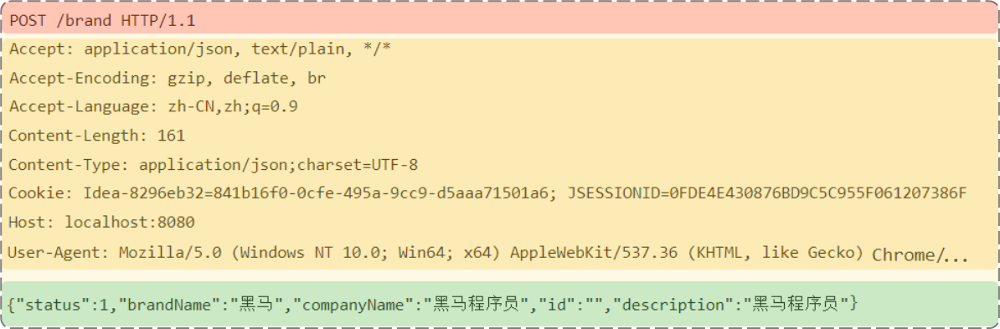
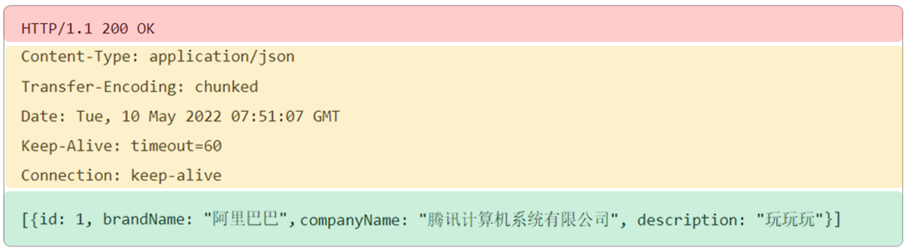
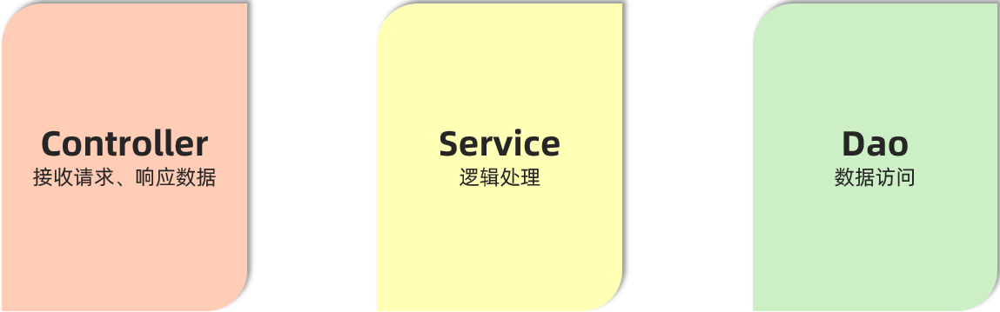
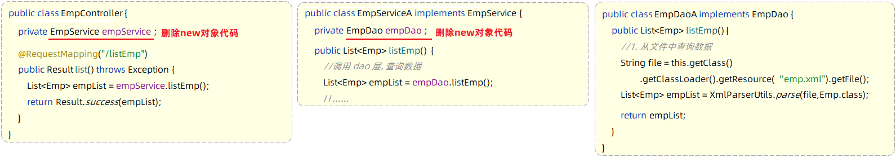
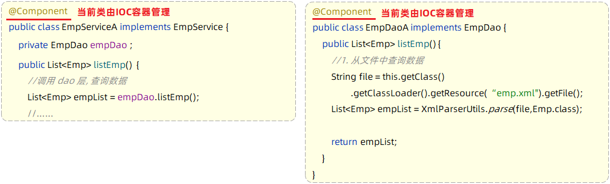
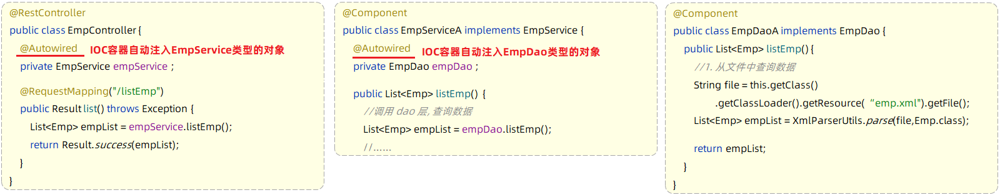
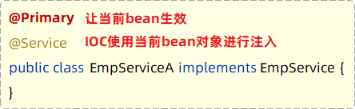
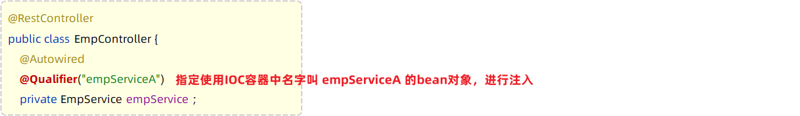
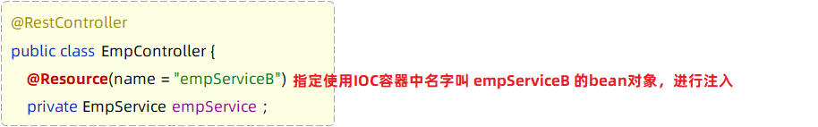
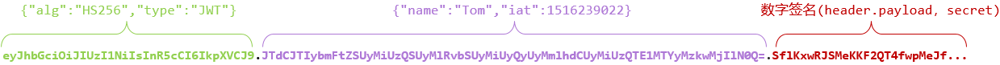

## javaWeb笔记（下）

[javaWeb笔记（上）](javaWeb笔记（上）.md)

## 1 Web

### 1.1 HTTP协议

#### 1.1.1 概述

HTTP：Hyper Text Transfer Protocol(超文本传输协议)，规定了浏览器与服务器之间数据传输的规则。

- http是互联网上应用最为广泛的一种网络协议 
- http协议要求：浏览器在向服务器发送请求数据时，或是服务器在向浏览器发送响应数据时，
  必须按照固定的格式进行数据传输

**HTTP的特点**：

* **基于TCP协议: **   面向连接，安全

  > TCP是一种面向连接的(建立连接之前是需要经过三次握手)、可靠的、基于字节流的传输层通信协议，在数据传输方面更安全

* **基于请求-响应模型:**   一次请求对应一次响应（先请求后响应）

  > 请求和响应是一一对应关系，没有请求，就没有响应

* **HTTP协议是无状态协议:**  对于数据没有记忆能力。每次请求-响应都是独立的

> - 缺点:  多次请求间不能共享数据
> - 优点:  速度快

#### 1.1.2 请求协议

HTTP协议又分为：请求协议和响应协议

- 请求协议：浏览器将数据以请求格式发送到服务器
  - 包括：**请求行**、**请求头** 、**请求体** 
- 响应协议：服务器将数据以响应格式返回给浏览器
  - 包括：**响应行** 、**响应头** 、**响应体** 



- 请求行(以上图中红色部分)

  - 请求方式：POST
  - 资源路径：/brand
  - 协议/版本：HTTP/1.1

- 请求头(以上图中黄色部分)   

  | 请求头          | 说明                                                         |
  | --------------- | ------------------------------------------------------------ |
  | Host            | 表示请求的主机名                                             |
  | User-Agent      | 浏览器版本。例如：Chrome浏览器的标识类似 `Mozilla/5.0 ...Chrome/79` |
  | Accept          | 表示浏览器能接收的资源类型，如 `text/*`、`image/*` 或 `*/*` 表示所有 |
  | Accept-Language | 表示浏览器偏好的语言，服务器可以据此返回不同语言的网页       |
  | Accept-Encoding | 表示浏览器可以支持的压缩类型，例如 `gzip`、`deflate` 等      |
  | Content-Type    | 请求主体的数据类型                                           |
  | Content-Length  | 数据主体的大小（单位：字节）                                 |

- 请求体(以上图中绿色部分) ：存储请求参数 

  - 请求体和请求头之间是有一个空行隔开（作用：用于标记请求头结束）

**GET请求和POST请求的区别**：

| 区别方式     | GET请求                                                      | POST请求             |
| ------------ | ------------------------------------------------------------ | -------------------- |
| 请求参数     | 请求参数在请求行中。<br/>例：/brand/findAll?name=OPPO&status=1 | 请求参数在请求体中   |
| 请求参数长度 | 请求参数长度有限制(与浏览器有关)                             | 请求参数长度没有限制 |
| 安全性       | 安全性低。原因：请求参数暴露在浏览器地址栏中。               | 安全性相对高         |

#### 1.1.3 响应协议



* 响应行(以上图中红色部分)：响应数据的第一行。响应行由`协议及版本`、`响应状态码`、`状态码描述`组成

  * 协议/版本：HTTP/1.1
  * 响应状态码：200
  * 状态码描述：OK
* 响应头(以上图中黄色部分)：响应数据的第二行开始。格式为key：value形式

  * http是个无状态的协议，所以可以在请求头和响应头中设置一些信息和想要执行的动作，这样，对方在收到信息后，就可以知道你是谁，你想干什么


- 响应体(以上图中绿色部分)： 响应数据的最后一部分。存储响应的数据
  - 响应体和响应头之间有一个空行隔开（作用：用于标记响应头结束）

**响应状态码**

| 状态码 | 说明                                                         |
| ------ | ------------------------------------------------------------ |
| 1xx    | **响应中** --- 临时状态码。表示请求已经接受，告诉客户端应该继续请求或者如果已经完成则忽略 |
| 2xx    | **成功** --- 表示请求已经被成功接收，处理已完成              |
| 3xx    | **重定向** --- 重定向到其它地方，让客户端再发起一个请求以完成整个处理 |
| 4xx    | **客户端错误** --- 处理发生错误，责任在客户端，如：客户端的请求一个不存在的资源，客户端未被授权，禁止访问等 |
| 5xx    | **服务器端错误** --- 处理发生错误，责任在服务端，如：服务端抛出异常，路由出错，HTTP版本不支持等 |

* 200    ok   客户端请求成功
* 404  Not Found  请求资源不存在
* 500  Internal Server Error  服务端发生不可预期的错误

常见响应码状态码大全：https://cloud.tencent.com/developer/chapter/13553 

**响应头**

| 头部字段         | 说明                                                         |
| ---------------- | ------------------------------------------------------------ |
| Content-Type     | 表示该响应内容的类型，例如 `text/html`，`image/jpeg`         |
| Content-Length   | 表示该响应内容的长度（字节数）                               |
| Content-Encoding | 表示该响应压缩算法，例如 `gzip`                              |
| Cache-Control    | 指示客户端应如何缓存，例如 `max-age=300` 表示可以最多缓存 300 秒 |
| Set-Cookie       | 告诉浏览器为当前页面所在的域设置 cookie                      |

### 1.2 Tomcat

**1）简介**

Tomcat服务器软件是一个免费的开源的web应用服务器。

由于Tomcat只支持Servlet/JSP少量JavaEE规范，所以是一个开源免费的轻量级Web服务器。

> JavaEE规范：   JavaEE => Java Enterprise Edition(Java企业版)
>
> JavaEE规范就是指Java企业级开发的技术规范总和。包含13项技术规范：JDBC、JNDI、EJB、RMI、JSP、Servlet、XML、JMS、Java IDL、JTS、JTA、JavaMail、JAF

Tomcat的官网: https://tomcat.apache.org/ 

**2）使用**

**启动Tomcat** 

- 双击tomcat解压目录/bin/**startup.bat**文件即可启动tomcat

> Tomcat启动的过程中，遇到控制台有中文乱码时
>
> 1. 打开conf/logging.prooperties文件
> 2. 找到51行，`java.util.logging.ConsoleHandler.encoding = UTF-8`
> 3. 把 UTF-8 改为 GBK

**关闭:**

1. 强制关闭：直接x掉Tomcat窗口（不建议）
2. 正常关闭：bin\shutdown.bat
3. 正常关闭：在Tomcat启动窗口中按下 Ctrl+C

**3）问题：端口号冲突**

- 发生问题的原因：Tomcat使用的端口被占用了。

- 解决方案：换Tomcat端口号
  - 要想修改Tomcat启动的端口号，需要修改 conf/server.xml文件

> 注: HTTP协议默认端口号为80，如果将Tomcat端口号改为80，则将来访问Tomcat时，将不用输入端口号。

**4）项目部署**

将项目放到webapps目录下

## 2 请求协议

- 请求（HttpServletRequest）：获取请求数据

- 响应（HttpServletResponse）：设置响应数据

- BS架构：Browser/Server，浏览器/服务器架构模式。客户端只需要浏览器，应用程序的逻辑和数据都存储在服务端。（维护方便 体验一般）
- CS架构：Client/Server，客户端/服务器架构模式。（开发、维护麻烦  体验不错）

### 2.1 请求

#### 2.1.1 简单参数

简单参数：在向服务器发起请求时，向服务器传递的是一些普通的请求数据。

**1）原始方式**

```json
//根据指定的参数名获取请求参数的数据值
String  request.getParameter("参数名")
```

```java
    // http://localhost:8080/simpleParam?name=Tom&age=10
    // 第1个请求参数： name=Tom   参数名:name，参数值:Tom
    // 第2个请求参数： age=10     参数名:age , 参数值:10

@RestController
public class RequestController {
    //原始方式
    @RequestMapping("/simpleParam")
    public String simpleParam(HttpServletRequest request){
        
        String name = request.getParameter("name");//name就是请求参数名
        String ageStr = request.getParameter("age");//age就是请求参数名

        int age = Integer.parseInt(ageStr);//需要手动进行类型转换
        System.out.println(name+"  :  "+age);
        return "OK";
    }
}
```

**2）SptingBoot方式**

~~~java
    // http://localhost:8080/simpleParam?name=Tom&age=10
    // 第1个请求参数： name=Tom   参数名:name，参数值:Tom
    // 第2个请求参数： age=10     参数名:age , 参数值:10

@RestController
public class RequestController {
    
    //springboot方式
    @RequestMapping("/simpleParam")
    public String simpleParam(String name , Integer age ){//形参名和请求参数名保持一致
        System.out.println(name+"  :  "+age);
        return "OK";
    }
}
~~~

> 对于简单参数来讲，请求参数名和controller方法中的形参名不一致
>
> 解决方案：可以使用Spring提供的@RequestParam注解完成映射
>
> `public String simpleParam(@RequestParam("name") String username , Integer age )`
>
> @RequestParam中的required属性默认为true（默认值也是true），代表该请求参数必须传递，如果不传递将报错
>
> `public String simpleParam(@RequestParam(name = "name", required = false) ...)`

#### 2.1.2 实体参数

请求参数名与实体类的属性名相同

##### 1 简单实体对象

定义POJO实体类：

```java
public class User {
    private String name;
    private Integer age;
}
```

Controller方法：

```java
@RestController
public class RequestController {
    //实体参数：简单实体对象
    @RequestMapping("/simplePojo")
    public String simplePojo(User user){
        System.out.println(user);
        return "OK";
    }
}

localhost:8080/simplePojo?name=Tom&age=10
```

##### 2 复杂实体对象

定义POJO实体类：

```java
public class User {
    private String name;
    private Integer age;
    private Address address
}

public class Address {
    private String province;
    private String city;
}
```

`&address.province=beijin&address.city=beijing`

#### 2.1.3 数组集合参数

Controller方法：

```java
@RestController
public class RequestController {
    //数组参数
    @RequestMapping("/arrayParam")
    public String arrayParam(String[] hobby){
        System.out.println(Arrays.toString(hobby));
        return "OK";
    }
    //集合参数
    @RequestMapping("/listParam")
    public String listParam(@RequestParam List<String> hobby){
        System.out.println(hobby);
        return "OK";
    }
}
```

在前端请求时，有两种传递形式：

方式一：xxxxxxxxxx?hobby=game&hobby=java

方式二：xxxxxxxxxx?hobby=game,java

#### 2.1.4 日期参数

Controller方法：

注解：@DateTimeFormat  (pattern = "yyyy-MM-dd") 

- pattern是格式形式

```java
@RestController
public class RequestController {
    //日期时间参数
   @RequestMapping("/dateParam")
    public String dateParam(@DateTimeFormat(pattern = "yyyy-MM-dd HH:mm:ss") LocalDateTime updateTime){
        System.out.println(updateTime);
        return "OK";
    }
}
```

#### 2.1.5 Json参数

封装规则：

- JSON数据键名与形参对象属性名相同
- 定义POJO类型形参即可**接收参数**。需要使用 **@RequestBody**标识。

传递的 json 文件

```json
{
    "name": "ITCAST",
    "age": 16,
    "address": {
        "province": "北京",
        "city": "北京"
    }
}
```


定义POJO实体类：

```java
public class User {
    private String name;
    private Integer age;
    private Address address
}

public class Address {
    private String province;
    private String city;
}
```

Controller方法：

```java
@RestController
public class RequestController {
    //JSON参数
    @RequestMapping("/jsonParam")
    public String jsonParam(@RequestBody User user){
        System.out.println(user);
        return "OK";
    }
}
```

#### 2.1.6 路径参数

直接在请求的URL中传递参数

~~~
http://localhost:8080/path/1		
http://localhost:8080/path/1/0
~~~

Controller方法：

使用{…}来标识该路径参数，需要使用**@PathVariable**获取路径参数

```java
@RestController
public class RequestController {
    //路径参数
    @RequestMapping("/path/{id}")
    public String pathParam(@PathVariable Integer id){
        System.out.println(id);
        return "OK";
    }
    //路径参数 多个
    @RequestMapping("/path/{id}/{name}")
    public String pathParam2(@PathVariable Integer id, @PathVariable String name){
        System.out.println(id+ " : " +name);
        return "OK";
}
```

### 2.2 响应

#### 2.2.1@ResponseBody

- 类型：方法注解、类注解
- 位置：书写在Controller方法上或类上
- 作用：将方法返回值直接响应给浏览器
  - 如果返回值类型是实体对象/集合，将会**转换为JSON格式**后在响应给浏览器

@RestController = @Controller + @ResponseBody 

RestController源码：

~~~java
@Target({ElementType.TYPE})   //元注解（修饰注解的注解）
@Retention(RetentionPolicy.RUNTIME)  //元注解
@Documented    //元注解
@Controller   
@ResponseBody 
public @interface RestController {
    @AliasFor(
        annotation = Controller.class
    )
    String value() default "";
}
~~~

结论：在类上添加@RestController就相当于添加了@ResponseBody注解。

- 类上有@RestController注解或@ResponseBody注解时：表示当前类下所有的方法返回值做为响应数据
  - 方法的返回值，如果是一个POJO对象或集合时，会先转换为JSON格式，然后响应给浏览器

#### 2.2.2 统一响应结果

定义一个Result类，里面方法作为常用返回值，供controller方法调用

```java
public class Result {
    private Integer code;//响应码，1 代表成功; 0 代表失败
    private String msg;  //响应码 描述字符串
    private Object data; //返回的数据
    
    
    //增删改 成功响应(不需要给前端返回数据)
    public static Result success(){
        return new Result(1,"success",null);
    }
    //查询 成功响应(把查询结果做为返回数据响应给前端)
    public static Result success(Object data){
        return new Result(1,"success",data);
    }
    //失败响应
    public static Result error(String msg){
        return new Result(0,msg,null);
    }
}
```

### 2.3 分层解耦

#### 2.3.1 三层架构

>单一职责原则：一个类或一个方法，就只做一件事情，只管一块功能。
>
>这样就可以让类、接口、方法的复杂度更低，可读性更强，扩展性更好，也更利用后期的维护。

- 数据访问：负责业务数据的维护操作，包括增、删、改、查等操作。
- 逻辑处理：负责业务逻辑处理的代码。
- 请求处理、响应数据：负责，接收页面的请求，给页面响应数据。



- Controller：控制层。负责请求处理
- Service：业务逻辑层。负责逻辑处理
- Dao：数据访问层，也称为持久层。负责数据访问操作。

**步骤**

1. 前端发起的请求，由Controller层接收（Controller响应数据给前端）
2. Controller层调用Service层来进行逻辑处理（Service层处理完后，把处理结果返回给Controller层）
3. Serivce层调用Dao层（逻辑处理过程中需要用到的一些数据要从Dao层获取）
4. Dao层操作文件中的数据（Dao拿到的数据会返回给Service层）

**控制层：**接收前端发送的请求，对请求进行处理，并响应数据

```java
@RestController
public class EmpController {
    //业务层对象
    private EmpService empService = new EmpServiceA();

    @RequestMapping("/listEmp")
    public Result list(){
        //1. 调用service层, 获取数据
        List<Emp> empList = empService.listEmp();

        //3. 响应数据
        return Result.success(empList);
    }
}
```

**业务逻辑层：**处理具体的业务逻辑

- 业务接口

~~~java
//业务逻辑接口（制定业务标准）
public interface EmpService {
    //获取员工列表
    public List<Emp> listEmp();
}
~~~

- 业务实现类

```java
//业务逻辑实现类（按照业务标准实现）
public class EmpServiceA implements EmpService {
    //dao层对象
    private EmpDao empDao = new EmpDaoA();

    @Override
    public List<Emp> listEmp() {
        //1. 调用dao, 获取数据
        List<Emp> empList = empDao.listEmp();

        //2. 对数据进行转换处理 - gender, job
        empList.stream().forEach(emp -> {
            //处理 gender 1: 男, 2: 女
            String gender = emp.getGender();
            if("1".equals(gender)){
                emp.setGender("男");
            }else if("2".equals(gender)){
                emp.setGender("女");
            }

            //处理job - 1: 讲师, 2: 班主任 , 3: 就业指导
            String job = emp.getJob();
            if("1".equals(job)){
                emp.setJob("讲师");
            }else if("2".equals(job)){
                emp.setJob("班主任");
            }else if("3".equals(job)){
                emp.setJob("就业指导");
            }
        });
        return empList;
    }
}
```

**数据访问层：**负责数据的访问操作，包含数据的增、删、改、查

- 数据访问接口

~~~java
//数据访问层接口（制定标准）
public interface EmpDao {
    //获取员工列表数据
    public List<Emp> listEmp();
    
}
~~~

- 数据访问实现类

```java
//数据访问实现类
public class EmpDaoA implements EmpDao {
    @Override
    public List<Emp> listEmp() {
        //1. 加载并解析emp.xml
        String file = this.getClass().getClassLoader().getResource("emp.xml").getFile();
        System.out.println(file);
        List<Emp> empList = XmlParserUtils.parse(file, Emp.class);
        return empList;
    }
}
```

#### 2.3.2 分层解耦

- 内聚：软件中各个功能模块内部的功能联系。

- 耦合：衡量软件中各个层/模块之间的依赖、关联的程度。

- 软件设计原则：高内聚低耦合。

**1）解耦操作**

- **控制反转：** Inversion Of Control，简称IOC。对象的创建控制权由程序自身转移到外部（容器），这种思想称为控制反转。

  > 对象的创建权由程序员主动创建转移到容器(由容器创建、管理对象)。
  >
  > 这个容器称为：IOC容器或Spring容器
  >
  > IOC容器中创建、管理的对象，称之为：bean对象

- **依赖注入：** Dependency Injection，简称DI。容器为应用程序提供 运行时所依赖的资源，称之为依赖注入。

  > 程序运行时需要某个资源，此时容器就为其提供这个资源。
  >
  > 例：EmpController程序运行时需要EmpService对象，Spring容器就为其提供并注入EmpService对象

**2）步骤：**

第1步：删除Controller层、Service层中new对象的代码



第2步：Service层及Dao层的实现类，交给IOC容器管理

- 使用Spring提供的注解：@Component ，就可以实现类交给IOC容器管理



第3步：为Controller及Service注入运行时依赖的对象

- 使用Spring提供的注解：@Autowired ，就可以实现程序运行时IOC容器自动注入需要的依赖对象



**3）IOC bean的声明**

| 注解        | 说明                 | 位置                       |
| :---------- | -------------------- | -------------------------- |
| @Controller | @Component的衍生注解 | 标注在控制器类上           |
| @Service    | @Component的衍生注解 | 标注在业务类上             |
| @Repository | @Component的衍生注解 | 标注在数据访问类上         |
| @Component  | 声明bean的基础注解   | 不属于以上三类时，用此注解 |

> 注意事项: 
>
> - 声明bean的时候，可以通过value属性指定bean的名字，如果没有指定，默认为类名首字母小写。
> - 使用以上四个注解都可以声明bean，但是在springboot集成web开发中，声明控制器bean只能用@Controller。

使用四大注解声明的bean，要想生效，还需要被组件扫描注解@ComponentScan扫描

@ComponentScan注解虽然没有显式配置，但是实际上已经包含在了引导类声明注解 @SpringBootApplication 中，==默认扫描的范围是SpringBoot启动类所在包及其子包==。

**4）DI注解**

@Autowired注解，默认是按照**类型**进行自动装配的

存在多个同类型的bean

- @Primary

- @Autowired + @Qualifier("bean的名称")

- @Resource(name = "bean的名称")

使用@Primary注解：当存在多个相同类型的Bean注入时，加上@Primary注解，来确定默认的实现。



使用@Qualifier注解：指定当前要注入的bean对象。 在@Qualifier的value属性中，指定注入的bean的名称。

- @Qualifier注解不能单独使用，必须配合@Autowired使用
- 

使用@Resource注解：是按照bean的名称进行注入。通过name属性指定要注入的bean的名称。



> @Autowird 与 @Resource的区别
>
> - @Autowired 是spring框架提供的注解，而@Resource是JDK提供的注解
> - @Autowired 默认是按照类型注入，而@Resource是按照名称注入


## 3 MyBatis

- 使用Java程序来完成对数据库的操作
- MyBatis是一款优秀的 **持久层** **框架**，用于简化JDBC的开发。
  - 持久层：即数据访问层(dao)，是用来操作数据库的。
- MyBatis本是 Apache的一个开源项目iBatis，2010年这个项目由apache迁移到了google code，并且改名为MyBatis 。2013年11月迁移到Github。

### 3.1 快速入门

1. 创建springboot工程，并勾选 Mybatis Framework 和 MySQL Driver

2. 连接数据库：在 resource 包的 application.properties 添加以下代码

```properties
#驱动类名称
spring.datasource.driver-class-name=com.mysql.cj.jdbc.Driver
#数据库连接的url
spring.datasource.url=jdbc:mysql://localhost:3306/mybatis
#连接数据库的用户名
spring.datasource.username=root
#连接数据库的密码
spring.datasource.password=123456
```

3. 创建表对应的实体类。
   - 属性类型要一致
   - 属性名与表中的字段名一一对应
4. 创建Mapper接口和sql语句

```java
@Mapper
public interface UserMapper {

    @Select("select * from user")
    public List<User> list();
}
```

5. 调用接口方法

```java
//依赖注入：创建接口userMapper的对象
@Autowired
private UserMapper userMapper;

@Test
public void testListUser(){

    List<User> userList =  userMapper.list();
    userList.stream().forEach(user -> System.out.println(user));
}
```

###  3.2 Lombok

Lombok是一个实用的Java类库，可以通过简单的注解来简化和消除一些必须有但显得很臃肿的Java代码。

> 通过注解的形式自动生成构造器、getter/setter、equals、hashcode、toString等方法，并可以自动化生成日志变量，简化java开发、提高效率。

| **注解**            | **作用**                                                     |
| ------------------- | ------------------------------------------------------------ |
| @Getter/@Setter     | 为所有的属性提供get/set方法                                  |
| @ToString           | 会给类自动生成易阅读的  toString 方法                        |
| @EqualsAndHashCode  | 根据类所拥有的非静态字段自动重写 equals 方法和  hashCode 方法 |
| @Data               | 提供了更综合的生成代码功能<br />（@Getter  + @Setter + @ToString + @EqualsAndHashCode） |
| @NoArgsConstructor  | 为实体类生成无参的构造器方法                                 |
| @AllArgsConstructor | 为实体类生成除了static修饰的字段的全参数的构造器方法。       |

**使用**

第1步：在pom.xml文件中引入依赖

```xml
<!-- 在springboot的工程中，已经集成了lombok并指定了版本号，故引入依赖时不需要指定version -->
<dependency>
    <groupId>org.projectlombok</groupId>
    <artifactId>lombok</artifactId>
</dependency>
```

第2步：在实体类上添加注解

```java
import lombok.Data;

@Data //getter方法、setter方法、toString方法、hashCode方法、equals方法
@NoArgsConstructor //无参构造
@AllArgsConstructor//全参构造
public class User {
    private Integer id;
    private String name;
    private Short age;
    private Short gender;
    private String phone;
}
```

- Lombok会在编译时，会自动生成对应的java代码
- 在使用lombok时，还需要安装一个lombok的插件（新版本的IDEA中自带）

### 3.3 基础操作(注解)

**日志输入**

1. 打开application.properties文件

2. 开启mybatis的日志，并指定输出到控制台

```properties
#指定mybatis输出日志的位置, 输出控制台
mybatis.configuration.log-impl=org.apache.ibatis.logging.stdout.StdOutImpl
```

#### 1）删除

```java
@Mapper
public interface EmpMapper {

    @Delete("delete from emp where id = #{id}")//使用#{key}方式获取方法中的参数值
    public void delete(Integer id);
}
```

> 返回值只能设置为 void 或 int 成功为1，失败为0

```java
class CrudApplicationTests {
    @Autowired
    private EmpMapper empMapper;

    @Test
    public void testEmpMapper(){
        empMapper.delete(17);
    }
}
```

#### 2）增添

```java
//@Options将生成的主键值，赋值给emp对象的id属性
@Options(useGeneratedKeys = true,keyProperty = "id")
@Insert("insert into  emp(username, name, gender, image, job, entrydate, dept_id, create_time, update_time)" +
        "VALUES (#{username},#{name},#{gender},#{image},#{job},#{entrydate},#{deptId}, #{createTime},#{updateTime});")
public void insert(Emp emp);
```


```java
//增添员工
@Test
public void testInsert(){
    //构造员工对象
    Emp emp = new Emp();
    emp.setUsername("Tom3");
	....//各种set方法
    empMapper.insert(emp);
    
    System.out.println(emp.getDeptId());}
```

#### 3）修改

```java
@Update("update emp " +
        "set username = #{username},name = #{name},gender =#{gender},image =#{image}," 
        + "job =#{job},entrydate =#{entrydate},dept_id =#{deptId},update_time =#{updateTime} "
        + "where id = #{id};")
public void update(Emp emp);
```


```java
//修改数据
@Test
public void testUpdate(){
    Emp emp = new Emp();
    emp.setId(18);
    ...//各种set方法
    empMapper.update(emp);
}
```

#### 4）查询

```java
@Select("select * from emp where id = #{id}")
public Emp select(Integer id);
```


```java
@Test
public void testSelect(){
    Emp emp = empMapper.select(18);
    System.out.println(emp);
}
```

出现问题：`deptId=null, createTime=null, updateTime=null`

- 实体类属性名和数据库表查询返回的字段名一致，mybatis会自动封装。
- 如果实体类属性名和数据库表查询返回的字段名不一致，不能自动封装。

 解决方案：

1. **起别名**

在SQL语句中，对不一样的列名起别名，别名和实体类属性名一样

```java
@Select("select id, username, password, name, gender, image, job, entrydate, " +
        "dept_id AS deptId, create_time AS createTime, update_time AS updateTime " +
        "from emp " +
        "where id=#{id}")
public Emp getById(Integer id);
```

2. **手动结果映射**

通过 @Results及@Result 进行手动结果映射

```java
@Results({@Result(column = "dept_id", property = "deptId"),
          @Result(column = "create_time", property = "createTime"),
          @Result(column = "update_time", property = "updateTime")})
@Select("select * from emp where id = #{id}")
public Emp getById(Integer id);
```

3. **开启驼峰命名**

如果字段名与属性名符合驼峰命名规则，mybatis会自动通过驼峰命名规则映射

> 驼峰命名规则：   abc_xyz    =>   abcXyz
>
> - 表中字段名：abc_xyz
> - 类中属性名：abcXyz

```properties
# 在application.properties中添加：
mybatis.configuration.map-underscore-to-camel-case=true
```

> 要使用驼峰命名前提是 实体类的属性 与 数据库表中的字段名严格遵守驼峰命名。

### 3.4 预编译SQL

**预编译SQL优点**：

1. 性能更高：编译一次之后会将编译后的SQL语句缓存起来，后面再次执行这条语句时，不会再次编译。
2. 更安全(防止SQL注入）：将敏感字进行转义，保障SQL的安全性。

**SQL注入**：通过操作输入来修改事先定义好的 SQL 语句，用以达到执行代码对服务器进行攻击的方法。

> 由于没有对用户输入进行充分检查，而SQL又是拼接而成，在用户输入参数时，在参数中添加一些SQL关键字，达到改变SQL运行结果的目的，也可以完成恶意攻击。
>
> `' or '1'='1`

**参数占位符**

在Mybatis中提供的参数占位符有两种：${...} 、#{...}

- #{...}
  - 执行SQL时，会将#{…}替换为?，生成预编译SQL，会自动设置参数值
  - 使用时机：参数传递，都使用#{…}

- ${...}
  - 拼接SQL。直接将参数拼接在SQL语句中，存在SQL注入问题
  - 使用时机：如果对表名、列表进行动态设置时使用

> 注意事项：在项目开发中，建议使用#{...}，生成预编译SQL，防止SQL注入安全。

### 3.5 XML映射文件

在Mybatis中使用XML映射文件方式开发，需要符合一定的规范：

1. XML映射文件放在resource里，且与Mapper接口同包同名

2. XML映射文件的namespace属性为Mapper接口全类名一致

3. XML映射文件中sql语句的id与Mapper接口中的方法名一致，并保持返回类型一致。

EmpMapper里的方法

```java
public List<Emp> list(String name);
```

xml的约束：

```java
<?xml version="1.0" encoding="UTF-8" ?>
<!DOCTYPE mapper
        PUBLIC "-//mybatis.org//DTD Mapper 3.0//EN"
        "http://mybatis.org/dtd/mybatis-3-mapper.dtd">
```

xml的映射方法

```java
<mapper namespace="org.example.crud.mapper.EmpMapper">

    <select id="list" resultType="org.example.crud.pojo.Emp">
        select * from emp where name like concat(#{name},'%')
    </select>
    
</mapper>
```

### 3.6 动态sql

**动态SQL**：SQL语句会随着用户的输入或外部条件的变化而变化

#### 1）if

`<if>`：用于判断条件是否成立。使用test属性进行条件判断，如果条件为true，则拼接SQL。

~~~xml
<if test="条件表达式">
   要拼接的sql语句
</if>
~~~

原句：必须指定name和gender后进行查询

```xml
<select id="list" resultType="com.itheima.pojo.Emp">
        select * from emp
        where name like concat('%',#{name},'%')
              and gender = #{gender}
</select>
```

改后：可以对单一变量查询

`!=''`:

~~~xml
<select id="list" resultType="com.itheima.pojo.Emp">
        select * from emp
        <where>
             <if test="name != null and name !='' ">
                 name like concat('%',#{name},'%')
             </if>
             <if test="gender != null">
                 and gender = #{gender}
             </if>
             <if test="begin != null and end != null">
                and entrydate between #{begin} and #{end}
             </if>
        </where>
</select>
~~~

使用`<where>`标签代替SQL语句中的where关键字

- `<where>`只会在子元素有内容的情况下才插入where子句
- 自动去除子句的开头的AND或OR

`<set>`：

- 动态的在SQL语句中插入set关键字
- 删掉额外的逗号。（用于update语句中）

```xml
<update id="updateXml">
    update emp
    <set>
            <if test="username != null and username != ''"> username = #{username}, </if>
            <if test="password != null and password != ''"> password = #{password}, </if>
            <if test="name != null and name != ''"> name = #{name}, </if>
            <if test="gender != null"> gender = #{gender}, </if>
            <if test="image != null and image != ''"> image = #{image}, </if>
            <if test="job != null"> job = #{job}, </if>
            <if test="entrydate != null"> entrydate = #{entrydate}, </if>
            <if test="deptId != null"> dept_id = #{deptId}, </if>
            <if test="updateTime != null"> update_time = #{updateTime} </if>
        </set>
    where id = #{id}
</update>
```

#### 2）foreach

Mapper接口：

~~~java
@Mapper
public interface EmpMapper {
    //批量删除
    public void deleteByIds(@Param("ids") List<Integer> ids);
}
~~~

==一定要加`@Param("ids")`注解，要不然名称默认为 list==

XML映射文件：

- 使用`<foreach>`遍历deleteByIds方法中传递的参数ids集合

~~~xml
<foreach collection="遍历的集合" item="遍历出来的元素" separator="每一次遍历使用的分隔符" 
         open="遍历开始前拼接的片段" close="遍历结束后拼接的片段">
</foreach>
~~~

~~~xml
<!-- 约束内容 -->
<mapper namespace="com.itheima.mapper.EmpMapper">
    <!--删除操作-->
    <delete id="deleteByIds">
        delete from emp where id in
        <foreach collection="ids" item="id" separator="," open="(" close=")">
            #{id}<!-- 代表每一次遍历出来的元素 -->
        </foreach>
    </delete>
</mapper> 
~~~

#### 3）sql&include

我们可以对重复的代码片段进行抽取

- `<sql>`：定义可重用的SQL片段

- `<include>`：通过属性refid，引用指定的SQL片段

SQL片段： 抽取重复的代码

```xml
<sql id="commonSelect">
 	select ... from emp
</sql>
```

然后通过`<include>` 标签在原来抽取的地方进行引用。

```xml
<select id="list" resultType="com.itheima.pojo.Emp">
    <include refid="commonSelect"/>
    <where>
        ...
    </where>
</select>
```

## 4 开发规范

### 4.1 REST

**REST**（Representational State Transfer），表述性状态转换，它是一种软件架构风格。

**传统URL风格如下：**

```url
http://localhost:8080/user/getById?id=1     GET：查询id为1的用户
http://localhost:8080/user/saveUser         POST：新增用户
http://localhost:8080/user/updateUser       POST：修改用户
http://localhost:8080/user/deleteUser?id=1  GET：删除id为1的用户
```

原始的传统URL，定义比较复杂，而且将资源的访问行为对外暴露出来了。

**基于REST风格URL如下：**

```
http://localhost:8080/users/1  GET：查询id为1的用户
http://localhost:8080/users    POST：新增用户
http://localhost:8080/users    PUT：修改用户
http://localhost:8080/users/1  DELETE：删除id为1的用户
```

其中总结起来，就一句话：通过URL定位要操作的资源，通过HTTP动词(请求方式)来描述具体的操作。

- GET ： 查询
- POST ：新增
- PUT ：修改
- DELETE ：删除

我们看到如果是基于REST风格，定义URL，URL将会更加简洁、更加规范、更加优雅。

> 注意事项：
>
> - REST是风格，是约定方式，约定不是规定，可以打破
> - 描述模块的功能通常使用复数，也就是加s的格式来描述，表示此类资源，而非单个资源。如：users、emps、books…


### 4.2 开发流程


1. 查看页面原型明确需求
   - 根据页面原型和需求，进行表结构设计、编写接口文档(已提供)

2. 阅读接口文档
3. 思路分析
4. 功能接口开发
   - 就是开发后台的业务功能，一个业务功能，我们称为一个接口
5. 功能接口测试
   - 功能开发完毕后，先通过Postman进行功能接口测试，测试通过后，再和前端进行联调测试
6. 前后端联调测试
   - 和前端开发人员开发好的前端工程一起测试

### 4.3 要点

```
@Slf4j
```

- **PathVariable（路径变量）**：放在URL路径里，用于**定位资源**（查具体哪一个）。

  - `/users/123`

  - ```java
    @GetMapping("/depts/{id}")
    public Result getById(@PathVariable Integer id){
    ```

- **RequestParam（请求参数）**：放在URL问号后面，用于**过滤或排序**（查哪一类）。

  - 键值对形式，如`?`**`page=1&size=10`**

  - ```java
    //可设默认值
    @GetMapping("/emps")
        public Result selectPage(@RequestParam(defaultValue = "1") Integer page,
                                 @RequestParam(defaultValue = "5") Integer size){
    ```

- **RequestBody（请求体）**：放在请求的“体内”，用于**新增或修改**（传复杂数据）。

  - JSON文件

  - ```java
    @PostMapping("/depts")
    public Result insertDept(@RequestBody Dept dept){
    ```

 多参数（必须加 `@Param`）

```java
@Select("select * from emp limit #{start} , #{pageSize}")
public List<Emp> page(@Param("start")Integer start, @Param("pageSize")Integer pageSize);
```

### 4.4 PageHelper

作用：分页查询

controller

```java
@GetMapping("/emps")
public Result selectPage(@RequestParam(defaultValue = "1") Integer page,
                         @RequestParam(defaultValue = "10") Integer pageSize){
    log.info("分页查询");

    PageBean  pageBean = empService.selectPage(page,pageSize);
    return Result.success(pageBean);
}
```

仅有service有变动

```java
public PageBean selectPage(Integer page, Integer pageSize) {
    Long count = empMapper.count();
    Integer start = (page - 1) * pageSize;
    List<Emp> emps = empMapper.page(start ,pageSize);

    PageBean pageBean = new PageBean(count,emps);
    return pageBean;
}
```

list() 方法：@Select("select * from emp")

```java
public PageBean selectPage(Integer page, Integer pageSize) {
    PageHelper.startPage(page,pageSize);
    Page<Emp> list = (Page<Emp>) empMapper.list();

    PageBean pageBean = new PageBean(list.getTotal(),list.getResult());
    return pageBean;
}
```

### 4.5 本地存储

controller

```java
@PostMapping("/upload")
public Result upload(String username, Integer age, MultipartFile image) throws IOException {

    log.info("文件上传，{}，{}，{}", username, age, image);


    String originalFilename = image.getOriginalFilename();

    int index = originalFilename.lastIndexOf(".");
    String extname = originalFilename.substring(index);
    String newFileName = UUID.randomUUID().toString() + extname;

    image.transferTo(new File("D:\\file\\" + newFileName));

    return Result.success();
}
```

如果需要上传大文件，可以在application.properties进行如下配置：

~~~properties
#配置单个文件最大上传大小
spring.servlet.multipart.max-file-size=10MB

#配置单个请求最大上传大小(一次请求可以上传多个文件)
spring.servlet.multipart.max-request-size=100MB
~~~

| 方法名              | 返回类型    | 参数      | 描述                         |
| ------------------- | ----------- | --------- | ---------------------------- |
| getOriginalFilename | String      | 无        | 获取原始文件名               |
| transferTo          | void        | File dest | 将接收的文件转存到磁盘文件中 |
| getSize             | long        | 无        | 获取文件的大小，单位：字节   |
| getBytes            | byte[]      | 无        | 获取文件内容的字节数组       |
| getInputStream      | InputStream | 无        | 获取接收到的文件内容的输入流 |

### 4.6 配置文件

#### 1）参数配置

application.properties

```properties
#自定义的阿里云OSS配置信息
aliyun.oss.endpoint = https://oss-cn-hangzhou.aliyuncs.com
aliyun.oss.accessKeyId = youKeyId
aliyun.oss.accessKeySecret = youKeySecret
aliyun.oss.bucketName = javaweb-test-xi
```

@Value 注解通常用于外部配置的属性注入，具体用法为： @Value("${配置文件中的key}")

~~~java
@Component
public class AliOSSUtils {
    
    @Value("${aliyun.oss.endpoint}")
    private String endpoint;
    
    @Value("${aliyun.oss.accessKeyId}")
    private String accessKeyId;
    
    @Value("${aliyun.oss.accessKeySecret}")
    private String accessKeySecret;
    
    @Value("${aliyun.oss.bucketName}")
    private String bucketName;
    
    ...其他方法
}
~~~

#### 2）yml配置

- application.properties

  ```properties
  server.port=8080
  server.address=127.0.0.1
  ```

- application.yml /yaml

  ```yml
  server:
    port: 8080
    address: 127.0.0.1
  ```


**基本语法：**

- 大小写敏感
- 数值前边必须有空格，作为分隔符
- 使用缩进表示层级关系，缩进时，不允许使用Tab键，只能用空格（idea中会自动将Tab转换为空格）
- 缩进的空格数目不重要，只要相同层级的元素左侧对齐即可
- `#`表示注释，从这个字符一直到行尾，都会被解析器忽略

**常见的数据格式**

对象/Map集合

```yml
user:
  name: zhangsan
  age: 18
  password: 123456
```

数组/List/Set集合

```yml
hobby: 
  - java
  - game
  - sport
```

#### 3）@ConfigurationProperties

作用：优化@Value 注解

- @Value注解只能一个一个的进行外部属性的注入。

- @ConfigurationProperties可以批量的将外部的属性配置注入到bean对象的属性中。

引入依赖：

~~~xml
<dependency>
    <groupId>org.springframework.boot</groupId>
    <artifactId>spring-boot-configuration-processor</artifactId>
</dependency>
~~~

创建AliOSSProperties类，bean对象

```java
/*阿里云OSS相关配置*/
@Data
@Component
@ConfigurationProperties(prefix = "aliyun.oss")
public class AliOSSProperties {
    //区域
    private String endpoint;
    //身份ID
    private String accessKeyId ;
    //身份密钥
    private String accessKeySecret ;
    //存储空间
    private String bucketName;
}
```

AliOSSUtils类中

```java
//注入配置参数实体类对象
    @Autowired
    private AliOSSProperties aliOSSProperties;

//方法里面用get方法获取
String endpoint = aliOSSProperties.getEndpoint();
```

## 5 登录认证

### 5.1 登录校验

登陆后才能访问后端系统页面，不登陆则跳转登陆页面进行登陆。

HTTP协议是无状态协议：每一次请求都是独立的，下一次请求并不会携带上一次请求的数据

### 5.2 会话技术

浏览器与服务器之间的一次连接，我们就称为一次会话

会话跟踪：一种维护浏览器状态的方法，服务器需要识别多次请求是否来自于同一浏览器，以便在同一次会话的多次请求间共享数据。

会话跟踪技术：

1. Cookie（客户端会话跟踪技术）
   - 数据存储在客户端浏览器当中
2. Session（服务端会话跟踪技术）
   - 数据存储在储在服务端
3. 令牌技术

#### 1）Cookie

- 服务器会 **自动** 的将 cookie 响应给浏览器。

- 浏览器接收到响应回来的数据之后，会 **自动** 的将 cookie 存储在浏览器本地。

- 在后续的请求当中，浏览器会 **自动** 的将 cookie 携带到服务器端。

**优缺点**

- 优点：HTTP协议中支持的技术（像Set-Cookie 响应头的解析以及 Cookie 请求头数据的携带，都是浏览器自动进行的，是无需我们手动操作的）
- 缺点：
  - 移动端APP(Android、IOS)中无法使用Cookie
  - 不安全，用户可以自己禁用Cookie
  - Cookie不能跨域

#### 2）Session

- 优点：Session是存储在服务端的，安全
- 缺点：
  - 服务器集群环境下无法直接使用Session
  - 移动端APP(Android、IOS)中无法使用Cookie
  - 用户可以自己禁用Cookie
  - Cookie不能跨域

> PS：Session 底层是基于Cookie实现的会话跟踪，如果Cookie不可用，则该方案，也就失效了。

#### 3）令牌技术

- 优点：
  - 支持PC端、移动端
  - 解决集群环境下的认证问题
  - 减轻服务器的存储压力（无需在服务器端存储）
- 缺点：需要自己实现（包括令牌的生成、令牌的传递、令牌的校验）

### 5.3 JWT令牌

#### 5.3.1 介绍

JWT全称：JSON Web Token  （官网：https://jwt.io/）

- 定义了一种简洁的、自包含的格式，用于在通信双方以json数据格式安全的传输信息。由于数字签名的存在，这些信息是可靠的。

  > 简洁：是指jwt就是一个简单的字符串。可以在请求参数或者是请求头当中直接传递。
  >
  > 自包含：指的是jwt令牌，看似是一个随机的字符串，但是我们是可以根据自身的需求在jwt令牌中存储自定义的数据内容。如：可以直接在jwt令牌中存储用户的相关信息。
  >
  > 简单来讲，jwt就是将原始的json数据格式进行了安全的封装，这样就可以直接基于jwt在通信双方安全的进行信息传输了。

JWT的组成： 



- 第一部分：Header(头）， 记录令牌类型、签名算法等。 例如：{"alg":"HS256","type":"JWT"}
- 第二部分：Payload(有效载荷），携带一些自定义信息、默认信息等。 例如：{"id":"1","username":"Tom"}
- 第三部分：Signature(签名），防止Token被篡改、确保安全性。
    将header、payload 和 指定秘钥 融合，通过指定签名算法计算而来。

>Base64：是一种基于64个可打印的字符来表示二进制数据的编码方式。
>64个字符分别是A到Z、a到z、 0- 9，+，/，加起来就是64个字符。
>还有一个符号，那就是等号。等号是一个补位的符号

在JWT登录认证的流程：

1. 在登录成功之后，要生成令牌。
2. 每一次请求当中，要接收令牌并对令牌进行校验。

#### 5.3.2 JWT生成

JWT的依赖：

~~~xml
<!-- JWT依赖-->
<dependency>
    <groupId>io.jsonwebtoken</groupId>
    <artifactId>jjwt</artifactId>
    <version>0.9.1</version>
</dependency>
~~~

生成JWT代码实现：

~~~java
@Test
public void genJwt(){
    Map<String,Object> claims = new HashMap<>();
    claims.put("id",1);
    claims.put("username","Tom");
    
    String jwt = Jwts.builder()
        .setClaims(claims) //自定义内容          
        .signWith(SignatureAlgorithm.HS256, "itheima") //签名算法
        //有效期，单位毫秒，延后h
        .setExpiration(new Date(System.currentTimeMillis() + 24*3600*1000)) 
        .compact();
    
    System.out.println(jwt);
}
~~~

解析生成的令牌

~~~java
@Test
public void parseJwt(){
    Claims claims = Jwts.parser()
        .setSigningKey("itheima")//指定签名密钥（必须保证和生成令牌时使用相同的签名密钥）  
	    .parseClaimsJws("填入令牌内容")
        .getBody();

    System.out.println(claims);
}
~~~

- JWT校验时使用的签名秘钥，必须和生成JWT令牌时使用的秘钥是配套的。

- 如果JWT令牌解析校验时报错，则说明 JWT令牌被篡改 或 过期了，令牌非法。 

### 5.4 Filter

- Filter表示过滤器，是 JavaWeb三大组件(Servlet、Filter、Listener)之一。
- 过滤器可以把对资源的请求拦截下来，从而实现一些特殊的功能
  - 使用了过滤器之后，要想访问web服务器上的资源，必须先经过滤器，过滤器处理完毕之后，才可以访问对应的资源。
- 过滤器一般完成一些通用的操作，比如：登录校验、统一编码处理、敏感字符处理等。

### 5.5 Interceptor

#### 1）介绍

拦截器的定义：

- 拦截器是一种动态拦截方法调用的机制，类似于过滤器。
- 拦截器是Spring框架中提供的，用来动态拦截控制器方法的执行。

拦截器的作用：

- 拦截请求，在指定方法调用前后，根据业务需要执行预先设定的代码。

#### 2）入门

**自定义拦截器：**实现HandlerInterceptor接口，并重写其所有方法

~~~java
//自定义拦截器
@Component
public class LoginCheckInterceptor implements HandlerInterceptor {
    //目标资源方法执行前执行。 返回true：放行    返回false：不放行
    @Override
    public boolean preHandle(HttpServletRequest request, HttpServletResponse response, Object handler) throws Exception {
        System.out.println("preHandle .... ");
        
        return true; //true表示放行
    }

    //目标资源方法执行后执行
    @Override
    public void postHandle(HttpServletRequest request, HttpServletResponse response, Object handler, ModelAndView modelAndView) throws Exception {
        System.out.println("postHandle ... ");
    }

    //视图渲染完毕后执行，最后执行
    @Override
    public void afterCompletion(HttpServletRequest request, HttpServletResponse response, Object handler, Exception ex) throws Exception {
        System.out.println("afterCompletion .... ");
    }
}
~~~

> 注意：
>
> ​	preHandle方法：目标资源方法执行前执行。 返回true：放行    返回false：不放行
>
> ​	postHandle方法：目标资源方法执行后执行
>
> ​	afterCompletion方法：视图渲染完毕后执行，最后执行

**注册配置拦截器**：实现WebMvcConfigurer接口，并重写addInterceptors方法

~~~java
@Configuration  
public class WebConfig implements WebMvcConfigurer {

    //自定义的拦截器对象
    @Autowired
    private LoginCheckInterceptor loginCheckInterceptor;

    
    @Override
    public void addInterceptors(InterceptorRegistry registry) {
       //注册自定义拦截器对象
        registry.addInterceptor(loginCheckInterceptor).addPathPatterns("/**");//设置拦截器拦截的请求路径（ /** 表示拦截所有请求）
    }
}
~~~

#### 3）使用详解

拦截路径

`addPathPatterns("要拦截路径")`方法：指定要拦截哪些资源。

`excludePathPatterns("不拦截路径")`方法，指定哪些资源不需要拦截

```java
    @Override
    public void addInterceptors(InterceptorRegistry registry) {
        //注册自定义拦截器对象
        registry.addInterceptor(loginCheckInterceptor)
                .addPathPatterns("/**")//设置拦截器拦截的请求路径（ /** 表示拦截所有请求）
                .excludePathPatterns("/login");//设置不拦截的请求路径
    }
```

常见拦截路径设置：

| 拦截路径  | 含义                 | 举例                                                |
| --------- | -------------------- | --------------------------------------------------- |
| /*        | 一级路径             | 能匹配/depts，/emps，/login，不能匹配 /depts/1      |
| /**       | 任意级路径           | 能匹配/depts，/depts/1，/depts/1/2                  |
| /depts/*  | /depts下的一级路径   | 能匹配/depts/1，不能匹配/depts/1/2，/depts          |
| /depts/** | /depts下的任意级路径 | 能匹配/depts，/depts/1，/depts/1/2，不能匹配/emps/1 |

Filter与Interceptor区别

- 接口规范不同：过滤器需要实现Filter接口，而拦截器需要实现HandlerInterceptor接口。
- 拦截范围不同：过滤器Filter会拦截所有的资源，而Interceptor只会拦截Spring环境中的资源。

**登录校验拦截器**

~~~java
//自定义拦截器
@Component //当前拦截器对象由Spring创建和管理
@Slf4j
public class LoginCheckInterceptor implements HandlerInterceptor {
    //前置方式
    @Override
    public boolean preHandle(HttpServletRequest request, HttpServletResponse response, Object handler) throws Exception {
        System.out.println("preHandle .... ");
        //1.获取请求url
        //2.判断请求url中是否包含login，如果包含，说明是登录操作，放行

        //3.获取请求头中的令牌（token）
        String token = request.getHeader("token");
        log.info("从请求头中获取的令牌：{}",token);

        //4.判断令牌是否存在，如果不存在，返回错误结果（未登录）
        if(!StringUtils.hasLength(token)){
            log.info("Token不存在");

            //创建响应结果对象
            Result responseResult = Result.error("NOT_LOGIN");
            //把Result对象转换为JSON格式字符串 (fastjson是阿里巴巴提供的用于实现对象和json的转换工具类)
            String json = JSONObject.toJSONString(responseResult);
            //设置响应头（告知浏览器：响应的数据类型为json、响应的数据编码表为utf-8）
            response.setContentType("application/json;charset=utf-8");
            //响应
            response.getWriter().write(json);

            return false;//不放行
        }

        //5.解析token，如果解析失败，返回错误结果（未登录）
        try {
            JwtUtils.parseJWT(token);
        }catch (Exception e){
            log.info("令牌解析失败!");

            //创建响应结果对象
            Result responseResult = Result.error("NOT_LOGIN");
            //把Result对象转换为JSON格式字符串 (fastjson是阿里巴巴提供的用于实现对象和json的转换工具类)
            String json = JSONObject.toJSONString(responseResult);
            //设置响应头
            response.setContentType("application/json;charset=utf-8");
            //响应
            response.getWriter().write(json);

            return false;
        }

        //6.放行
        return true;
    }
~~~

**注册配置拦截器**

~~~java
@Configuration  
public class WebConfig implements WebMvcConfigurer {
    //拦截器对象
    @Autowired
    private LoginCheckInterceptor loginCheckInterceptor;

    @Override
    public void addInterceptors(InterceptorRegistry registry) {
       //注册自定义拦截器对象
        registry.addInterceptor(loginCheckInterceptor)
                .addPathPatterns("/**")
                .excludePathPatterns("/login");
    }
}

~~~

### 5.6 异常处理

没有做任何的异常处理时，三层架构处理异常的方案：

- Mapper接口在操作数据库的时候出错了，此时异常会往上抛(谁调用Mapper就抛给谁，会抛给service。 
- service 中也存在异常了，会抛给controller。
- 而在controller当中，我们也没有做任何的异常处理，所以最终异常会再往上抛。最终抛给框架之后，框架就会返回一个JSON格式的数据，里面封装的就是错误的信息，但是框架返回的JSON格式的数据并不符合我们的开发规范。

#### 1）解决方法

- 方案一：在所有Controller的所有方法中进行try…catch处理
  - 缺点：代码臃肿（不推荐）
- 方案二：全局异常处理器
  - 好处：简单、优雅（推荐）

#### 2）全局异常处理器

定义全局异常处理器：定义一个类，在类上加上一个注解@RestControllerAdvice

注解@ExceptionHandler：value属性指定捕获的是哪一类型的异常

~~~java
@RestControllerAdvice
public class GlobalExceptionHandler {

    //处理异常
    @ExceptionHandler(Exception.class) //指定能够处理的异常类型
    public Result ex(Exception e){
        e.printStackTrace();//打印堆栈中的异常信息

        //捕获到异常之后，响应一个标准的Result
        return Result.error("对不起,操作失败,请联系管理员");
    }
}
~~~

> @RestControllerAdvice = @ControllerAdvice + @ResponseBody
>
> 处理异常的方法返回值会转换为json后再响应给前端

## 6 事务管理

### 6.1 介绍

**事务**是一组操作的集合，它是一个不可分割的工作单位

事务的操作主要有三步：

1. 开启事务（一组操作开始前，开启事务）：start transaction / begin ;
2. 提交事务（这组操作全部成功后，提交事务）：commit ;
3. 回滚事务（中间任何一个操作出现异常，回滚事务）：rollback ;

@Transactional注解：方法执行之前，开启事务；方法执行完毕，提交事务。方法执行出现异常，回滚事务。

通常在业务层的多次操作方法上添加

```java
@Override
@Transactional  //当前方法添加了事务管理
public void delete(Integer id){
    //根据部门id删除部门信息
    deptMapper.deleteById(id);
        
	//模拟：异常发生
    int i = 1/0;

    //删除部门下的所有员工信息
    empMapper.deleteByDeptId(id);   
}
```
可以在application.yml配置文件中开启事务管理日志，这样就可以在控制看到和事务相关的日志信息了

~~~yaml
#spring事务管理日志
logging:
  level:
    org.springframework.jdbc.support.JdbcTransactionManager: debug
~~~

### 6.2 进阶

@Transactional注解的两个属性

1. 异常回滚的属性：rollbackFor 
2. 事务传播行为：propagation

默认情况下，只有出现RuntimeException(运行时异常)才会回滚事务

配置@Transactional注解当中的rollbackFor属性，指定出现何种异常类型回滚事务。@Transactional(rollbackFor=Exception.class)：所有异常都会回滚

事务的传播行为：方法A 调用 有事务管理的方法B，是否需要创建新事务

| **属性值**    | **含义**                                                     |
| ------------- | ------------------------------------------------------------ |
| REQUIRED      | 【默认值】有则加入，无则创建新事务                           |
| REQUIRES_NEW  | 需要新事务，无论有无，总是创建新事务                         |
| SUPPORTS      | 支持事务，有则加入，无则在无事务状态中运行                   |
| NOT_SUPPORTED | 不支持事务，在无事务状态下运行,如果当前存在已有事务,则挂起当前事务 |
| MANDATORY     | 必须有事务，否则抛异常                                       |
| NEVER         | 必须没事务，否则抛异常                                       |
| …             |                                                              |

```java
//根据部门id，删除部门信息及部门下的所有员工
    @Override
    @Log
    @Transactional(rollbackFor = Exception.class) 
    public void delete(Integer id) throws Exception {
        try {
            //根据部门id删除部门信息
            deptMapper.deleteById(id);
            //模拟：异常
            if(true){
                throw new Exception("出现异常了~~~");
            }
            //删除部门下的所有员工信息
            empMapper.deleteByDeptId(id);
        }finally {
            //不论是否有异常，最终都要执行的代码：记录日志
            DeptLog deptLog = new DeptLog();
            deptLog.setCreateTime(LocalDateTime.now());
            deptLog.setDescription("执行了解散部门的操作，此时解散的是"+id+"号部门");
            //调用其他业务类中的方法
            deptLogService.insert(deptLog);
        }
    }
```

**测试:**

重新启动SpringBoot服务，测试删除3号部门后会发生什么？

- 执行了删除3号部门操作
- 执行了插入部门日志操作
- 程序发生Exception异常
- 执行事务回滚（删除、插入操作因为在一个事务范围内，两个操作都会被回滚）

**解决方案：**

在DeptLogServiceImpl类中insert方法上，添加@Transactional(propagation = Propagation.REQUIRES_NEW)

> Propagation.REQUIRES_NEW  ：不论是否有事务，都创建新事务  ，运行在一个独立的事务中。

~~~java
@Service
public class DeptLogServiceImpl implements DeptLogService {

    @Autowired
    private DeptLogMapper deptLogMapper;

    @Transactional(propagation = Propagation.REQUIRES_NEW)//事务传播行为：不论是否有事务，都新建事务
    @Override
    public void insert(DeptLog deptLog) {
        deptLogMapper.insert(deptLog);
    }
}
~~~

## 7 AOP

### 7.1 入门

AOP英文全称：Aspect Oriented Programming（面向切面编程、面向方面编程）

面向切面编程就是面向特定方法编程。 

> AOP的优势：
>
> 1. 代码无侵入：没有修改原始的业务方法，对原始的业务方法进行了功能的增强或改变
> 2. 减少重复代码
> 3. 提高开发效率
> 4. 维护方便

**pom.xml**

~~~xml
<dependency>
    <groupId>org.springframework.boot</groupId>
    <artifactId>spring-boot-starter-aop</artifactId>
</dependency>
~~~

**AOP程序：TimeAspect**

~~~java
@Component
@Aspect //当前类为切面类
@Slf4j
public class TimeAspect {

    //对哪些代码进行编程
    @Around("execution(* com.itheima.service.*.*(..))") 
    public Object recordTime(ProceedingJoinPoint pjp) throws Throwable {
        //记录方法执行开始时间
        long begin = System.currentTimeMillis();

        //执行原始方法
        Object result = pjp.proceed();

        //记录方法执行结束时间
        long end = System.currentTimeMillis();

        //计算方法执行耗时
        log.info(pjp.getSignature()+"执行耗时: {}毫秒",end-begin);

        return result;
    }
}
~~~

### 7.2 概念

**1. 连接点：JoinPoint**，可以被AOP控制的方法（暗含方法执行时的相关信息）

例如：所有的业务方法都是可以被aop控制的方法。

**2. 通知：Advice**，指哪些重复的逻辑，也就是共性功能（最终体现为一个方法）

**3. 切入点：PointCut**，匹配连接点的条件，通知仅会在切入点方法执行时被应用

切入点表达式：`@Around("execution")`

**4. 切面：Aspect**，描述通知与切入点的对应关系（通知+切入点）

**5. 目标对象：Target**，通知所作用的对象

### 7.3 通知类型

Spring中AOP的通知类型：

- @Around：环绕通知，此注解标注的通知方法在目标方法前、后都被执行
- @Before：前置通知，此注解标注的通知方法在目标方法前被执行
- @After ：后置通知，此注解标注的通知方法在目标方法后被执行，无论是否有异常都会执行
- @AfterReturning ： 返回后通知，此注解标注的通知方法在目标方法后被执行，有异常不会执行
- @AfterThrowing ： 异常后通知，此注解标注的通知方法发生异常后执行

~~~java
@Slf4j
@Component
@Aspect
public class MyAspect1 {

    //切入点方法（公共的切入点表达式）
    @Pointcut("execution(* com.itheima.service.*.*(..))")
    private void pt(){
    }

    //前置通知（引用切入点）
    @Before("pt()")
    public void before(JoinPoint joinPoint){
        log.info("before ...");
    }

    //环绕通知
    @Around("pt()")
    public Object around(ProceedingJoinPoint proceedingJoinPoint) throws Throwable {
        log.info("around before ...");
        
        //调用目标对象的原始方法执行
        Object result = proceedingJoinPoint.proceed();
        //原始方法在执行时：发生异常,后续代码不在执行

        log.info("around after ...");
        return result;
    }

    //后置通知
    @After("pt()")
    public void after(JoinPoint joinPoint){
        log.info("after ...");
    }

    //返回后通知（程序在正常执行的情况下，会执行的后置通知）
    @AfterReturning("pt()")
    public void afterReturning(JoinPoint joinPoint){
        log.info("afterReturning ...");
    }

    //异常通知（程序在出现异常的情况下，执行的后置通知）
    @AfterThrowing("pt()")
    public void afterThrowing(JoinPoint joinPoint){
        log.info("afterThrowing ...");
    }
}
~~~

@PointCut注解：是将公共的切入点表达式抽取出来

>- @Around环绕通知需要自己调用 ProceedingJoinPoint.proceed() 来让原始方法执行，其他通知不需要考虑目标方法执行
>- @Around环绕通知方法的返回值，必须指定为Object，来接收原始方法的返回值，否则原始方法执行完毕，是获取不到返回值的。
>

通知顺序

- 目标方法前的通知方法：字母排名靠前的先执行
- 目标方法后的通知方法：字母排名靠前的后执行

使用@Order注解，控制通知的执行顺序：

@Order(1)  //切面类的执行顺序（前置通知：数字越小先执行; 后置通知：数字越小越后执行）

### 7.4 切入点表达式

切入点表达式：

- 作用：主要用来决定项目中的哪些方法需要加入通知

- 常见形式：

  1. execution(……)：根据方法的签名来匹配
  2. @annotation(……) ：根据注解匹配

#### @execution

~~~
execution([访问修饰符]  返回值  [包名.类名.]方法名(方法参数) [throws 异常])
~~~

其中带`[]`的表示可以省略的部分

- 访问修饰符：可省略（比如: public、protected）

- 包名.类名： 可省略(不建议省略)

- throws 异常：可省略（注意是方法上声明抛出的异常，不是实际抛出的异常）

**通配符**

- `*` ：单个独立的任意符号，可以通配任意返回值、包名、类名、方法名、任意类型的**一个参数**，也可以通配包、类、方法名的一部分

- `..` ：多个连续的任意符号，可以通配任意层级的包，或任意类型、**任意个数的参数**

> 根据业务需要，可以使用 且（&&）、或（||）、非（!） 来组合比较复杂的切入点表达式。
>
> 所有业务方法名在命名时尽量规范，方便切入点表达式快速匹配。如：查询类方法都是 find 开头，更新类方法都是update开头：`find*`，`update*`

- 描述切入点方法通常基于接口描述，而不是直接描述实现类，增强拓展性

  ~~~java
  execution(* com.itheima.service.DeptService.*(..))
  ~~~

- 在满足业务需要的前提下，尽量缩小切入点的匹配范围。如：包名匹配尽量不使用 ..，使用 * 匹配单个包

  ~~~java
  execution(* com.itheima.*.*.DeptServiceImpl.find*(..))
  ~~~


#### @annotation

实现步骤：

1. 编写自定义注解
2. 在业务类要做为连接点的方法上添加自定义注解

**自定义注解**：MyLog

~~~java
@Target(ElementType.METHOD)
@Retention(RetentionPolicy.RUNTIME)
public @interface MyLog {
}
~~~

@annotation(com.itheima.anno.MyLog)

### 7.5 连接点

Spring中用JoinPoint抽象了连接点，用它可以获得方法执行时的相关信息，如目标类名、方法名、方法参数等。

- 对于@Around通知，获取连接点信息只能使用ProceedingJoinPoint类型

- 对于其他四种通知，获取连接点信息只能使用JoinPoint，它是ProceedingJoinPoint的父类型

```java
//环绕通知
    @Around("pt()")
    public Object around(ProceedingJoinPoint pjp) throws Throwable {
        //获取目标类名
        String className = pjp.getTarget().getClass().getName();
        log.info("目标类名：{}",className);

        //目标方法名
        String methodName = pjp.getSignature().getName();
        log.info("目标方法名：{}",methodName);

        //获取方法执行时需要的参数
        Object[] args = pjp.getArgs();
        log.info("目标方法参数：{}", Arrays.toString(args));

        //执行原始方法
        Object returnValue = pjp.proceed();

        return returnValue;
    }
```

## 8 SpringBoot

### 8.1 Bean

从IOC容器中获取到bean对象

```java
@Autowired
private ApplicationContext applicationContext; //IOC容器对象
```
1. 根据name获取bean

   Bean默认名称为类名首字母小写

   ~~~java
   Object getBean(String name)
   ~~~

2. 根据类型获取bean

   ~~~java
   <T> T getBean(Class<T> requiredType)
   ~~~

3. 根据name获取bean（带类型转换）

   ~~~java
   <T> T getBean(String name, Class<T> requiredType)
   ~~~

Bean的作用域

| **作用域**  | **说明**                                        |
| ----------- | ----------------------------------------------- |
| singleton   | 容器内同名称的bean只有一个实例（单例）（默认）  |
| prototype   | 每次使用该bean时会创建新的实例（非单例）        |
| request     | 每个请求范围内会创建新的实例（web环境中，了解） |
| session     | 每个会话范围内会创建新的实例（web环境中，了解） |
| application | 每个应用范围内会创建新的实例（web环境中，了解） |

> @Scope注解：配置作用域
>
> `@Scope("prototype") //bean作用域为非单例`

第三方Bean

如果要管理的bean对象来自于第三方（不是自定义的），是无法用@Component 及衍生注解声明bean的，就需要用到**@Bean**注解。

**解决方案1：在启动类上添加@Bean标识的方法**

```java
	//声明第三方bean
    @Bean //将当前方法的返回值对象交给IOC容器管理, 成为IOC容器bean
    public SAXReader saxReader(){
        return new SAXReader();
    }
```

**解决方案2：在配置类中定义@Bean标识的方法**

- 如果需要定义第三方Bean时， 通常会单独定义一个配置类

- 使用时创建IOC容器对象来获取

~~~java
@Configuration //配置类  (在配置类当中对第三方bean进行集中的配置管理)
public class CommonConfig {

    //声明第三方bean
    @Bean //将当前方法的返回值对象交给IOC容器管理, 成为IOC容器bean
          //通过@Bean注解的name/value属性指定bean名称, 如果未指定, 默认是方法名
    public SAXReader reader(DeptService deptService){
        System.out.println(deptService);
        return new SAXReader();
    }

}

~~~

如果第三方bean需要依赖其它bean对象，直接在bean定义方法中设置形参即可，容器会根据类型自动装配。

### 8.2 自动配置

SpringBoot的自动配置：当Spring容器启动后，一些配置类、bean对象就自动存入到了IOC容器中，不需要我们手动去声明，从而简化了开发，省去了繁琐的配置操作。

@ComponentScan组件扫描

~~~java
@SpringBootApplication
@ComponentScan({"com.itheima","com.example"}) //指定要扫描的包
public class SpringbootWebConfig2Application {
    public static void main(String[] args) {
        SpringApplication.run(SpringbootWebConfig2Application.class, args);
    }
}

~~~

@Import导入

导入形式主要有以下几种：

1). 导入普通类

`@Import(TokenParser.class) //导入的类会被Spring加载到IOC容器中`

2). 导入配置类

配置类

~~~java
@Configuration
public class HeaderConfig {
    @Bean
    public HeaderParser headerParser(){
        return new HeaderParser();
    }

    @Bean
    public HeaderGenerator headerGenerator(){
        return new HeaderGenerator();
    }
}
~~~

`@Import(HeaderConfig.class) //导入配置类`

3). 导入ImportSelector接口实现类

ImportSelector接口实现类

~~~java
public class MyImportSelector implements ImportSelector {
    public String[] selectImports(AnnotationMetadata importingClassMetadata) {
        //返回值字符串数组（数组中封装了全限定名称的类）
        return new String[]{"com.example.HeaderConfig"};
    }
}
~~~

启动类

~~~java
@Import(MyImportSelector.class) //导入ImportSelector接口实现类
@SpringBootApplication
public class SpringbootWebConfig2Application {

    public static void main(String[] args) {
        SpringApplication.run(SpringbootWebConfig2Application.class, args);
    }
}

~~~

4). 使用**第三方依赖提供**的 @EnableXxxxx注解

- 第三方依赖中提供的注解

~~~java
@Retention(RetentionPolicy.RUNTIME)
@Target(ElementType.TYPE)
@Import(MyImportSelector.class)//指定要导入哪些bean对象或配置类
public @interface EnableHeaderConfig { 
}
~~~

- 在使用时只需在启动类上加上@EnableXxxxx注解即可

~~~java
@EnableHeaderConfig  //使用第三方依赖提供的Enable开头的注解
@SpringBootApplication
public class SpringbootWebConfig2Application {
    public static void main(String[] args) {
        SpringApplication.run(SpringbootWebConfig2Application.class, args);
    }
}

~~~

**@Conditional注解：**

- 作用：按照一定的条件进行判断，在满足给定条件后才会注册对应的bean对象到Spring的IOC容器中。
- 位置：方法、类
- @Conditional本身是一个父注解，派生出大量的子注解：
  - @ConditionalOnClass：判断环境中有对应字节码文件，才注册bean到IOC容器。
  - @ConditionalOnMissingBean：判断环境中没有对应的bean(类型或名称)，才注册bean到IOC容器。
  - @ConditionalOnProperty：判断配置文件中有对应属性和值，才注册bean到IOC容器。


下面我们通过代码来演示下Conditional注解的使用：

- @ConditionalOnClass注解

~~~java
@Configuration
public class HeaderConfig {

    @Bean
    @ConditionalOnClass(name="io.jsonwebtoken.Jwts")//环境中存在指定的这个类，才会将该bean加入IOC容器
    public HeaderParser headerParser(){
        return new HeaderParser();
    }
    
    //省略其他代码...
}
~~~

- pom.xml

~~~java
<!--JWT令牌-->
<dependency>
     <groupId>io.jsonwebtoken</groupId>
     <artifactId>jjwt</artifactId>
     <version>0.9.1</version>
</dependency>
~~~

